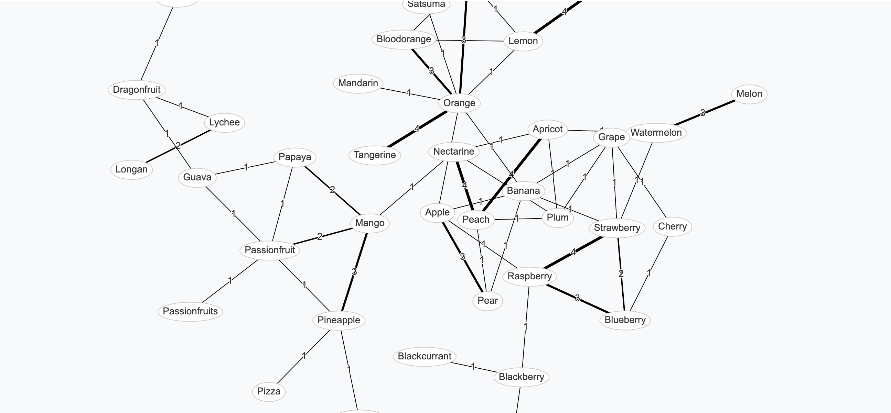
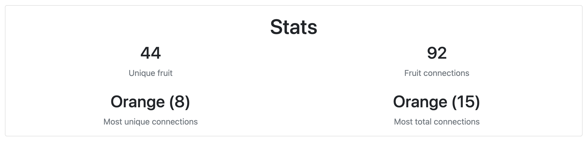

# Background

I went to see a friend for drinks, and left at 11:30 because he had work the next day, leaving me drunk and very much before my drunk bedtime.

I saw a [TikTok](https://www.tiktok.com/@_brogz/video/7106954222557482246?_t=8T1g2g3I9vq&_r=1) on the bus home which pointed out that if someone asks for an Apple, then offering them a Pear is acceptable, but offering them a Pineapple is not.

I considered that there was a theoretical graph of fruit substitutions, and I wondered if maybe, while a direct Apple to Kiwi replacement is crazy, there might be some chain through which you could lead someone to make it acceptable.

I realised that any kind of poll on social media would not be adequate for this task.

I decided to build a website which would allow people to vote for acceptable fruit substitutions, and build a graph of these connections in real time.

# Build process

I'm always looking for excuses to play with frontend JS because I don't currently for work, so I thought I'd do something React-based.

I also wanted a really easy way to host this, so I went for Netlify as they just make it completely effortless.

They offered a Next.js starter so I went with that and hacked around for 4 hours.

Data persistance was key straight away, so I did some Googling and came across FaunaDB (as Netlify doesn't support any type of DB by itself).

It's a document store, which I usually hate, but it's perfect for something silly like this.

After a lot of fiddling with its very unintuitive query language, I got data going in and out in an acceptable format.

I have a simple list of fruits, each with its own document in the DB, and the potential to easily add more fields if I ever fancied (e.g. colour).

The trickiest thing to represent was the graph itself. From CS theory I knew the best method was an adjacency matrix, which is really easy in a single threaded program but gets really annoying when trying to store data in a DB.

I tried having each row in the matrix have its own document, to limit write collisions (when two people are editing at the same time, one will just end up overwriting the other), but it wasn't working so I just put the whole in thing in a single JSON object in 1 document.

Then I spent a good hour trying to get D3 talking to Next.js. I feel I learnt a lot about React and hooks, and eventually the auto-updating in response to state changes part was working, but d3 just wasn't rendering properly for some reason (even the demos on their website).

I did some more Googling (I only really went with D3 originally because I'd heard of it) and came across a great package called `vis-network` which had a handy React wrapper called `react-graph-vis`.

I rearranged the page a bit to make it more compact and intuitive, added a description, then posted it on my story at 4AM and went to bed.

# Results

By 21:30 the same day

* The story got 150 views
* 4 people replied to it
* 5 people liked it
* 44 unique fruit had been added
* 92 connections had been added (maybe 5 by me)

For a random drunk idea, I'm pretty happy with how it turned out!

[Substi-fruit](https://comfy-custard-c39caa.netlify.app/ "https://comfy-custard-c39caa.netlify.app/")

# Improvements

When I woke up the next day I added an MIT license to the repo, just to protect my very valuable IP.

I also added Google Analytics, but I had missed a few people, I've learned to put it on from the start next time!

I also squished things around more and added a nice background.

I also added a live updating stats block including the most connected fruit, both by number of unique links and total cumulative links, and by both metrics Orange is the most substitutable fruit. The graph is undirected, so it is not completely clear whether people are happy with it in either direction, but I'd imagine so.

{.img-w-60}
