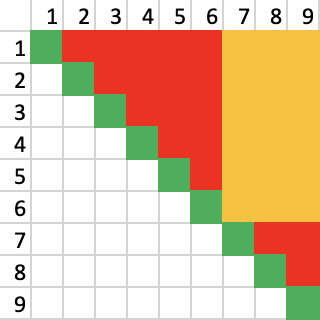

Pairing your socks after washing them seems like an annoying and unnecessary task. You think you can just find pairs as and when you need them, you could either do all the work now, or just spread it out over the next couple of weeks.

It turns out that, for more than 2 pairs of socks, it is *always* quicker to pair all your socks at once rather than one at a time.

## Assumptions

For this post I will assume that all pairs of socks are unique in their pattern.

To make it possible to write about socks I am going to use numbers to refer to specific socks (sock 1, sock 2, etc.), and letters to refer to patterns of socks (sock pattern A, sock pattern B, etc.)

## Worst cases

It is usually helpful in discussions like this to start with the worst case scenario. After all, you could get incredibly lucky and always pull out 2 socks that match, but, to understand just *how* lucky that would be, we need to know how bad it could have been.

If I have 5 unique pairs of socks (so 10 socks) all jumbled up, and I would like to find a single matching pair, the steps could look something like this:

1. Pick out a sock (sock 1), which we take to be part of our pair
2. Pick out another sock (sock 2)
3. If sock 1 matches sock 2 then we are finished, otherwise return sock 2, and go back to step 2

What is the most socks I could have to look at (including sock A) before I find my matching pair?

Spoiler

Say we have 5 pairs of socks, with patterns A, B, C, D, E

If I pick up socks in the following order: `A, B, B, C, C, D, D, E, E, A`

I will have to go through all 10 socks before I find a pair

_This is not necessarily the most efficient algorithm. You could argue that after I saw 2 Bs in a row I could stop. But if you scale this up to 100 socks, if the third sock you pulled was pattern F, and then the thirty-third had pattern F, would you remember where you'd put it?_

### Expressing things formally (Big-O notation)

If we have 10 socks we could have to go through a maximum of 10 socks to find a pair. Similarly, for 20 socks, we could have to go through all 20 socks to find a pair. This is true for any number of socks. It is useful to know how the number of steps scales with the number of socks, and therefore how long it could take to find a pair.

We can express this as a formula: $t = s$ (where $t$ is the time taken, and $s$ is the number of socks). This means that the time taken scales linearly with the number of socks. We could also write this as $t = \frac{1}{2} p$ (where $p$ is the number of pairs of socks).

In both cases here, the time taken is proportional to the number of socks, and so we can say that the time taken is "of the order of $O(s)$", or more commonly $O(n)$, where $n$ is a stand in for any input variable.

The phrasing "of the order of" is irrelevant, people often say "has an order of", or even just shorten it to "this algorithm is $O(n)$"; the interesting part is $O(n)$.

$O$ (as in Big O) tells us that whatever is in the brackets is the **worst case**.

Then the $n$ is the really important part. It refers to the input of your system, essentially whatever can scale. In our case $n$ refers to the number of socks (or pairs of socks). We can increase the number of socks, which will increase the time taken to find a pair.

Here, because the time taken scales **linearly** with the number of socks, we write $O(n)$. If we had a task that took 4 actions for 2 socks, 9 actions for 3 socks, 16 actions for 4 socks, etc. then this is likely $O(n^2)$.

Also, we would say that the sock pairing has order $O(p)$, not $O(\frac{1}{2} p)$, because any constant factor is ignored. This is because we are only interested in how the time taken *scales* with the number of socks, not the exact time taken.

## Average and best cases

If we know the best case ($2$), and the worst case ($n$), and we assume that the probability of falling anywhere between those values is uniform, then we can find the average case.

$$
\begin{aligned}
    onepair(n) &= \frac{n + 2}{2} \\
    &= \frac{1}{2}n + 1
\end{aligned}
$$

For the average case we use $\Theta$ instead of $O$, so we say it has an order of $\Theta(n)$ (note that we have dropped the factor of $\frac{1}{2}$, and the + 1).

For the best case we use $\Omega$, so we say it has an order of $\Omega(1)$ (for any constant $2, 73, x$ etc., we just use $1$).

When we're designing algorithms it's generally useful to think in terms of the average case (although outliers in the best or worst cases can cause problems so don't fully ignore them).

Unfortunately people often seem just use $O$ to refer to all three cases (or often the average case), but it's useful to know the difference.

## Pairing n socks

If we have 10 socks, and we find one pair, on average this will take $\frac{10 + 2}{2} = 6$ steps. From the remaining 8 socks, to find another pair will take $\frac{8 + 2}{2} = 5$ steps. For 6: $4$, for 4: $3$, for 2: $2$. This gives us a total of $6 + 5 + 4 + 3 + 2 = 20$ steps.

Can you see a pattern here?

Spoiler

This is equivalent to the sum of the numbers 2 to 6.

Or, for `n` socks, the sum of the numbers 2 to `0.5n + 1`.

The formula for $1 + 2 + \cdots + x$ is

$$\sum_{a = 1}^{x} a = \frac{1}{2}x(x + 1)$$

So to find $(\frac{n}{2} + 1) + (\frac{n}{2}) + \cdots + 2$ we use

$$
\begin{aligned}
allpairs(n) &= \sum_{a = 2}^{\frac{n}{2} + 1} a \\
&= \left( \sum_{a = 1}^{\frac{n}{2} + 1} a \right) - 1 \\
&=\frac{1}{2}(\frac{n}{2} + 1)(\frac{n}{2} + 2) - 1
\end{aligned}
$$

This looks annoying, but let's expand it out:

$$allpairs(n) = \frac{1}{8}n^{2} + \frac{3}{4}n$$

And given we only care about the average case, we can drop the factor on $n^{2}$ and the $n$ term, and just have

$$allpairs(n) = \Theta(n^{2})$$

## Pairing n socks out of N

If we want to pair 100 socks, we can find how long it will take. What if we just want to pair 10 socks out of 100?

We know to pair 2 socks out of 100 we can use $onepair(100) = \frac{1}{2}n + 1 = 51$, similarly 2 socks out of 99: 50, 98: 49, etc.

So to pair 10 socks out of 100 we need $51 + 50 + 49 + 48 + 47 = 245$.

How can we figure this out quicker? It's the same as doing $allpairs(100) - allpairs(90)$.

We can check this:

$$
\begin{aligned}
    allpairs(100) &= \frac{1}{2}(\frac{100}{2} + 1)(\frac{100}{2} + 2) - 1 \\
    allpairs(90) &= \frac{1}{2}(\frac{90}{2} + 1)(\frac{90}{2} + 2) - 1 \\
    allpairs(100) - allpairs(90) &= 1325 - 1080 \\
    &= 245
\end{aligned}
$$

So we can say that to pair $n$ socks out of $N$ is found by

$$
\begin{aligned}
    somepairs(N, n) &= allpairs(X) - allpairs(X - x) \\
    &= \left( \frac{1}{8} N^{2} + \frac{3}{4} N \right) - \left( \frac{1}{8} (N - 2)^{2} + \frac{3}{4} (N - n) \right) \\
    &= \left( \frac{1}{8} N^{2} + \frac{3}{4} N \right) - \left( \frac{1}{8} N^{2} - \frac{1}{4} nN + \frac{1}{8} n^{2} + \frac{3}{4} N - \frac{3}{4} n \right) \\
    &= \left( \frac{1}{8} N^{2} - \frac{1}{8} N^{2} \right) + \left( \frac{3}{4} N - \frac{3}{4} N \right) - \left( - \frac{1}{4} nN + \frac{1}{8} n^{2} - \frac{3}{4} n \right) \\
    &= \frac{1}{4} nN - \frac{1}{8} n^{2} + \frac{3}{4} n
\end{aligned}
$$

### Sanity check

$n$ is necessarily less than or equal to $N$, because you can't pair more socks than you have, so the worst case is when $n = N$. If we sub this in, we find

$$
\begin{aligned}
somepairs(N, N) &= \frac{1}{4} nN - \frac{1}{8} n^{2} + \frac{3}{4} n \\
&= \frac{1}{4} N^2 - \frac{1}{8} N^{2} + \frac{3}{4} N \\
&= \frac{1}{8} N^2 + \frac{3}{4} N \\
&= allpairs(N)
\end{aligned}
$$

That makes sense!

## The core of the argument

So we can say

$$somepairs(N, n) = \Theta(Nn)$$

Is that good?

As we've seen, $n \le N$, so $Nn \le N^{2}$. This means that the time taken to pair $n$ socks out of $N$ is guaranteed to be at most the time taken to pair $N$ socks, and the smaller $n$ is relative to $N$, the more efficient it is to pair them as soon as they are out of the washing machine.

That is to say that the **more socks you have**, or the **smaller your washing machine**, the **more efficient it is** to pair them as soon as they are out of the washing machine.

## Explanation

Where is this time saving coming from?

Assume we have 9 pairs of socks, split into a 6 and a 3, with a guarantee that every sock is in the same set as its pair.

In the image above, in red are all the possible unsuccessful comparisons, and in green the successful ones. In reality, only half of the red comparisons will be done, because on average half-way through a comparison you will find a match.

In yellow are the comparisons that are not done, because they are between socks in different sets. This is a saving of $6 \times 3 = 18$ comparisons.

And how do get two subsets with all pairs in the same one? If we assume socks are always worn in matching pairs, then the process of wearing and discarding pairs of socks achieves this!

## Conclusion

There are lots more interesting things you could try to understand about this problem:

- If I wanted to pair all $N$ socks, in chunks of $n$, how many chunks would I need? ($somepairs(N, n) + somepairs(N - n, n) + somepairs(N - 2n, n) + \cdots$?)
- In the "pair as you go" case, unless you're wearing all your socks then washing them all, the actual amount of checks is much worse than we have calculated because every $n$ pairs you wear, we reset back to $N$ socks to search through! How does that affect things?
- On the other hand, the inclusion of duplicated patterns of socks would make the problem much easier, because you could just pair all the $A$ socks, then all the $B$ socks, etc.

But none of these detract from the fact that it is always quicker (or at least as fast if $n = N$, i.e. you washed all your socks at once) to pair your socks straight out of the wash, and that is a nice result to have.
