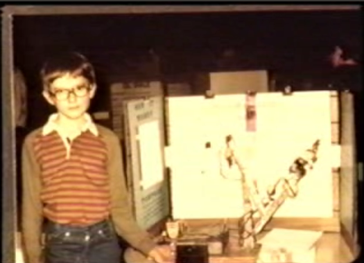

**This is not my content**

A long time ago I read an article called 'Code Fearlessly', which was very helpful in growing my confidence as a developer. The post about it on [Hacker News](https://news.ycombinator.com/item?id=1964060) is still up, but the link itself is dead.

You can see the original post using the [Wayback Machine](https://web.archive.org/web/20160304033011/http://cam.ly/blog/2010/12/code-fearlessly/) (exploring the rest of the site on the Wayback Machine, it seems to be from the blog of a webcam manufacturer called cam.ly that has since disappeared).

I often reference it when teaching people, and the archived version doesn't appear in Google, so I thought I'd reproduce it here.

*(Some of the links are now dead...)*

## Original post from [cam.ly](http://cam.ly/blog/2010/12/code-fearlessly/)

When Dane Jensen first started to work on Cam.ly, he dove right into things and wanted to learn how everything worked.
It was no small feat, considering that our system already used (in addition to others) Ruby on Rails, Haml / Sass, Javascript, Java, shell, c, and c++.

After a few days, he was ready for a task, and I gave him some tough problems that we had to solve.
We had some great brainstorming sessions, and decided that there were a few potential ways that we could approach solving some of our major problems, which he would work on.
A few days later, I came back to see how he was doing, and noticed that he had apparently lost a lot of his initial energy.
I asked him how his work was going on the big problems and he explained that he was intimidated and didn’t want to break anything.
Then I said two words to Dane that changed him forever:

> "Code Fearlessly"

All of the code he was working on was versioned in git.
He was working entirely on development machines (not production).
There was absolutely no way for him to break anything.

I decided that "Coding Fearlessly" was critical to being an extremely productive programmer by watching [Nat Friedman](https://nat.org/).
Nat is one of the best programmers I know, and he truly loves working on software.

*Fearlesss Nat, staring down some code*

One day I watched Nat deleting and changing a lot of code that people had obviously spent a lot of time writing.
Some people might feel scared to even save the file after deleting so much code.
Nat didn’t hesitate at all.
He said, "Ok, well this is all in git," and just started deleting.
He was right.
There was nothing he could do that would set back anyone else’s work, and even if he pushed to a development server (not likely unless he was sure it was a good commit), it would probably only take someone a few minutes to roll things back to the way things were.

There has been a lot of excitement, hype, and potentially disappointment when software development processes such as, XP (eXtreme Programming), TDD (Test Driven Development), or BDD (Behavior Driven Development), work really well for some teams, but not others.
A huge benefit of TDD is that in some teams, on some projects, it creates a safety net where people are able to code fearlessly, and as long as all of the tests pass, they can push code.
The benefits from having developers who work fearlessly without disrupting each other are enormous on any project.

Thinking about it further, I realized that this also reminded me of a story that the [inventor](http://invention.smithsonian.org/centerpieces/ilives/massie.html), [roboticist](http://web.mit.edu/invent/iow/massiepg.html), and [entrepreneur](http://sensable.com/company-about-us.htm), [Thomas Massie](https://thomasmassie.com/), once told me.
When he was a child, he was fortunate enough that his parents bought a computer, and he desperately wanted to start making robots with it.
However, he was smart enough to know that it was a bad idea to start sticking wires into the family computer that cost thousands of dollars.
So, Thomas hatched a plan. He figured out that he could scotch-tape photo sensors to the computer screen and write programs that turned portions of the screen either on full brightness or full darkness.
That way, he could write programs that controlled motors, without electrically connecting anything to the computer itself.

*Young Thomas Massie, and his robot arm*

Many years later, at MIT, Thomas realized that as young child, he had re-invented the [Opto-isolator](https://en.wikipedia.org/wiki/Opto-isolator), a device that gave him the freedom to work fearlessly with a computer.

While the benefits of "Coding Fearlessly" are clear to me, I think it’s important to make the distinction from "Coding Recklessly."
To truly code fearlessly, an environment must be created where there is truly nothing for the coder to fear.
We developers are fortunate to finally have, as of the past few years, tools that can allow this for all developers cost effectively.
Distributed version control (git, mercurial), virtual machines locally or in the cloud, laptops powerful enough to run databases, smartphone emulators, and many other pieces of technology (hardware or software), can all be used to put together development environments for software engineers that are very much unlike the days of the past.

Whoever is setting up the development environment for any project, whether your team is 1 person or 100 people, it doesn’t matter if you choose "agile" or "waterfall."
Your primary concern should be to create an environment where you developers can code fearlessly.
