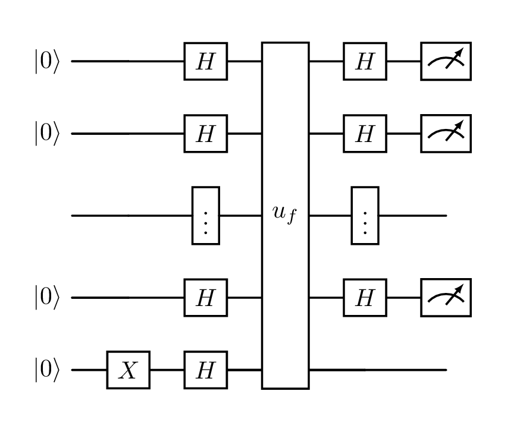

I have a problem, which very well may be simply due to my old messy LaTeX installation, but I didn't want to reinstall everything on my laptop, so see below...

That problem is that I like to use the LaTeX editor [Texifier](https://www.texifier.com/), which has a lovely speedy "live" typesetter.
However, it doesn't seem to play well with a library called [quantikz](https://mirrors.ibiblio.org/CTAN/graphics/pgf/contrib/quantikz/quantikz.pdf) which I use to generate pretty drawings of quantum circuits, like this one of the [Deutsch-Josza algorithm](https://en.wikipedia.org/wiki/Deutsch%E2%80%93Jozsa_algorithm):

{.img-w-30}

Previously, I just used an external non-"live" typesetter for my quantum notes, which was fine because that was a small amount of my classes.
But I've just started an [MSc in Quantum Computer Science at UvA](https://www.uva.nl/shared-content/programmas/en/masters/quantum-computer-science/quantum-computer-science.html), so now all my courses are quantum!

So I've built a very over-engineered solution, which packages up a LaTeX installation with the quantikz library into a Docker container, accepts a `.tex` file containing just a quantikz diagram as input, puts that into a barebones document template, and generates a PNG of the resulting quantikz circuit..!

> [LaTeX](https://www.latex-project.org/) is a type-setting system, which lets you write complex documents as code. It is especially useful (in my opinion) for laying out mathematical formulas neatly. [Docker](https://www.docker.com/) is a tool which allows you to wrap up (virtually) any command line code/tools into a container which can then be run on Mac/Windows/Linux "easily".

### Size

The resulting docker image is 732.61MB, which is admittedly enourmous, but it's much smaller than it would have been if I had used the [full base TeX Live Docker image](https://hub.docker.com/layers/texlive/texlive/latest/images/sha256-0911e3d2c81e125e0d733e14ef18a12b2317b866cc1da326003d81bb117c7a03) which weighs in at 2.31GB!

Instead I used the "medium" installation, which I believe is just the core LaTeX software, with none of the standard packages one expects. The implications of this are that I have then had to specifically install any packages I need on top.

I identified the very tiny subset of LaTeX packages that I needed specifically for this use case; essentially the barest set that can compile a `standalone` LaTeX document, plus [quantikz](https://mirrors.ibiblio.org/CTAN/graphics/pgf/contrib/quantikz/quantikz.pdf) for the diagrams themself, and [braket](https://ctan.org/pkg/braket?lang=en) which allows you to easily write quantum states.

If I, or anyone else, needs more than this, I'll need to update the project.

### AI usage

I am very hesitant about AI usage but I feel that this project was a perfect use case as:
- The project is very small/the development time is short lived (I basically finished it in about 3h), so there are few, if any, potential for messes to be created by me not carefully considering the output the AI gives me
- The types of output it is producing is not code per se, but more configuration files/domain specific languages; namely Dockerfiles, LaTeX, and bash commands. bash code is the closest thing to an imperative programming language here, and anecdotally in this case was the AI output I reworked the most. The LaTeX and Dockerfile languages are both ones with which I interact much less frequently (so having an AI help me, instead of brute forcing half-remembered syntax, was quite handy), and their narrower use-cases mean that (in relatively simple usages like this) if it works, then it's good code (in my opinion!).

As such, I used GitHub Copilot, both inline and using the chat, running GPT-4.1.
This choice was simply because it was already installed and running in VS code, and already logged into my GitHub account.
A very smooth developer experience..!

### Docker Hub

This is more of a fun milestone for myself than anything salient, but this is my [first image that I have publicly pushed to Docker Hub](https://hub.docker.com/r/adnathanail/qzfr)!

I've been using container registries privately for paid work for a long time, but having a piece of genuinely useful (or at least good-intentioned) open-source code published to Docker Hub feels quite fun!

The building and pushing to Docker Hub is all automated [via a GitHub Action](https://github.com/adnathanail/qzfr/blob/main/.github/workflows/docker-publish.yml) which runs every time I push to the `main` branch.

What this means is that anyone can now write some quantikz code and, so long as they have Docker installed, process it with the following command:

```bash
docker run --rm -v .:/work/data adnathanail/qzfr test1.tex
```

Breaking this down:
- `docker run ... adnathanail/qzfr ...` tells Docker to pull the `adnathanail/qzfr` image from Docker Hub, with the `latest` tag (default tag name), and run it
- `-v .:/work/data` says mount the current directory (`.`) into the container at the path `/work/data` (which is where my code expects to find its input)
- `test1.tex` tells the container which LaTeX file it should process
- `--rm` tells Docker to delete the container after it has finished, so everything is neat and tidy!

### Code

Check out my [code on GitHub](https://github.com/adnathanail/qzfr)!
