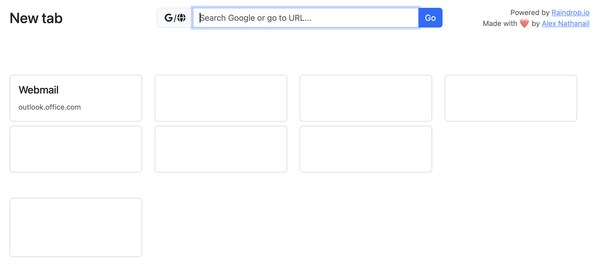
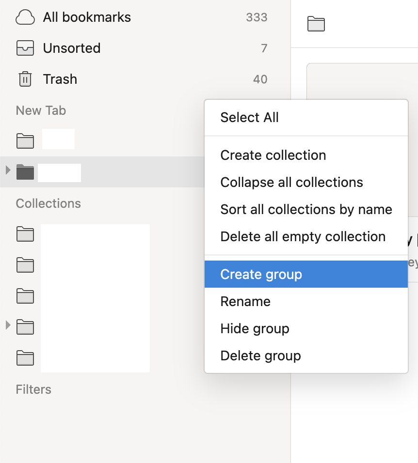
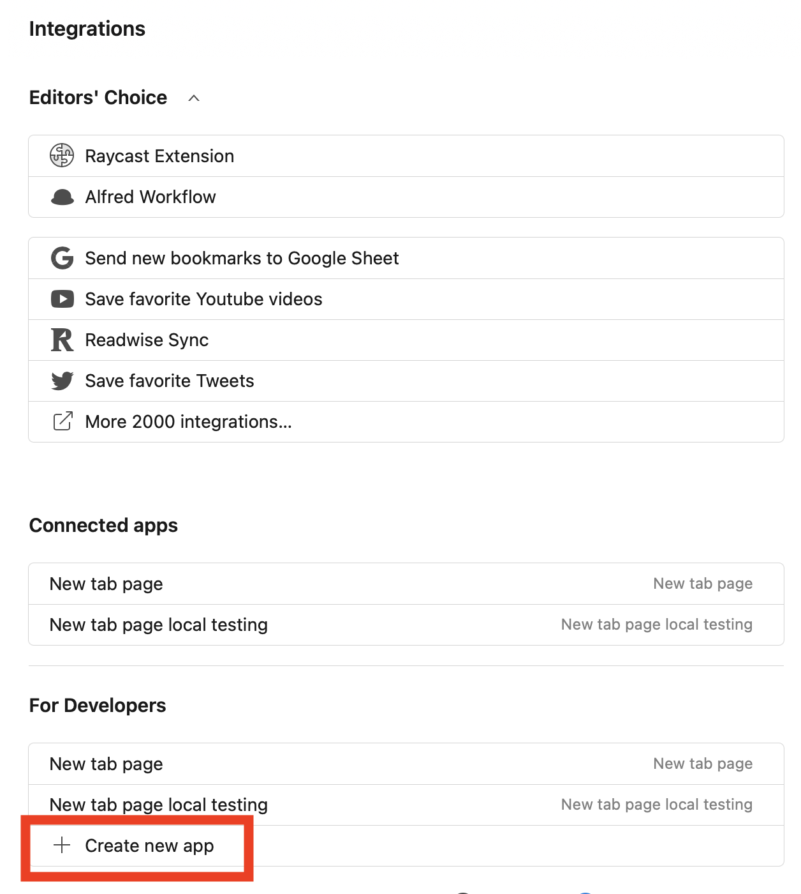
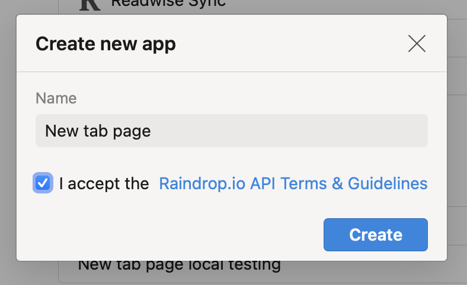
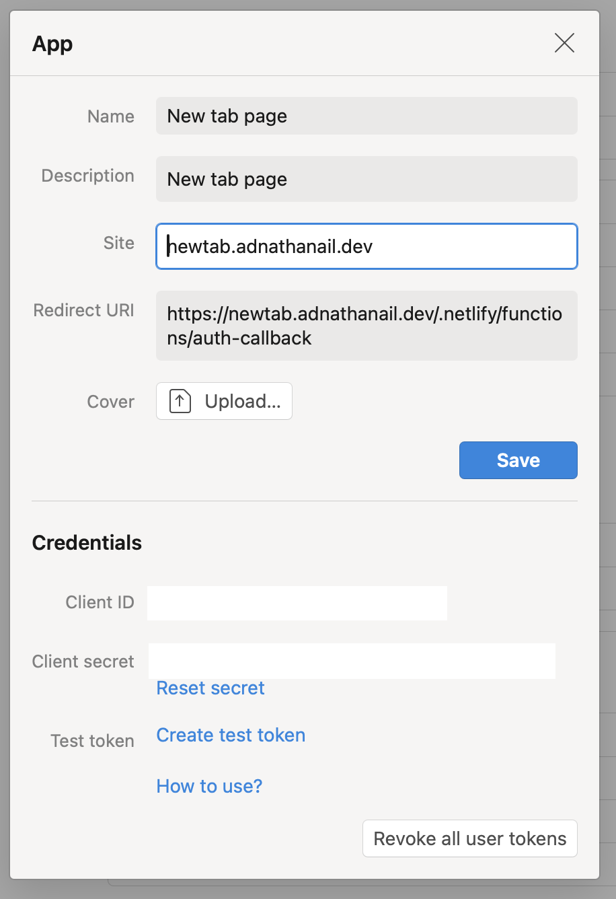

## Links

- [Demo](https://github.com/adnathanail/adnathanail-blog-tina) (requires Raindrop account)
- [Code](https://github.com/adnathanail/raindrop-new-tab-page)

## Background

I've been browser-hopping a lot recently.
I loved Arc for a while, then it got abandoned for their weird AI project.
I spent a while with Edge!?
I've used Orion for the last couple of weeks, which I like, but it seems to lag with 1Password, because they don't have their own extensions, so it uses the Chrome Web Store version, and clearly there's some incompatibility.

Every time I've moved browsers I've had to copy my bookmarks across and it was getting messy and annoying, so I did some research and decided to put them all into [Raindrop](http://raindrop.io).

But, now that my bookmarks weren't integrated into my browser, the New Tab page wasn't useful to me.

So I built a custom New Tab page in raw JS, which pulls in a specific set of bookmarks from my Raindrop account, using their API.

Here's the result (bookmark content hidden for obvious reasons):



You can actually see it [here](https://newtab.adnathanail.dev), but you'll need a Raindrop account to authorise it, and you'll need to create a group (not a collection!) called `New Tab` in your Raindrop, for it to pull from.

## Technical details

I used Claude Code heavily for the UI, and JS boilerplate.

I didn't want to use React or any framework because they're bulky and annoying and I'll have to keep updating them, so the only NPM dependency is `netlify-cli` for locally testing Netlify Functions, and Bootstrap and Font Awesome as JS `<script>` imports.

Raindrop's API uses OAuth for their API, so to keep my credentials seceret I used Netlify functions to run things server-side.
There's a couple which handle the OAuth setup, storing an auth token in a cookie, and then another which uses this token to load my bookmarks on pageload!

I then realised that what I usually do when I load a new tab is just start typing a URL or a Google search (because browsers usually default my cursor into the search bar), so I added an input which is auto-focussed, which tries to detect if what you've entered is a URL.
If it is, it redirects to that URL, otherwise it searches what you entered into Google.

This still wasn't ideal, as the browser URL bar autocompletes previous searches.
So I added a new group to Raindrop, full of all the URLs I commonly visit, which show up as autocomplete options which I can navigate with my keyboard just like the browser search bar!

Lastly, loading the page took maybe a second, which is just annoying for a new tab page experience. So I added a service worker to cache the files, so the page loads instantly after first use!

## How to host it yourself

1. In the Raindrop app, create a group called "New Tab" (or whatever you like, as long as it matches the `RAINDROP_GROUP_NAME` env var)

{.no-center}

2. And another one called "Autocomplete URLs" (or matching `RAINDROP_AUTOCOMPLETE_GROUP_NAME`)

3. Create a Raindrop integration in the [integrations page](https://app.raindrop.io/settings/integrations)

{.img-w-25}
{.img-w-25}
{.img-w-25}

4. Set Site to wherever your app will be hosted, and the Redirect URI to
```html
https://blahblah.com/.netlify/functions/auth-callback
```

5. Save the Client ID and Client secret

6. Clone the [git repo](https://github.com/adnathanail/raindrop-new-tab-page) and deploy it to Netlify

> [!tip]
> I added a deploy to Netlify button (at the top of the README) which should automatically create a copy of the repo for you and start the process of deploying to Netlify, but I haven't tested it so YMMV..!

7. Set the environment variables

```properties
RAINDROP_CLIENT_ID=YOUR_CLIENT_ID
RAINDROP_CLIENT_SECRET=YOUR_CLIENT_SECRET
RAINDROP_REDIRECT_URI=https://blahblah.com/.netlify/functions/auth-callback
RAINDROP_GROUP_NAME=New Tab
RAINDROP_AUTOCOMPLETE_GROUP_NAME=Autocomplete URLs
```

> [!tip] 
> You can change the name of the groups it pulls from with the `RAINDROP_GROUP_NAME` and `RAINDROP_AUTOCOMPLETE_GROUP_NAME` variables if you like

8. Then visit the page, login with Raindrop, and it should pull through your bookmarks from your `New Tab` group, split out by folder!
