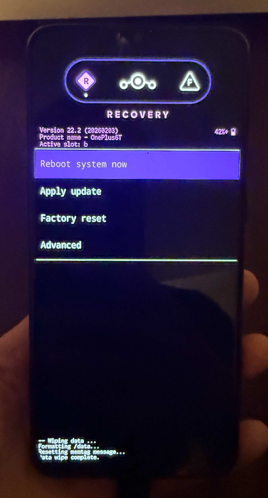
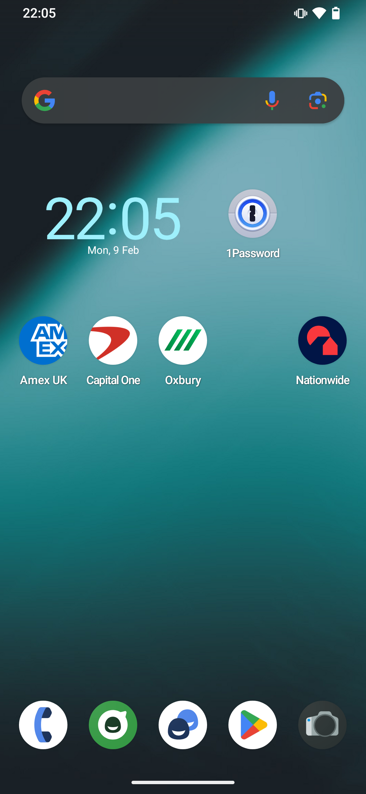
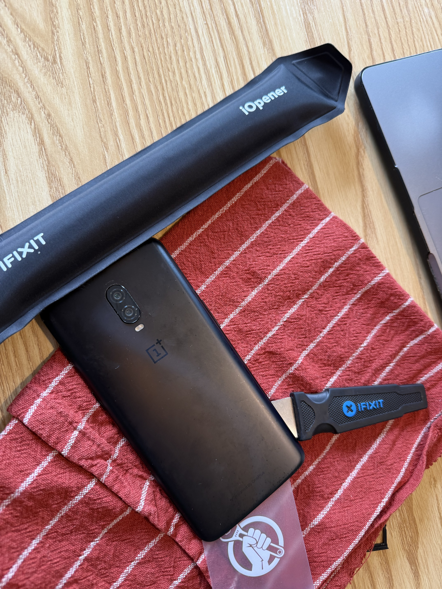
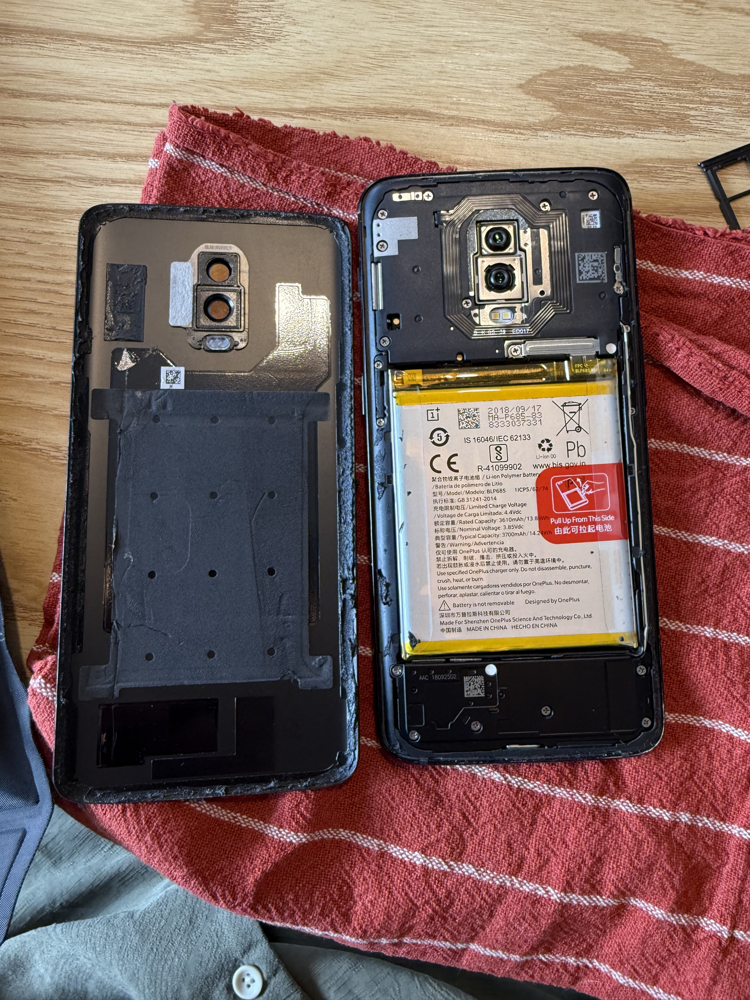
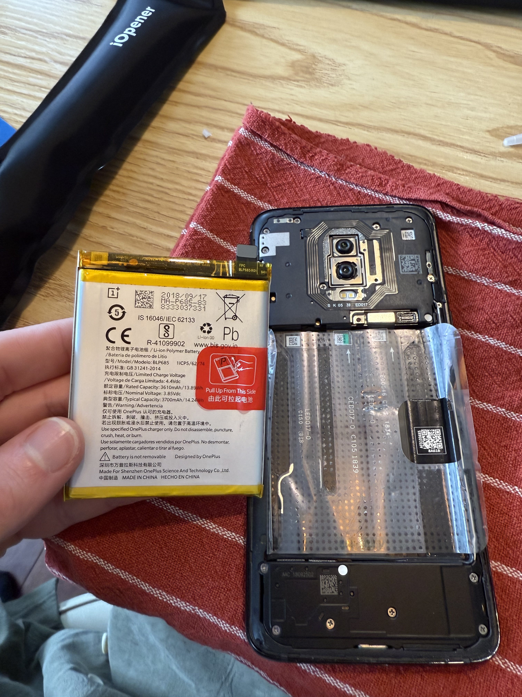
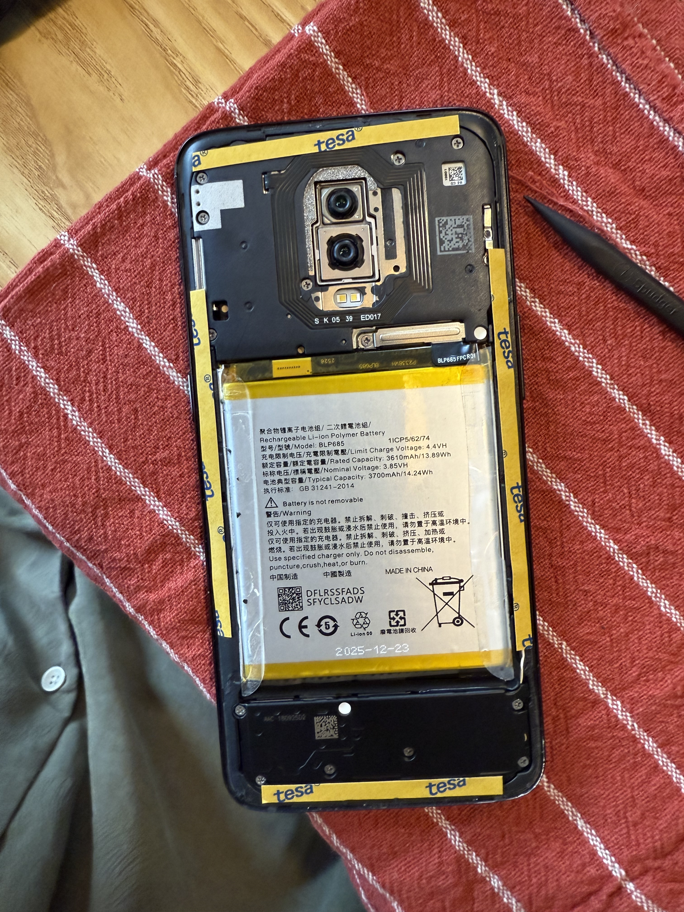
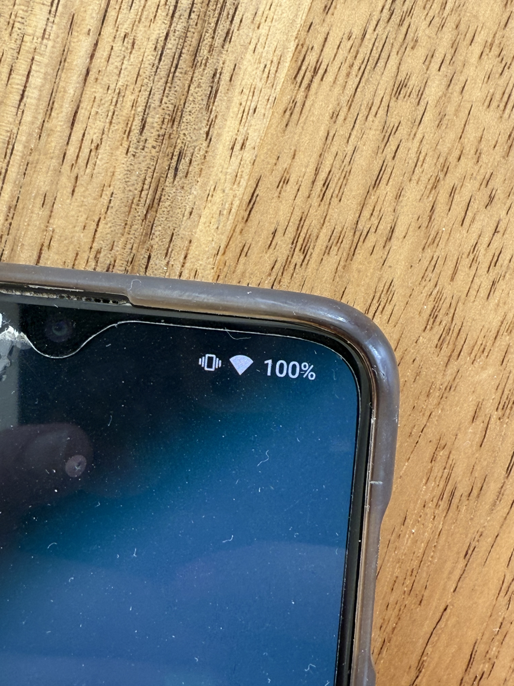

## I hate region locks and banking apps

I recently moved to the Netherlands.
This is the first time I've lived for any extended period of time outside of the UK, and hence the first time I've really had to deal with App Store region locks.

When I signed up for my Dutch bank account, I realised I couldn't get the app in the UK app store.
So I figured out how to change the region; I had to cancel some App Store subscriptions, and re-sign up in the Netherlands app store; and I thought nothing of it.

Several months later one of my (UK) banking apps complained that it was out of date, and wouldn't let me log in.
When I tried to manually update it in the App Store, I realised that it wasn't available.
Basically every other app that I use is available globally, but banking apps really seem to only want to be available in the region that they are for.
This is understandable, compliance blah blah.

So I dug out my old OnePlus 6T, which was on the UK Google Play store, to get the banking apps on there.
Alas, it was running Android 11, which was too old for any of these apps.

_Enter [LineageOS](https://lineageos.org)_

## What is LineageOS?

Android is an open-source project, meaning that anyone can fork it and produce their own version.
Most Android phone vendors maintain their own private forks of Android, specifically for their own devices, providing custom drivers, or bloaty apps that no-one really wants.

LineageOS is an (open-source!) Android distribution, with minimal apps (no bloatware), extra security (not 100% what this entails but it sounds good), and, most importantly for me, they provide Android updates for much longer than original device manufacturers!

The latest available version of OnePlus' Android distribution (OxygenOS) for the OnePlus 6T (released October 2018) is based on Android 11 (released September 2020).
Version 22 of LineageOS is based on Android 15 (released October 2024), and they provide builds for the OnePlus 6T a full 6 years after its initial release, which is 3 times as long as the OEM!

LineageOS 23, based on Android 16, is in active development, with unofficial ROMs for the OnePlus 6T already available, so the end is not even in sight for this almost 7.5yo phone!

## How to install LineageOS

The guides provided on the LineageOS website are excellent.

Each supported device has its [own guide](https://wiki.lineageos.org/devices/), for example [this one for the OnePlus 6T](https://wiki.lineageos.org/devices/fajita/variant1/).
They list all the specs for the phone, provide individual builds for each supported device, and even include instructions for building from source, if you really want to.

I had one sticky moment at the start of step 4: after unlocking the bootloader and shutting down, I tried starting up into the bootloader to continue the process and nothing happened.

The phone was just black, no noise, no lights, no vibrations. I tried every combination of holding power and volume buttons for various lengths of time.
Eventually I decided to take a break, left it charging from the wall, and waited \~30 minutes or so.
And, through the magic of patience, it happily loaded the bootloader screen.

{.no-center}

> [!note]
> This is not the bootloader, this is the LineageOS recovery screen, I just think it looks cool

Step 7 "Installing Add-Ons" is optional, but, if you want your device to be able to download apps from the Play Store you need to do it.

## Did it work?

Yes!

{.no-center}

I now have a device which can access UK apps again.

And, what's more, it's very functional.
The phone is performing much more smoothly than the stock OS.

[LineageOS](https://lineageos.org) has solved my problem, and breathed new life into an otherwise relatively dead piece of tech!

## Addendum (1 month later): Battery replacement

The OS runs great, I have my apps, but I only look at the phone every week or so.
And usually within that week it has discharged to almost 0%, and leaving it plugged in constantly seems like a bad idea.
So I wondered if maybe a battery replacement would help...

Luckily the wonderful folks over at [iFixit](https://www.ifixit.com) publish an enourmous range of guides, and sell replacement parts, for an enourmous range of devices.
Like this one for [replacing the battery on a OnePlus 6T](https://www.ifixit.com/Guide/OnePlus+6T+Battery+Replacement/127951).
The new battery cost me €25!

So I melted the screen adhesive with an [iOpener](https://www.ifixit.com/en-eu/products/iopener) (not sponsored), pried off the back cover, popped out the battery, popped the new one in, put on some new adhesive patches, and put it all back together!

{.img-w-25}
{.img-w-25}
{.img-w-25}
{.img-w-25}

I think there was one screw.
The only really difficult parts are feeling like you're going to break it.
Feeling like you're going to break something whilst blindly jimmying the back off.
Feeling like you're going to cause a fire trying to pull out the battery.
Feeling like you haven't connected the new battery correctly.

Luckily for me, in all cases, I was fine.

And the results?

Well it's been 4 days without touching it, and it's still on 100%!!

{.no-center}
