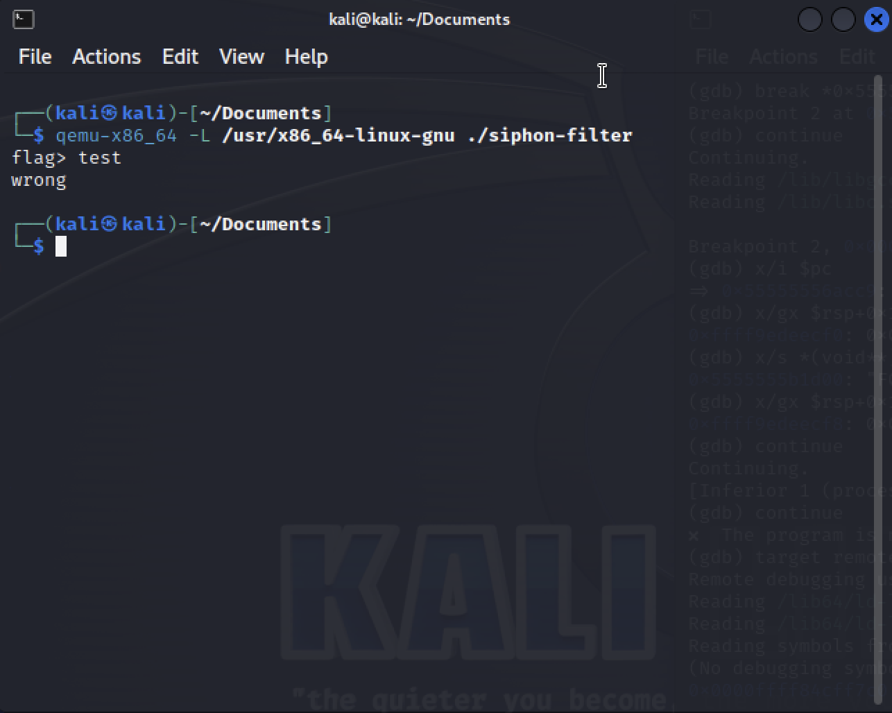
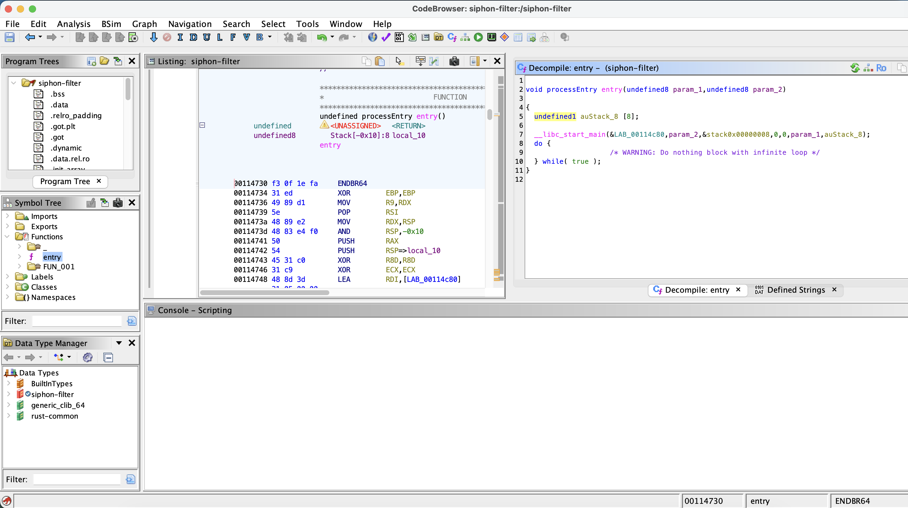
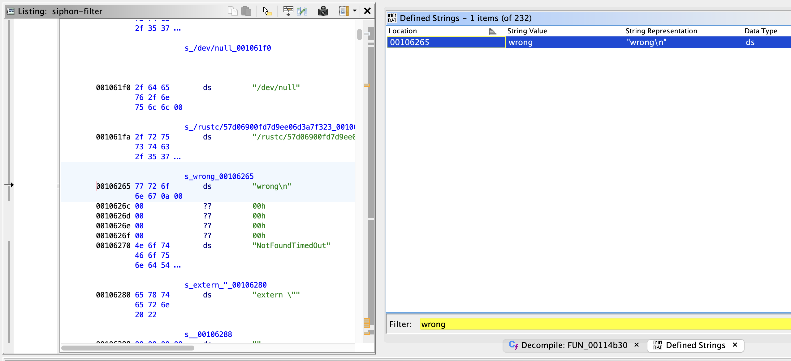
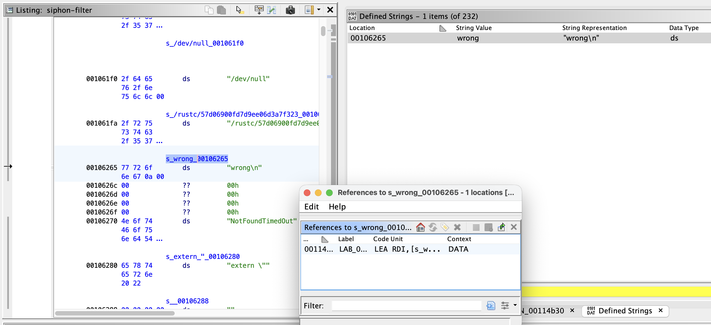
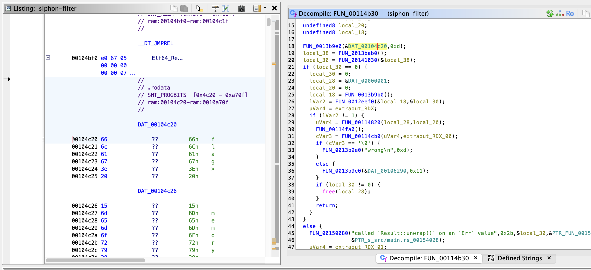
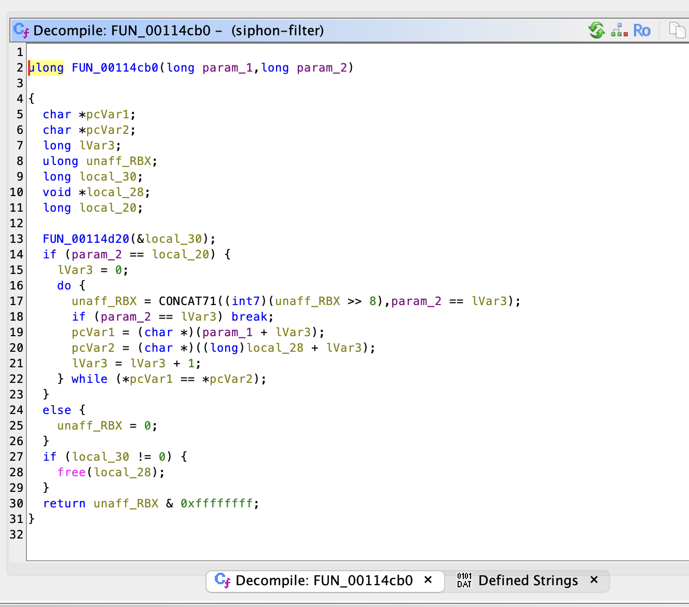
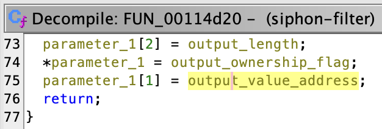
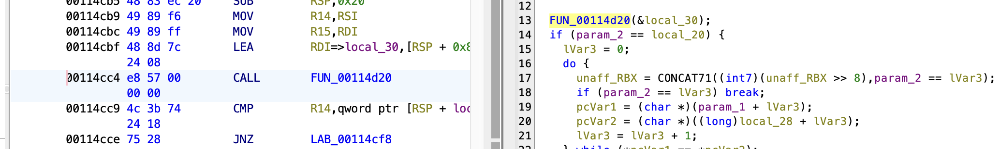
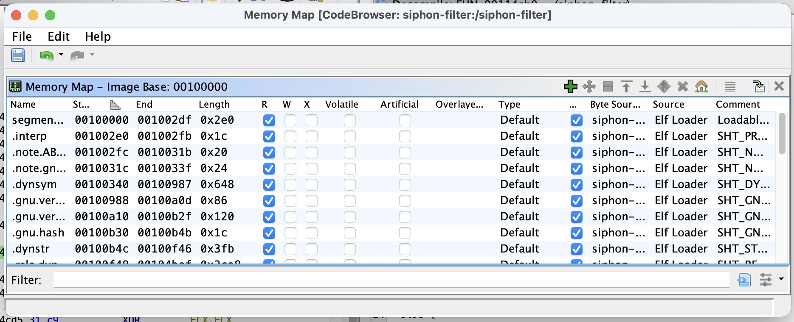
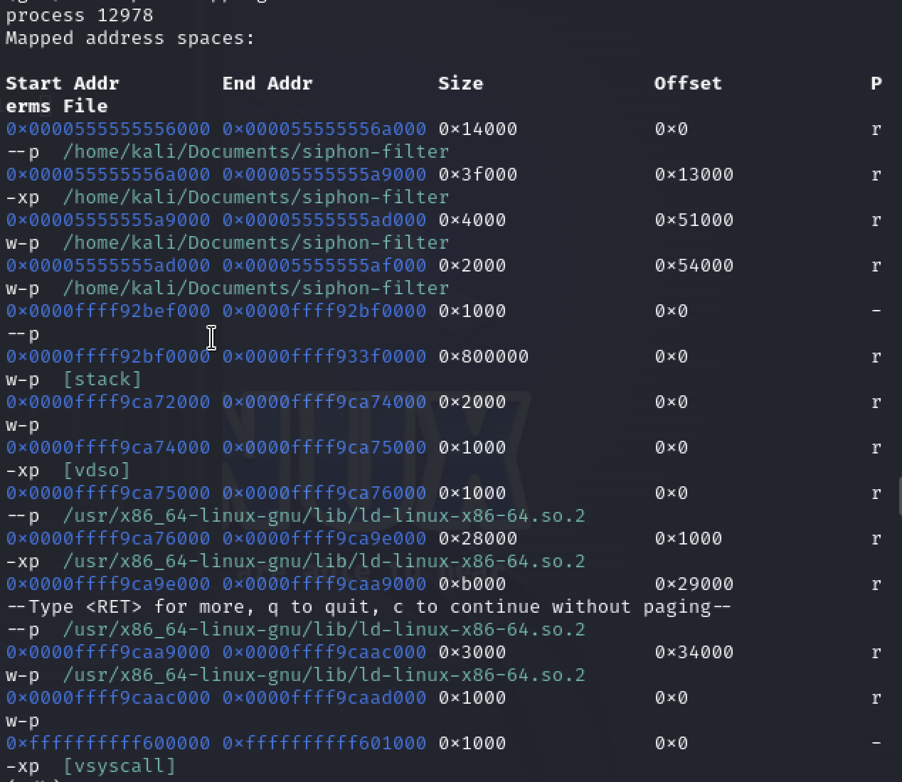

I've just come back from [EMF camp 2026](https://emfcamp.org)!

> [!note]
> Check out my [post about shaders](/posts/_2022-06-12-shaders) from EMF camp 2022

One fun thing they often have is a [capture the flag](https://ctf101.org/intro/what-is-a-ctf/) (CTF), which can take many formats but the basic shape is that you complete a series of challenges which each result in a string (the 'flag') that can be automatically checked.
This year I tried a software reverse engineering CTF, involving decompiling binaries to find flags.
I have zero experience with this, and it was apparently designed to be challenging for industry professionals, but I managed to get one and I thought I'd write it up so I could understand it better myself!

The main tool for these types of tasks is called [Ghidra](https://github.com/nationalsecurityagency/ghidra), developed by the NSA, which allows you to explore a binary, and even decompile it to C to make it easier to work with.
I also needed access to Linux, so I set up a Kali Linux VM on my MacBook using [UTM](https://mac.getutm.app).


<details>
<summary>Software installation</summary>

You can install Ghidra using their instructions, and you can download UTM from the Mac App store, or use any other method for accessing a Linux terminal.

On my laptop I use [nix-darwin](https://github.com/nix-darwin/nix-darwin) to manage my environment, so my install just required adding these lines to [my config](https://github.com/adnathanail/ALix):

```nix
home.packages = [
    ...
    pkgs.ghidra
]
...
homebrew = {
    ...
    casks = [ ... "utm" ];
}
```
</details>

To start, I wanted to inspect the binary.
It's a 351KB file called `siphon-filter`.
I'm not sure if it's rude to post other people's CTF files on the internet, so I won't do, but if you're curious I think it would be ok for me to send it privately (DM me on LinkedIn or Instagram).

I used the `file` command to get some info:

```bash
> file siphon-filter
siphon-filter: ELF 64-bit LSB pie executable, x86-64, version 1 (SYSV), dynamically linked, interpreter /lib64/ld-linux-x86-64.so.2, for GNU/Linux 3.2.0, BuildID[sha1]=9b262be8e974bcbc465545c2d3fae13e144b05fd, stripped
```

From this we can see it is an executable, designed to run on Linux on x86 processors.
My laptop runs an Apple M chip, so not only will I need to emulate Linux, I will also need to emulate/transpile the x86 instruction set using [qemu](https://www.qemu.org) inside the Kali VM.

<details>
<summary>UTM and Kali Linux setup</summary>

Again, any method of accessing a Linux terminal is fine, this is just what I did.

1. Download the [Kali Linux UTM image](https://mac.getutm.app/gallery/kali-2023)
2. Open it in UTM
3. Add a shared folder with the `siphon-filter` file

The version of Kali in the UTM gallery is a bit old, so I had to do some weird stuff to get everything working

```bash
# Update the Kali keyring and update the package registry
sudo wget https://archive.kali.org/archive-keyring.gpg -O /usr/share/keyrings/kali-archive-keyring.gpg
sudo apt update

# Fix an issue with overwriting libraries on install
sudo dpkg --configure -a
sudo apt -f install -o Dpkg::Options::="--force-overwrite"

# Install some libraries
sudo apt install libc6-amd64-cross
sudo apt install libgcc-s1-amd64-cross

# Try running siphon-filter with qemu (qemu should offer to install itself)
qemu-x86_64 -L /usr/x86_64-linux-gnu ./siphon-filter
```
</details>

When you run the binary you should see something like this:



Seems simple enough!
It asks us for a flag, and tells us if it's right.
We could just brute force this, but that could take a while...
Let's try decompiling it with Ghidra!

## Static analysis with Ghidra

<details>
<summary>Opening a binary in Ghidra</summary>

1. `File > New Project`
    1. `Non-Shared Project`
2. `File > Import File`
    1. Select the file (`siphon-filter`)
3. Right click `siphon-filter`
    1. `Open With > CodeBrowser`
    2. If offered to `Analyze`, click `Yes` then `Analyze`
</details>

In the middle pane you will see the raw assembly code.
The strings of 8 numbers (e.g. `00114734`) is the address of that line of the program, the pairs of characters (e.g. `31 ed`) are machine code represented as hexadecimal, and the rest of the line like `XOR EBP,EBP` is the assembly instruction corresponding to that line of machine code.
In the right hand panel is C code, and if you click parts of that code, it will take you to the corresponding line in assembly.



It's important to highlight at this point that 'decompilation' doesn't recover the exact code that was originally written, it is a best guess at code that could have produced the binary.
Specifically, this means that we have no variable or function names, so everything is quite hard to read.
The aim of the human aspect of decompiling is then to go through and rename everything as you figure out what it does.

One thing we can try to use to navigate our way around this mislabelled mess is strings.
Whilst it's possible to deliberately obfuscate them, normal compiled programs will retain them.

We saw the program prints `"wrong"`, let's see whether that string, or more precisely the binary representation of that string, is present.

- In Ghidra do `Window > Defined Strings`
    1. Search for `wrong`
    2. Double click it and you'll be taken to the assembly that defines it



- Right click the symbol name (something like `s_wrong_00106265`) in the Listing
    1. Click `References > Show references to s_wrong_00106265`
    2. In the popup double click on the only reference that appears
    3. You'll be taken to the function that uses this string in the Listing



- Do `Window > Decompile: FUN_00114b30`
    1. In the right side you'll see C code for the function
    2. If you double click the argument to the first function call, you'll see it is the string `"flag >"`



This is probably a print function!
The same function is also used on line 33 to print our `"wrong!"` string.
Wrong is printed depending on the output of `FUN_00114cb0`.



Looking at `FUN_00114cb0` it seems to be a byte-by-byte string comparison where `param_1` is a string, and `param_2` is the length of that string.
But the first comparison on line 14 is with `local_20`, a seemingly uninitialised value.
The only thing happening beforehand is a call to `FUN_00114d20`, which is only passed `local_30`?
Maybe looking inside that function will shed some light.



`FUN_00114d20` is passed the address for `local_30`, a `long`; but inside, it seems to be being treated like an array?

If we look back at `FUN_00114cb0` we see `local_28` and `local_20` assigned straight after `local_30`, so they should be at adjacent memory locations.
If we have a memory address, and we want to access something next to it, we can just pretend that first address is an array.
This is what `FUN_00114d20` is doing with the `[1]` and `[2]`.

So, even though we only passed in `local_30`, `local_20` and `local_28` are also being modified!
This is the shape of a Rust return-value-by-pointer: `(capacity_or_owned_flag, pointer, length)`.
This means that the comparison on line 14 of `FUN_00114cb0` is comparing the length of whatever is returned from `FUN_00114d20`, with `param_2`.
It's a safe bet then that `param_2` is the length of the guessed value, and `FUN_00114d20` is returning the correct value.
So we want the second item returned by `FUN_00114d20`: `local_28`, a memory address hopefully pointing to a string containing our flag!

We could try interpreting `FUN_00114d20` by hand, or even copying some of the C code into a fresh project and running it ourselves.
Instead, I ran the code using a debugger called [gdb](https://wiki.osdev.org/GDB), set a breakpoint just after the call to `FUN_00114d20`, and inspected the memory address containing what we hope is our flag.

## Reading program memory using gdb

Memory moves very quickly, an address used for one job could be freed and used for another a few lines later.
So we need to know exactly when to look at our flag, in order to set a breakpoint.
A sensible place would seem to be just after the function call.

If we select the line with the function call, the corresponding assembly is selected.
The address of the line after that function call is `00114cc9`, so we want to break there and view the value of `local_28`.



But we're not quite ready, because addresses are relative to the base address of whatever is working with them.
We need to know what base address Ghidra is using.

- Go to `Window > Memory Map`, and look at the first address



For me it was `0x00100000`, so the relative address of the line after the function call is `0x00114cc9 - 0x00100000 = 0x14cc9`.

Back in Kali we now want to run the binary with the debugger.

```bash
# Terminal 1
qemu-x86_64 -L /usr/x86_64-linux-gnu -g 1234 ./siphon-filter
```

This doesn't run the program yet, it's waiting for a debugger to connect to it and tell it what to do.

In a separate terminal we want to connect to the debugger, and list the mapped memory regions, to find what the base memory address being used there is.

```bash
# Terminal 2
gdb-multiarch ./siphon-filter
(gdb) set architecture i386:x86-64
(gdb) target remote :1234
(gdb) info proc mappings
```



We can see the first memory address is `0000555555556000`, so the address we want to break at is `0x0000555555556000 + 0x14cc9 = 0x000055555556acc9`.

We can ask `gdb` to break at that point, and then keep running the program until it gets to that point.

```bash
# Terminal 2
(gdb) break *0x000055555556acc9
(gdb) continue
```

In the first terminal, the program should have continued running and asked for a flag.

- Enter anything you like

It should hang without saying `wrong!`, because it hit our breakpoint.
We then want to check we're in the right place, by checking which command is about to be run next.

```bash
(gdb) x/i $pc
0x55555556acc9:      cmp     0x18(%rsp), %r14
```

If we compare this to the line in Ghidra, `CMP R14,qword ptr [RSP + local_20]`, this looks pretty similar!

<details>
<summary>What does that instruction mean?</summary>

`CMP` is the assembly command to compare 2 values.

`r14` is a register, a very small piece of memory, of which there are only a very small number.
In C programs, function arguments are often stored in registers, so this is likely our guess length which was passed to the function.

`rsp` is the stack pointer, which keeps track of the top of a 'stack' of values of memory.
Each function call 'pushes' its local variables to the stack for it to use, and then at the end of the function they can easily be 'popped' off.
It's a neat way to automatically allocate and free memory without manual effort, in contrast to the 'heap' where larger things like arrays have to live.
The stack pointer points to the _bottom_ of the memory region currently in use, so all our local variables will be living above it.

The 3 element struct we mentioned earlier was put 8 bytes above the stack pointer.
The first comparison done is on the length of the returned value, which is the 3rd element of the struct, 16 bytes after the start of the struct.
So we want the address 24 bytes after the stack pointer, which is `0x18` in Hexadecimal, hence why the `cmp` instruction is comparing `0x18(%rsp)`
</details>

> [!tip]
> [GDB x command reference](https://visualgdb.com/gdbreference/commands/x)

We can ask the debugger to read this value:

```bash
# Read the memory location 24 bytes above the stack pointer, and interpret it as a 64-bit decimal value
(gdb) x/gd $rsp+0x18
0xffff7bdeecf8: 41
```

So the flag is 41 bytes long.

To view the value returned, we want the second element of the struct, which will be 16 bytes after the stack pointer, or `0x10` in hexadecimal.

```bash
# Read the memory location 16 bytes above the stack pointer, and interpret it as an address
(gdb) x/a $rsp+0x10
0xffff7bdeecf0: 0x5555555b1d00
```

This is an address, so to view its value we need to dereference the pointer
```bash
# Read the memory location pointed to by the address stored 16 bytes above the stack pointer, and interpret it as a string
(gdb) x/s *(void**)($rsp+0x10)
0x5555555b1d00: "F0{THEWHALEGOBBLEDADEVILEDEGGBUTGOTDEATH}\342\001"
```

We know our string should have 41 characters, which if you count carefully, means we ignore everything after the `}` and our flag is

```
F0{THEWHALEGOBBLEDADEVILEDEGGBUTGOTDEATH}
```

What fun!