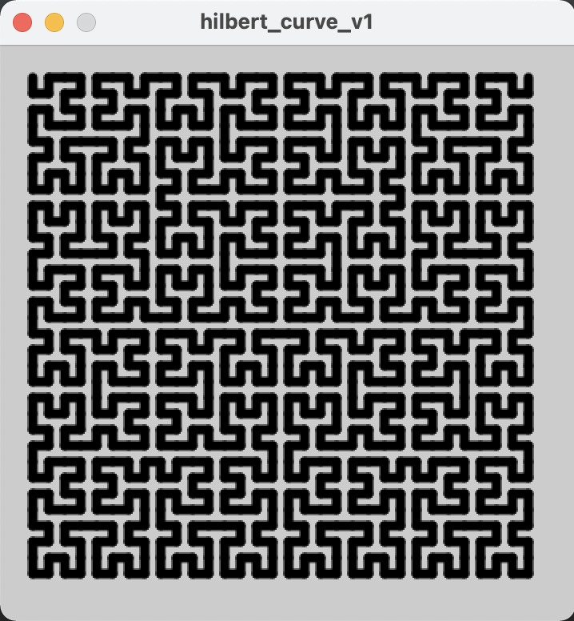
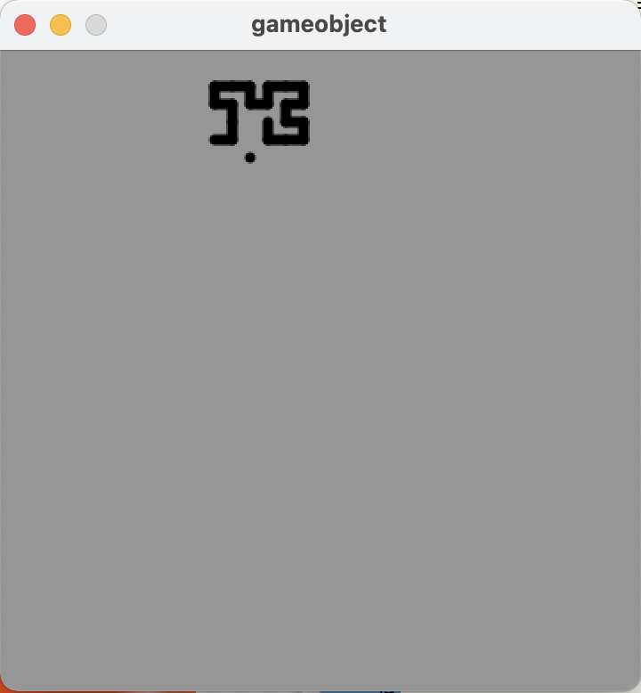
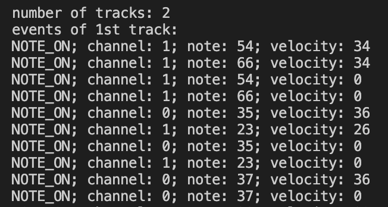
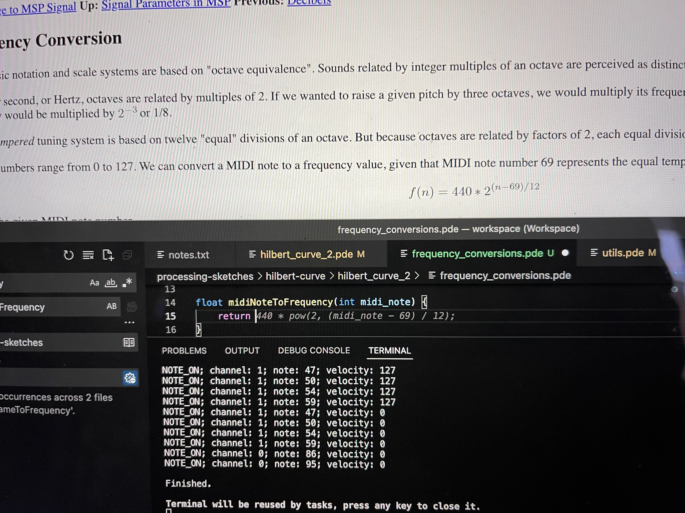

> [!note]
> This was originally 3 posts but they're not that important so I didn't want them to clutter this blog

# Part 1

I heard about Hilbert curves a while ago and thought they sounded fun!

I had a play, trying to understand the algorithm from Wikipedia, but I got tired of that pretty quickly and stumbled across [this blog post](http://blog.marcinchwedczuk.pl/iterative-algorithm-for-drawing-hilbert-curve).

It gave me a very neat iterative algorithm that could find the coordinates for a single point on the "curve".

The blog post was written in JavaScript.
I tried converting it to Python, but the support for Python in Processing is rather lacking, so I decided to use Java even though I am less familiar with it.
This actually made it easy to convert the code in the blog post, as the syntax is quite similar, but it's going to make further development of this project a bit more challenging.

My code has 3 parameters that you can tweak, which affect the number of iterations of the curve (`log_2(N)`), the size of the curve, and the amount of space around the edges:

```java
int N = 32;
int SCALE_FACTOR = 10;
int PADDING = 2;
```

The main algorithm looks like this:

```processing
int[] hindex2xy(int hindex, int N) {
  int[] tmp = POSITIONS[last2bits(hindex)];

  hindex = hindex >> 2;

  int x = tmp[0];
  int y = tmp[1];

  for (var n = 4; n <= N; n*= 2) {
    var n2 = n / 2;

    switch(last2bits(hindex)) {
      case 0: /* case A: left-bottom */
            int tmp2 = x; x = y; y = tmp2;
            break;

        case 1: /* case B: left-upper */
            y = y + n2;
            break;

        case 2: /* case C: right-upper */
            x = x + n2;
            y = y + n2;
            break;

        case 3: /* case D: right-bottom */
            int tmp3 = y;
            y = (n2-1) - x;
            x = (n2-1) - tmp3;
            x = x + n2;
            break;
    }

    hindex = hindex >> 2;
  }

  int[] out = {x, y};
  return out;
}
```

And the rest of the code is just Processing stuff, to take my list of points and draw them out into this beautiful pattern:



Check out the [source code on my GitHub](https://github.com/adnathanail/hilbert-curve)!

# Part 2

My original concept for this Hilbert curve experiment was to have a point move along a Hilbert curve, with different rows and columns representing different note values.
It would maybe have 12 columns, for the 12 notes, or 8 for a given scale, and I was going to see what kind of music a Hilbert curve could generate on its own.

I may still do that, but I realised that what I'd made reminded me a lot of the classic game "snake", and a new idea came to me. The curve would essentially serve as an interesting path for a snake to follow, and then every time it ate a piece of food the note would change. I can easily position the food at correct spacings on the path, so that it can actually play music.



This was going to make the code a lot larger, so I decided to start splitting up my code into classes to represent the snake and its food, as well as creating somewhere to stick all the utility functions.

The `GameObject` class is the base for both `Snake` and `SnakeFood`, and just holds a `hindex` (an integer representing a position along a Hilbert curve, counted from the first point in the top left) and functions that can turn that into coordinates.

```java
class GameObject {
    int hindex;

    GameObject (int in_hindex) {
        this.hindex = in_hindex;
    }

    int get_location(int coord) {
        return (points[this.hindex][coord] + PADDING) * SCALE_FACTOR;
    }
    int get_x_location() {
        return get_location(0);
    }
    int get_y_location() {
        return get_location(1);
    }
}
```

The `Snake` class builds on this, adding a `length` attribute and a `draw()` method:

```java
class Snake extends GameObject {
    int length;

    Snake (int in_hindex) {
        super(in_hindex);
        this.length = 1;
    }

    void draw() {
        int end_point = min(hindex, (N*N) - 1);
        for (int i = end_point - this.length; i < end_point; i++) {
            line(
                cached_h2x(i, 0),
                cached_h2x(i, 1),
                cached_h2x(i+1, 0),
                cached_h2x(i+1, 1)
            );
        }
    }
}
```

And `SnakeFood` brings in some of the music, taking a `note` (A-G#) and an `octave` (0-8), which are converted to a frequency using a handy helper function.
There is also a boolean `hidden` which is used when there are no more food to be eaten, so I just hide the last one for aesthetics sake.

```java
class SnakeFood extends GameObject {
    float frequency;
    boolean hidden;

    SnakeFood (String note, int octave, int in_hindex) {
        super(in_hindex);
        this.frequency = getFrequency(note, octave);
        this.hidden = false;
    }

    void draw() {
        if (!hidden) {
            point(
                get_x_location(),
                get_y_location()
            );
        }
    }
}
```

The last class is `Note` which is really just used as an intermediary between me and `SnakeFood`, as it defines an easier interface to enter music in, allowing a `duration` as opposed to a `hindex`.
Then in the `setup` we convert one to the other.

```java
class Note {
    String note;
    int octave;
    int duration;

    Note (String in_note, int in_octave, int in_duration) {
        this.note = in_note;
        this.octave = in_octave;
        this.duration = in_duration;
    }
}
```

The `last2bits` and `hindex2xy` functions remain relatively unchanged, but refactored into the new `utils.pde` file. There is also a helper for getting the cached results:

```java
int cached_h2x(int hindex, int coord) {
    return (points[hindex][coord] + PADDING) * SCALE_FACTOR;
}
```

Then there is a function to convert a note name and an octave to a frequency that the Processing `sound` library can play:

```java
float getFrequency(String note, int octave) {
    float keyNumber = NOTES.indexOf(note);

    if (keyNumber < 3) {
        keyNumber = keyNumber + 12 + ((octave - 1) * 12) + 1;
    } else {
        keyNumber = keyNumber + ((octave - 1) * 12) + 1;
    }

    // Return frequency of note
    return 440 * pow(2, (keyNumber - 49) / 12);
};
```

Now that everything is nicely split up, the main code file is much neater, and easier to work with.
You can find the full code listing [here](https://github.com/adnathanail/hilbert-curve/tree/master/hilbert_curve_2).

All that was left to do was encode a song in my `Note` format, for which I chose [this copy of In the Hall of the Mountain King](https://makingmusicfun.net/pdf/sheet_music/in-the-hall-of-the-mountain-king.pdf).

```java
Note[] SONG = {
    new Note("D", 3, 2), new Note("E", 3, 2), new Note("F", 3, 2), new Note("G", 3, 2),
    new Note("A", 3, 2), new Note("F", 3, 2), new Note("A", 3, 4),

    new Note("G#", 3, 2), new Note("E", 3, 2), new Note("G#", 3, 4),
    new Note("G", 3, 2), new Note("D#", 3, 2), new Note("G", 3, 4),

    new Note("D", 3, 2), new Note("E", 3, 2), new Note("F", 3, 2), new Note("G", 3, 2),
    new Note("A", 3, 2), new Note("F", 3, 2), new Note("A", 3, 2), new Note("D", 4, 2),

    new Note("C", 4, 2), new Note("A", 3, 2), new Note("F", 3, 2), new Note("A", 3, 2),
    new Note("C", 4, 8),
};
```

And now, what you've all been waiting for, a demo:



As you can hear, it just keeps playing the last note forever. It also doesn't look incredible, and it is very laborious to convert music to this format. All this will be improved in part 3!

# Part 3

"Let's read MIDI files," I said. "It'll be easy," I said. "This is the standard musical interchange format, and has been for decades, it must be well-defined and simple to parse," I said.

Firstly, MIDI files are not (as I had assumed) text files, they are binary files, so I am unable to parse them directly. 
Luckily Java has the `javax.sound.midi` library which can do some of the work for me.
Using it wasn't instantly straightforward, but I found [this handy article on the processing forums](https://discourse.processing.org/t/parse-midi-files/14126/2).

I found [a MIDI copy of In The Hall Of The Mountain King](https://bitmidi.com/in-the-hall-of-the-mountain-king-mid) and tested the code on it.



This was a decent start as, with minimal effort from me, I had a list of notes taken from a MIDI file, which could easily be swapped out for basically any song in existence.

> [!note]
> One small note, for some reason the MIDI file I had had a random empty track on it.
> A **track** seems to be a bit of a modern invention on top of the original system of **channels**.
>
> A MIDI file/device/instrument can (normally) only have 16 output channels, as a holdover from when data was being sent down physical 16-wite cables.
> The ability to subdivide things further (e.g. each different drum in a kit having a separate track, but the same channel) can be useful during the editing process.
>
> My understanding is that I should be playing all tracks and all channels simultaneously.

The next thing to do was to try actually playing this, which means I need to convert MIDI `note` values to frequencies.
I found a [handy gist on GitHub](https://gist.github.com/stuartmemo/3766449) which I was ready to convert to Java, but I typed out the function name `midiNoteToFrequency` and GitHub Copilot (which I forgot I had really) did it for me!



Ignoring channels, for now, I removed the `SONG` array and added a line to the loop in the MIDI demo code which would create `SnakeFood` objects, ready to be played.
And here is the finished result!



Hmm, something isn't quite right! 
From the screenshot I can see there are 2 channels (0 and 1) and I am just playing them both at the same time.
Here are the two channels played separately

**Channel 0**



**Channel 1**



Channel 1 sounds a bit odd/boring but it's only a baseline, I'm sure it'll sound fine in context.
Channel 0 is clearly recognizable and highlights my next problem: note duration.
The proper song (as demonstrated in my last post) should have 6 quavers and then a crotchet, however here all notes are being played with the same duration so it just sounds like 7 quavers.

I'll figure this out in part 4!

*Dear reader, part 4 never came..*
