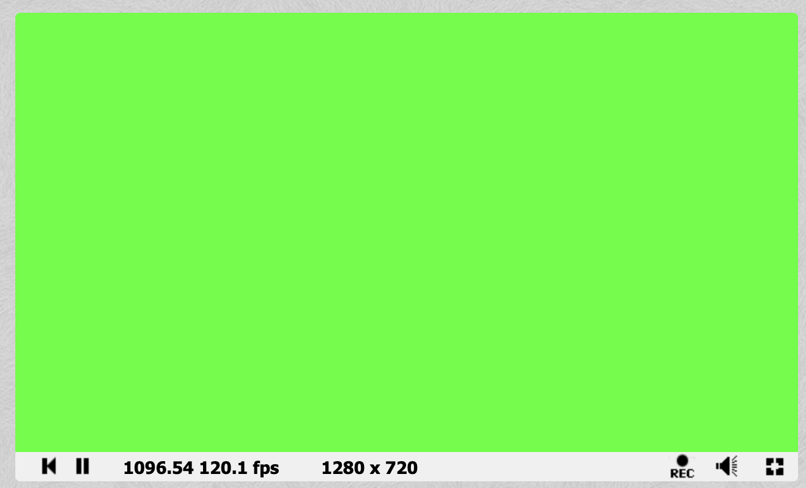
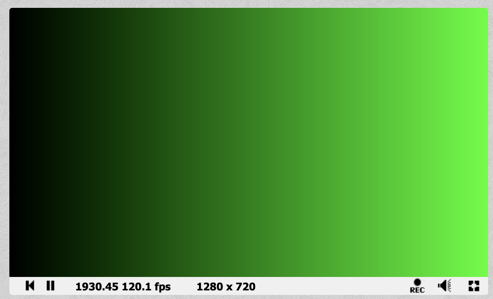
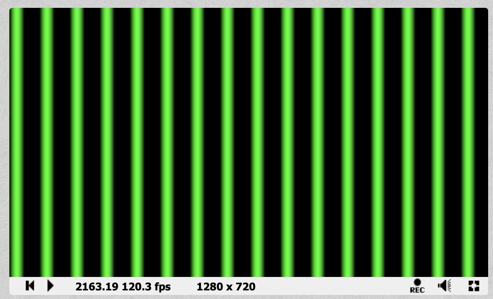
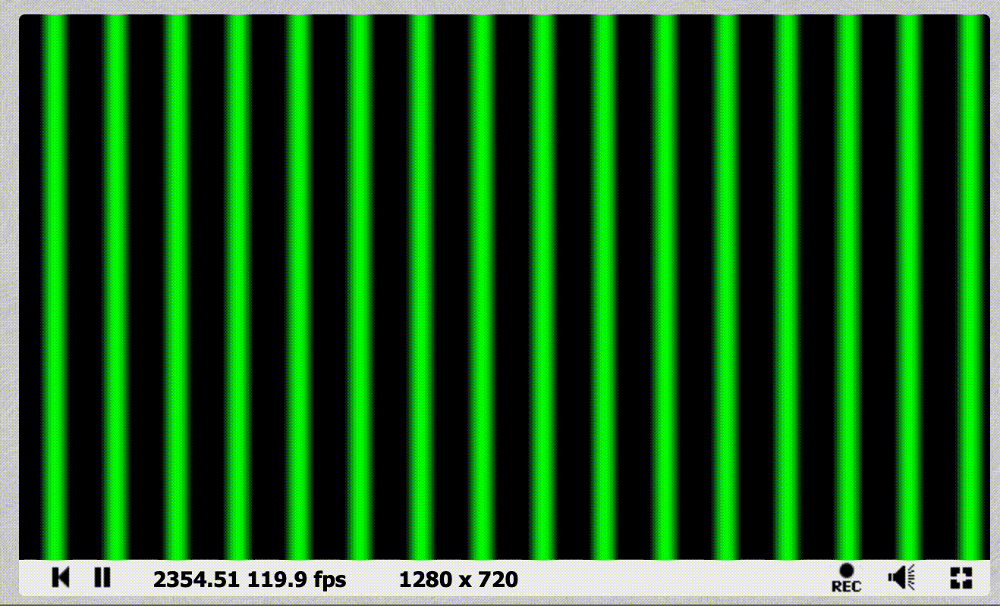
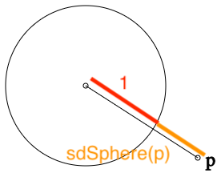
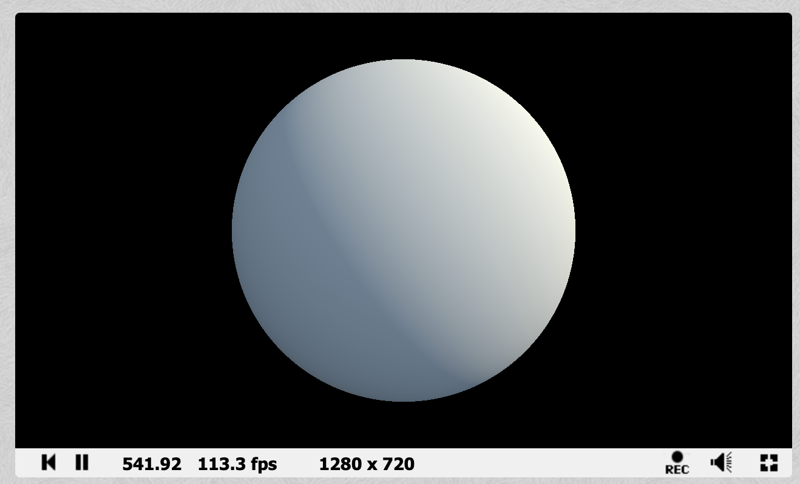

I've just come back from EMF camp 2022 and I went to a workshop about shaders. I thought I would document what I learned, and what I managed to discover from independent research afterwards.

## What is a shader?

A shader is a function that takes pixel coordinates (and some other context data) as input and returns a colour as output. They are passed every possible coordinate on a screen, and the resulting colours are stuck together to form an image.

This may seem like an odd way to generate an image on a screen, but it means that each pixel can be calculated independently, and therefore in parallel. GPUs (Graphics Processing Units) have thousands of processing cores, so an entire screen's worth of pixels can be calculated in one clock cycle.

There is a handy website called [Shadertoy](https://shadertoy.com) which allows you to write and share shaders online in a consistent format.

[This is a demo provided by the person running the workshop](https://www.shadertoy.com/view/sdVczz).

## How to write 2D shaders

### Block of colour

The structure of a shader, at least on Shadertoy, is always like this:

```c
void mainImage( out vec4 fragColor, in vec2 fragCoord )
{
    fragColor = vec4(0, 1, 0, 1);
}
```

You write a function called `mainImage` which takes 2 arguments.

The second argument (typically called `fragCoord` but this is up to you) is a `vec2` which means it is a two element vector (a bit like an array). This vector contains the coordinates of the pixel whose colour you are calculating.

> [!info]
> The first argument may be a bit confusing if you're not used to C-like languages, but this is actually the output (the colour of the pixel). It is a `vec4` which should contain an RGBA value. The reason the output variable is passed as an input is that you can't return vectors as values from functions, you can only return primitive types (integers, booleans, chars etc.).

> [!info]
> You could return a "pointer" which is a number that tells the program where you have stored a vector, or you could do what we see here, which is to simply have the function accept a vector as an argument. We can then edit this vector within the body of the function, and then, when the function finishes, all our changes to the vector will have been stored and whatever code that is calling our shader can receive this output.

In the very short shader I have written above, I don't look at `fragCoord` at all. I simply set `fragColor` to `(0, 1, 0, 1)` for every pixel. That list of numbers represents the colour green, as the first three values code for red, green, and blue (between `0` and `1`) and the last value codes for "alpha" or transparency. For the scope of this blog post, we will leave alpha as `1`.

This produces a lovely green screen!



### Single gradient

Now let's do something that actually takes into account the different pixel coordinates.

```c
void mainImage( out vec4 fragColor, in vec2 fragCoord )
{
    // Normalise coordinates between 0 and 1
    vec2 uv = fragCoord/iResolution.xy;
    // Black to green gradient
    fragColor = vec4(0, uv.x, 0, 1);
}
```

The first thing you'll notice is this new variable `uv`. UV coordinates (or texture coordinates) are a coordinates that have been normalised onto some different coordinate scale than your input. In this case, we normalise the coordinates between `[0, 1]` (meaning the top left of the screen will have coordinates `0,0` and the bottom right will have coordinates `1,1`.

> [!info]
> The name UV comes from the letters commonly used to refer to the axes of a plane, as `x, y, z` are used to refer to points in 3D space

There is more than one way to normalise coordinates, in fact the person running the workshop at EMF chose to normalise between `[-.5, .5]` for `y` and `[-.88, .88]` for `x`. It depends on whatever makes the maths you would like to do easy!

It is then very easy to create a nice gradient by setting the quantity of green to the current `x` value. Hopefully, it is now clearer why we chose to normalise our `x` and `y` values, as the RGB colour outputs have a range of `[0, 1]`.



Try the code for yourself, by pasting it here: [https://www.shadertoy.com/new](https://www.shadertoy.com/new) (click the little triangle at the bottom left of the code window)

* Make the gradient go from green to black
* Make the gradient go vertically
* Make the gradient fade 2 different colours, one in each direction

### Stripy gradients (sin function)

A very useful tool in shader creation is the `sin` function. What if we replace `uv.x` with `sin(uv.x)` in the previous example? The gradient shifts a bit... not very interesting. What *is* interesting is if you replace it with `sin(uv.x * 100.)`: you get a bunch of stripes!

> [!info]
> What is the `.` doing at the end of `100.`? `uv.x` is a `float` which means that it can have a decimal point. You can't multiply a `float` with an `int` in this language so even though the value we want has no decimal part, the `.` forces it to take the `float` type. It is really shorthand for `100.0`

Why have we got stripes? If we just returned `uv.x * 100.` the value would soon become more than `1` and you would just see a big block of green (as values greater than `1` are just interpreted as `1`).

What is great about the `sin` function is that it can take any `float`, and return a value between `0` and `1` (with a nice smooth gradient). This means that we end up with sections of green with blurry edges.

```c
void mainImage( out vec4 fragColor, in vec2 fragCoord )
{
    // Normalise coordinates between 0 and 1
    vec2 uv = fragCoord/iResolution.xy;
    // Black to green gradient
    fragColor = vec4(0, sin(uv.x * 100.0), 0, 1);
}
```



> [!question]
> What is the relationship between the number stripes, and the value we multiply `uv.x` by?

> [!tip]
> Add a different colour of stripes in between the green ones

### Movement

Creating static images is nice but it's probably computationally more expensive than just drawing it once normally and holding the result in memory. Let's add some motion.

In addition to the 2 inputs to the function, there are a few variables that we have access to within our function, including a `float` called `iTime` which gives the number of seconds that the shader has been running

> [!tip]
> For a full list of the variables you have access to, click the `Shader inputs` button at the top of the code editor

Add the `iTime` value to the `sin` equation like so, and the stripes will start to move!

```c
void mainImage( out vec4 fragColor, in vec2 fragCoord )
{
    // Normalise coordinates between 0 and 1
    vec2 uv = fragCoord/iResolution.xy;
    // Moving green stripes
    fragColor = vec4(0, sin(uv.x * 100. + iTime * 5.), 0, 1);
}
```



> [!tip]
> Another variable you have access to is `iMouse` which is the current mouse coordinates (while the mouse is clicked). Try making the stripes interactive

# How to write 3D shaders

## A sphere

> [!info]
> Raymarching is a technique which involves sending out an imaginary beam of light and finding the first surface it intersects with. It is a more approximate, and more versatile, form of a technique called raytracing, which involves doing precise intersection calculations as opposed to trial and error

The core of raymarching are SDFs (Signed Distance Functions). These functions take a point as an input, and return the shortest distance between that point and a surface that you are trying to represent with this function.

Say we want to define a sphere with radius 1, centered at the origin. Take a point, `p`, from which we want to find the shortest distance to the surface of the sphere. The shortest path to the surface of this sphere is always going to lie on the line between `p` and the origin.



This makes our life very easy because the distance between `p` and the origin, is the same as the distance between `p` and the sphere plus the distance between the sphere and the origin, AKA the radius (1).

So our SDF looks like this (where `s` is the radius of the sphere).

```c
float sdSphere( vec3 p, float s )
{
  return length(p) - s;
}
```

We then want to build our scene, in a function which is usually called `map`

```c
float map( in vec3 pos )
{
  return sdSphere(pos, 0.5);
}
```

I'm now hitting a brick wall in my ability to explain the maths, as we reach this next part: lighting.

Currently our sphere would just display as a circle. The maths to give realistic, or even vaguely recognisable, lighting is really complex, so I'm just going to paste it here

```c
float sdSphere( vec3 p, float s )
{
  return length(p)-s;
}

float map( in vec3 pos )
{
    return sdSphere(pos + vec3(0,1,0), 0.5);
}

// https://iquilezles.org/articles/normalsSDF
vec3 calcNormal( in vec3 pos )
{
    vec2 e = vec2(1.0,-1.0)*0.5773;
    const float eps = 0.0005;
    return normalize( e.xyy*map( pos + e.xyy*eps ) + 
					  e.yyx*map( pos + e.yyx*eps ) + 
					  e.yxy*map( pos + e.yxy*eps ) + 
					  e.xxx*map( pos + e.xxx*eps ) );
}

void mainImage( out vec4 fragColor, in vec2 fragCoord )
{
     // camera movement	
	float an = 0.5*(iTime-10.0);
	vec3 ro = vec3( 1.0*cos(an), 0.4, 1.0*sin(an) );
    vec3 ta = vec3( 0.0, 0.0, 0.0 );
    // camera matrix
    vec3 ww = normalize( ta - ro );
    vec3 uu = normalize( cross(ww,vec3(0.0,1.0,0.0) ) );
    vec3 vv = normalize( cross(uu,ww));

    vec3 tot = vec3(0.0);

    vec2 p = (-iResolution.xy + 2.0*fragCoord)/iResolution.y;

    // create view ray
    vec3 rd = normalize( p.x*uu + p.y*vv + 1.5*ww );

    // raymarch
    const float tmax = 3.0;
    float t = 0.0;
    for( int i=0; i<256; i++ )
    {
        vec3 pos = ro + t*rd;
        float h = map(pos);
        if( h<0.0001 || t>tmax ) break;
        t += h;
    }

    // shading/lighting	
    vec3 col = vec3(0.0);
    if( t<tmax )
    {
        vec3 pos = ro + t*rd;
        vec3 nor = calcNormal(pos);
        float dif = clamp( dot(nor,vec3(0.7,0.6,0.4)), 0.0, 1.0 );
        float amb = 0.5 + 0.5*dot(nor,vec3(0.0,0.8,0.6));
        col = vec3(0.2,0.3,0.4)*amb + vec3(0.8,0.7,0.5)*dif;
    }

    // gamma        
    col = sqrt( col );
    tot += col;

	fragColor = vec4( tot, 1.0 );
}
```

Which produces a lovely spinning sphere like the below



> [!tip]
> Try altering the `map` function by adding a `vec3` and tweaking the `??` values `return sdSphere(pos + vec3(??, ??, ??), 0.5);`

## Other shapes

The functions for other shapes are often less intuitive, and there is no need to work them all out. See [this blog post](https://iquilezles.org/articles/distfunctions/) for a list of them.

For further information on how ray marching works see [this very informative post](http://jamie-wong.com/2016/07/15/ray-marching-signed-distance-functions/).
