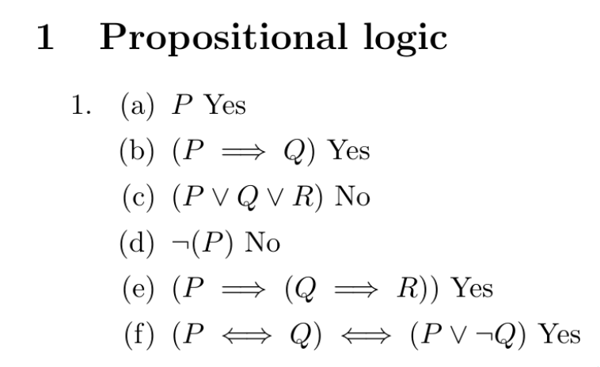
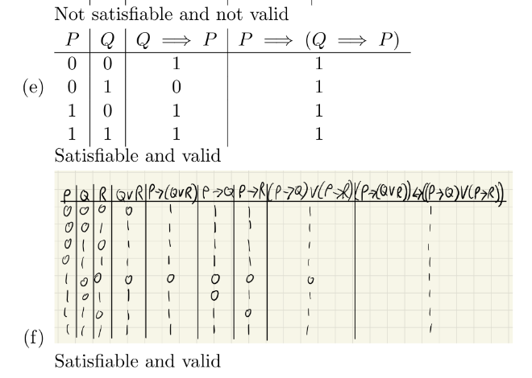
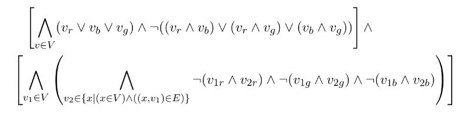
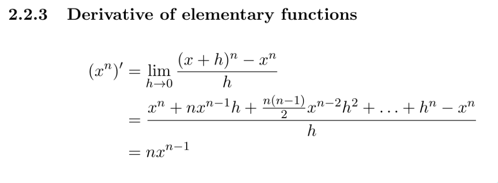
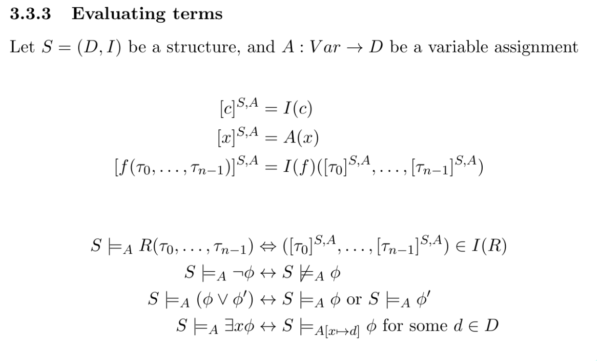
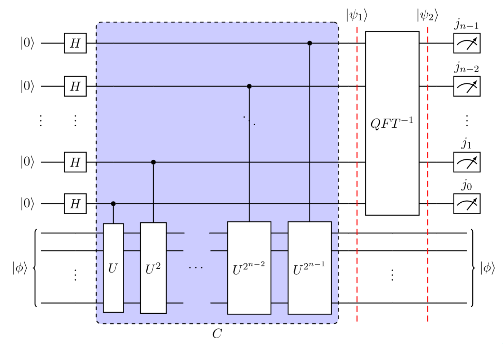
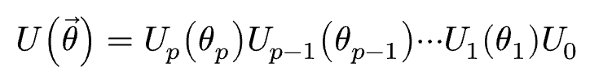
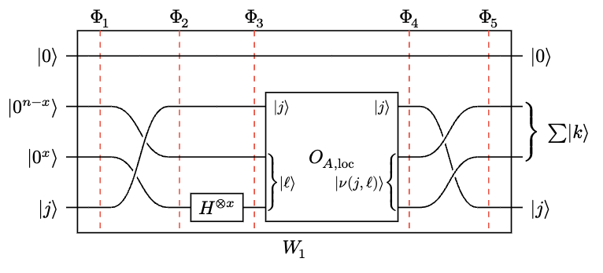
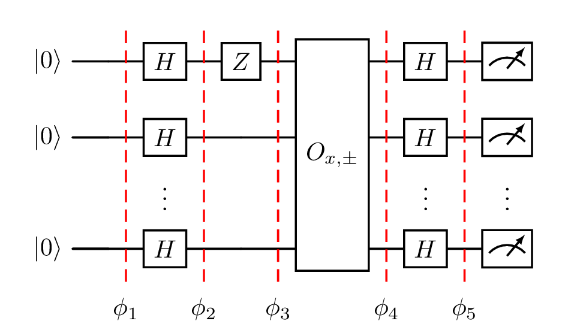

As a youngster, I was mildly obsessed with stories I'd heard about MIT, and how they had these famous "p-sets", which everyone typed up in something called LaTex.

I'd tried using Microsoft Word's equation editor, and it was awful, so I was doing all my work on an iPad Mini with an Apple pencil. But alas, my handwriting is not what you'd call up to scratch.

So, on January 20th 2021, half-way through my Formal Logic homework, I pivoted and I decided to dive into LaTeX.

These are from my first LaTeX document (note the shoddy handwriting in the table I couldn't be bothered to LaTeX-ify):

{.img-w-30}
{.img-w-30}
{.img-w-40}

That third image was the key: the light-bulb moment. That big complex expression, that actually almost looks wrong in the way that it's rendered, except it's not.

I'd never have produced that by hand.

I think it's so pretty, I'm just going to show you more of what I produced over the last few years of uni.

{.img-w-30}
{.img-w-30}
{.img-w-40}

And, don't get my wrong, this is nothing special that I'm doing. This is LaTeX itself being wonderful.

That last one is a full quantum circuit, entirely defined in LaTeX code..!

I've written hundreds and hundreds of pages worth of LaTeX. I can take real-time notes in it (matrices, and complex diagrams trip me up). I parse LaTeX code automatically in my head.

LaTeX gave me the ability to produce beautiful notes, something I'd never been able to do by hand, essentially revolutionising my academics.

I went from someone who never took a single note, to religiously maintaining almost-transcription copies of course notes; this helped me internalise what I was learning, and allowed me to contract and expand sections that I found easy/hard.

I love it.

## But nothing good can last forever

LaTeX is a very old piece of software. It's basis, TeX, was created by Donald Knuth in 1978, and it's been updated valiantly over the years.

And some of the commands are a bit clunky. This is symptomatic of layers upon layers of packages and extensions (exactly the issue Knuth was trying to resolve with TeX in the first place). So new use-cases, have to use slightly unideal constructions to be possible.

Also, language design in general has moved on a lot since then. It was sort of expected that things were a little bit difficult to work with (e.g. defining custom commands).

Also, also, LaTeX is built on top of TeX. So there's sort of multiple ways to do a lot of things, and I've never been able to get down to the base layer of tweaking things. I just copy other peoples snippets until they work.

Lastly, recently I've been using an editor called Texifier for macOS, which adds live reloading, so I can see the output in real-time as I type. And I've used it so much I now can't really live without it. Saving and reloading just feels annoying now.

But this doesn't play well with everything (e.g. quantikz diagrams; see [previous post](./_2025-09-16-qzfr)). And it's started crashing with very long documents.

## New kid on the block

[Typst](https://typst.app) offers live-reloading out of the box. So far it's not crashed. It's a single integrated piece of software. And the syntax is just neater

Function calls aren't clunky (not having to hit the `\` key with my pinky before every command improves my speed a shocking amount):
```latex
% LaTeX
$$
  \mathcal{H}
  \frac{1}{2}
  \left(\begin{array}{cc} 0 & 0 \\ 1 & 1 \end{array}\right)
$$
```

```typst
// Typst
$
  cal(H)
  frac(1, 2)
  mat(0, 0; 1, 1)
$
```

Lists and sections are intuitively like markdown:
```latex
% LaTeX
\section{title}
\subsection{subtitle}
\begin{itemize}
  \item a point
  \item another point
  \item a final point
\end{itemize}
```

```typst
// Typst
= title
== subtitle
- a point
- another point
- a final point 
```

Math environments have lovely syntactic sugar: automatic sizing brackets without manually using `\left` `\right`, automatic fractions with `/`, inline text with just `"`, and all environments are align environments!
```latex
% LaTeX
\begin{align}
  a &= \left( frac{1}{2} \right) \\
  b &= \text{asd}
\end{align}
```

```typst
// Typst
$
  a &= cal(1/2) \
  b &= "asd"
$
```

And it's almost impossibly easy to import libraries, you don't have to install them, you just import them with your desired version number:
```typst
#import "@preview/physica:0.9.6": *
```

My two favourites thus far are [physica](https://typst.app/universe/package/physica/) for physics symbols, and [quill](https://typst.app/universe/package/quill/) for making quantum circuits.

The Typst code is short and sweet, it sort of looks boring in the examples above. But that's kind of the point.

## A nitpick

The outputted formulas are subtly differently laid out. This is reasonable and to be expected, because they're reimplented the entire equation renderer from scratch. And the LaTeX style isn't inherently correct, it's just what I'm very used to.

But one thing that is definitely wrong (in my opinion) is the kerning on ellipses in formulas

{.img-w-30}

There should be spaces around that.

## Conclusion

Typst gives me the same ability as LaTeX, to produce beautiful notes, but it's got modern syntax, live-reloading, and a vibrant community of library contributors.

And it's not had a version 1 release yet, so any issues for now I'm forgiving, and chalking up to early development.

So, I'm giving it a try.

## Quantum circuits

I'm putting this at the bottom because it's kind of long, but look how much neater this Typst code is:

```typst
#align(center)[
  #quantum-circuit(
    lstick($ket(0)$), gategroup(4, 6, label: (content: $W_1$, pos: bottom)), 1,
      slice(label: $Phi_1$), 1,
      slice(label: $Phi_2$), 1,
      slice(label: $Phi_3$), 1,
      slice(label: $Phi_4$), 1,
      slice(label: $Phi_5$), 1, rstick($ket(0)$), [\ ],
    lstick($ket(0^(n - x))$), 1, permute(1, 2, 0), 1,
      mqgate(
        $O_(A,text("loc"))$, n: 3, width: 7em,
        inputs: (
          (qubit: 0, label: $ket(j)$),
          (qubit: 1, label: $ket(ell)$, n:2),
        ),
        outputs: (
          (qubit: 0, label: $ket(j)$),
          (qubit: 1, label: $ket(nu(j, ell))$, n:2),
        )
      ),
      permute(2, 0, 1), 1,  rstick($sum ket(k)$, n:2), [\ ],
    lstick($ket(0^x)$), [\ ],
    lstick($ket(j)$), 1, 1, $H^(times.o x)$, 1, 1, 1, rstick($ket(j)$)
  )
]
```

Compared to LaTeX:
```latex
\begin{quantikz}
    \lstick{$\ket{0}$} &
        \slice[label style={pos=1, anchor=north}]{$\phi_1$} &
        \gate{H} \slice[label style={pos=1, anchor=north}]{$\phi_2$} &
        \gate{Z} \slice[label style={pos=1, anchor=north}]{$\phi_3$} &
        \gate[wires=4]{O_{x, \pm}} \slice[label style={pos=1, anchor=north}]{$\phi_4$} &
        \gate{H} \slice[label style={pos=1, anchor=north}]{$\phi_5$} &
        \meter{} \\
    \lstick{$\ket{0}$} &
        \qw &
        \gate{H} & & &
        \gate{H} &
        \meter{} \\
    \setwiretype{n} & &
        \midstick{\vdots} & & &
        \midstick{\vdots} &
        \midstick{\vdots} \\
    \lstick{$\ket{0}$} &
        \qw &
        \gate{H} & & &
        \gate{H} &
        \meter{}
\end{quantikz}
```

They're not doing the same thing, but they're comparably complex circuits. And I think that the `\` and `&` style is just harder to read, particularly for a brain used to languages like Python?

{.img-w-30}
{.img-w-30}

Left: typst, right: LaTeX
