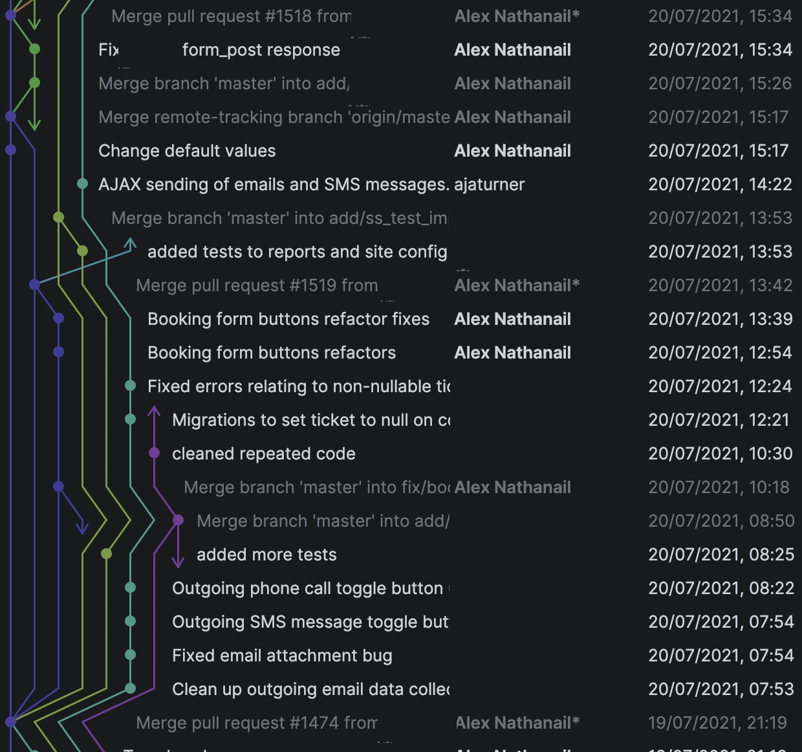
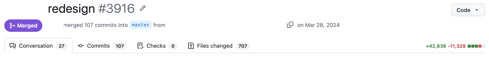
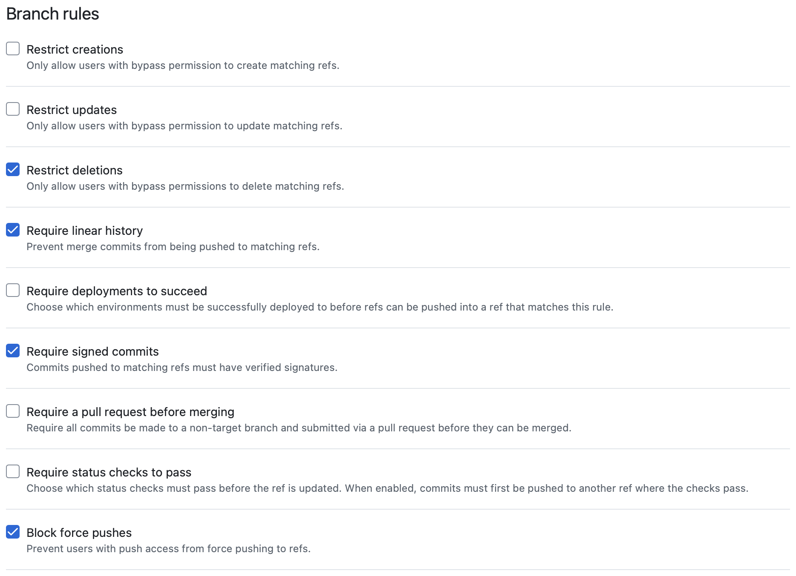

I like linear Git history.
This proclivity grew out of working with teams, where lots of people touch lots of files, sometimes on very long running branches.
Specifically, I like to be able to view the commit history on a file and step perfectly backwards through time, without jumping between different versions of a file as two histories interleave.

I also like 'granular' commits, i.e. not squashing PRs ([Pull Requests](https://docs.github.com/en/pull-requests/reference/pull-requests)).
Sometimes a PR is necessarily quite large, and keeping the commit history of a piece of development before it hit main is quite handy.
You see the story of how someone worked on an issue, you see how designs changed and decisions were made, you see pitfalls hit and worked around.

{.img-w-100}

I quite like verified commits.
In the spaces I'm working (mostly proprietary code, or technically open-source but tiny and irrelevant) they're maybe not an enourmous concern.
But it seems like a good industry practice, and I like the little green badge it gives me.

It seems that, of these three desires, I can only choose two.

## GitHub Pull request merge options

### Merge commits ⛔️✅✅

The default merge button on a Pull request creates a merge commit.
This takes the two separate Git histories, and just makes sure they are consistent at their ends.
It maintains my exact commits which I pushed, keeping their Verified status, and GitHub even signs the merge commit for me.

But my history is messy.

### Squash and merge ✅⛔️✅

This takes all of the commits from the branch and combines them into a single commit on the main branch.
This commit is signed by GitHub, so it shows as verified, and the history is in a way linear.

But I've lost the granularity.

### Rebase and merge ✅✅⛔️

This takes the commits from the branch, and sticks them linearly onto the end of the main branch.
My history is linear, I've kept my story.

But for some reason GitHub refuses to sign this, despite the fact that they seem happy to sign merge commits and squash commits.
The [rationale in their docs](https://docs.github.com/en/repositories/configuring-branches-and-merges-in-your-repository/configuring-pull-request-merges/about-merge-methods-on-github#rebasing-and-merging-your-commits) is that they are _'using the data and content of the original commit'_ and therefore _'GitHub didn't truly create this commit, and can't therefore sign it as a generic system user'_.

I don't follow this reasoning at all.
In fact, I think that the act of creating commits in the merge and squash methods shouldn't be verified, because whose authority or identity is being invoked here?
The rebase is the only operation where exactly what was verified on my machine is landing on main.

Is it that the action was performed through GitHub's interface, through a logged in account, and therefore GitHub knows exactly who did it?
Because so is a rebase!

## A clear solution which GitHub are ignoring because they hate me

The [fast-forward merge](https://docs.gitlab.com/user/project/merge_requests/methods/#fast-forward-merge) is a handy feature of Git, which notices when the branch you are merging is already up to date with the main branch (i.e. there are no commits on main that don't exist on the branch).
In this case, instead of creating a merge commit, Git just sticks the commits onto main.
This makes a lot of sense, because what is the point of having a merge commit when there are no divergent histories.

For some unknown reason, GitHub's **Merge pull request** functionality is [explicitly set to run](https://docs.github.com/en/repositories/configuring-branches-and-merges-in-your-repository/configuring-pull-request-merges/about-merge-methods-on-github) with the `--no-ff` option.

There is years of discussion ([#4618](https://github.com/orgs/community/discussions/4618) [#5524](https://github.com/orgs/community/discussions/5524)) on GitHub's community forum asking for this to be implemented.
There are [blog posts](https://v5.chriskrycho.com/notes/fast-forward-merges-on-github/), showing how you can do the fast-forward merge manually on your local machine, and then push to main.
There are [multiple](https://github.com/marketplace/actions/merge-fast-forward-only) [GitHub actions](https://github.com/marketplace/actions/fast-forward-pr) allowing you to fast-forward merge through PR comments, or run them manually.
There are [companies](https://docs.mergify.com/merge-queue/merge-strategies/#fast-forward) who offer fast-forward merging as a feature in their product.

But all of these things require trusting something: your own usage of the command line, an obscure open-source project, a business.
If there's one thing that I've learned in years of development, it's that you should _trust nothing_, especially not yourself.

## Rulesets

GitHub has a feature called [rulesets](https://docs.github.com/en/repositories/configuring-branches-and-merges-in-your-repository/managing-rulesets/about-rulesets) which allows you to enforce various standards within your repository, and _trust no-one_.

There's loads of options, to enforce a beautiful clean workspace, and prevent accident or malice.

But, if you select `Require linear history` and `Require signed commits`, your only option is the squash commit.

This belies a complete lack of product cohesion.

Squashing feels like the worst of the option in many ways.
Of course, if you follow best practices, your PRs should be small enough to be a single commit anyway.
But that feels like one of those aphorisms like _'functions should be 20 lines max'_ which just doesn't survive contact with reality.

> [!tip]
> Fun fact!
> 
> If you have any merge commits in your repository's history, you can **never** push to a new branch with `Require linear history`.
>
> You might say that you only need that enabled on your main branch, but it's helpful for developers to discover as early as possible that they are creating a problem.
>
> If they have accidentally created a merge commit in their branch with some Git mess-up, it's quite painful to only be told when you try to merge in 2 weeks time that your history is unacceptable.

## A plea

I don't understand why rebased commits can't be signed.

But, even if that is the case, surely we can have fast-forward merges?

I'll accept the annoyance of having to rebase every branch onto main locally before merging it.

I just want a beautiful bulletproof system, where my rulesets keep everyone safe, and all my commits are signed, linear, and granular.