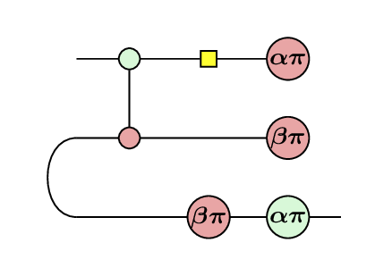
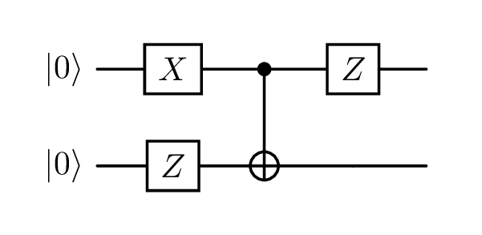
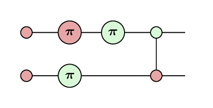
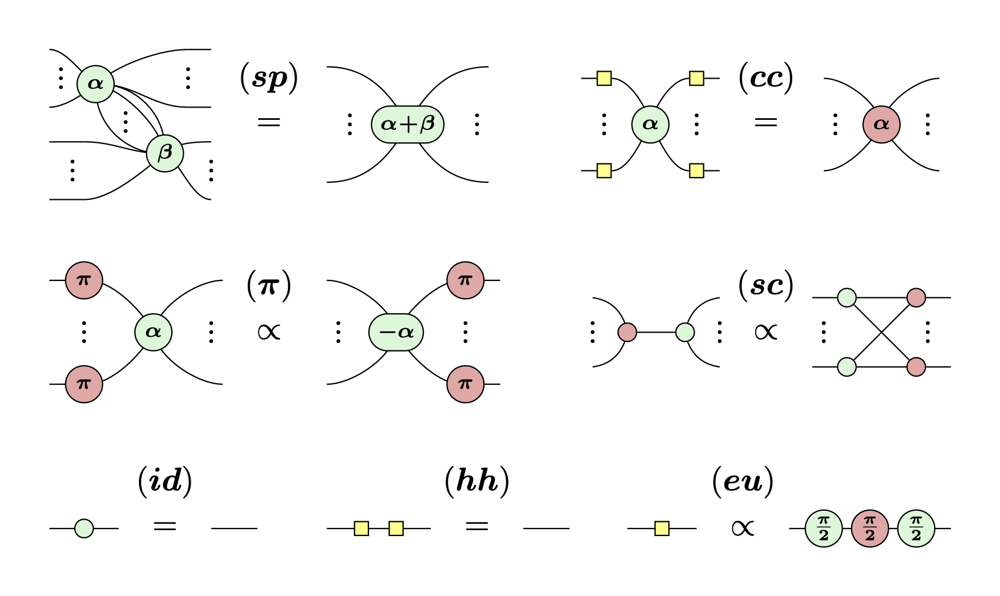
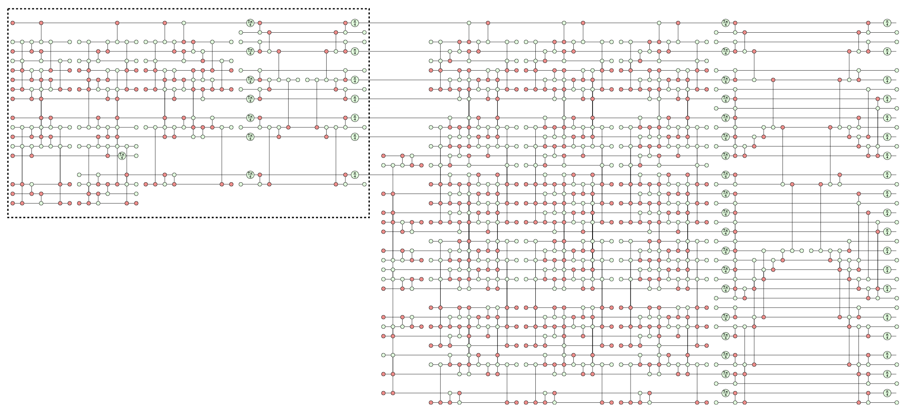

For the last year I've been doing a [Master's degree in Quantum Computer Science at the University of Amsterdam](https://www.uva.nl/shared-content/programmas/en/masters/quantum-computer-science/quantum-computer-science.html).
The first year has been primarily lecture-based, looking at a lot of the maths underpinning quantum computation.
I'm now going into my second year, in which I will primarily work on my thesis about working with the [ZX-calculus](https://zxcalculus.com) in [Lean](https://lean-lang.org).

As I work on this project, I will hopefully put out blogs along the way, so I think it will be helpful to be able to link to this page to provide some understanding for what the ZX-calculus is.

## Linear algebra

One of the most recurrent themes in my lectures this year has been **linear algebra**.
This may be a daunting phrase, and I certainly don't understand it anywhere well enough to talk about it authoritatively, but, in so far as I have interacted with it:

> [!tip]
> Linear algebra is matrices and vectors.

In school, you might have learned matrix multiplication:
$$
  \left( \begin{array}{cc} 1 & 2 \\ 3 & 4 \end{array} \right)
  \left( \begin{array}{cc} 5 & 6 \\ 7 & 8 \end{array} \right)
  =
  \left( \begin{array}{cc} 1 \cdot 5 + 2 \cdot 7 & 1 \cdot 6 + 2 \cdot 8 \\ 3 \cdot 5 + 4 \cdot 7 & 3 \cdot 6 + 4 \cdot 8 \end{array} \right)
  =
  \left( \begin{array}{cc} 19 & 22 \\ 43 & 50 \end{array} \right)
$$

Or how to find the determinant of a matrix:
$$
  \left| \begin{array}{cc} a & b \\ c & d \end{array} \right| = ad - bc
$$

Or even eigenvectors and eigenvalues:
$$
  A v = \lambda v
$$

These are some of the tools of linear algebra, which are applied in a wide range of fields.
In quantum computing, one thing they are used for is to see what a quantum circuit does.

### Quantum circuits

A **quantum circuit** is one way that the 'code' for a quantum computer can be written.

They have rows which represent [**qubits**](https://www.ibm.com/think/topics/qubit), which are given a starting **state** (often $\ket{0}$).

Along each row are placed [**gates**](https://quantum.cloud.ibm.com/learning/en/courses/utility-scale-quantum-computing/bits-gates-and-circuits) which represent operations being done on the state.
Gates act sequentially from left to right, and gates placed vertically above each other can act at the same time.
You can sort of read them like sheet music.

Here is an example (useless) quantum circuit:

> [!note]
> The red dashed lines (**time slices**) are for ease of reference to the diagram, they don't have any impact on the circuit itself.

Looking at each time slice step by step:
- $t_0$: 2 qubits initialized to the $\ket{0}$ state
- $t_1$: top qubit had an X gate applied, bottom qubit had a Z gate applied, at the same time
- $t_2$: both qubits had a CNOT gate applied
  - This gate affects both qubits at the same time
  - Which side has the dot and which the plus is important!
- $t_3$: top qubit had a Z gate applied, bottom qubit was left alone

### Evaluating a quantum circuit

If we want to understand the effect that this circuit has on its starting state we need a few pieces of information:

1. Some vectors commonly used in quantum physics have a special shorthand called [Dirac notation](https://learn.microsoft.com/en-us/azure/quantum/concepts-dirac-notation). The starting state in the circuit above means:

$$
  \ket{0} = \left( \begin{array}{c} 1 \\ 0 \end{array} \right)
$$

2. Matrices and vectors stacked vertically in our diagram are combined using the [Kronecker product](https://learn.microsoft.com/en-us/azure/quantum/concepts-vectors-and-matrices#tensor-product). Our starting state would therefore be:

$$
  \ket{0} \otimes \ket{0} = \left( \begin{array}{c} 1 \\ 0 \end{array} \right) \otimes \left( \begin{array}{c} 1 \\ 0 \end{array} \right) = \left( \begin{array}{c} 1 \\ 0 \\ 0 \\ 0 \end{array} \right)
$$

3. The effect of a gate can be described as a matrix. Common gates can be seen in [this handy reference image](https://upload.wikimedia.org/wikipedia/commons/e/e0/Quantum_Logic_Gates.png?utm_source=commons.wikimedia.org&utm_campaign=index&utm_content=original).
4. A wire with no gate on it can be represented by the [identity matrix](https://www.khanacademy.org/math/precalculus/x9e81a4f98389efdf:matrices/x9e81a4f98389efdf:properties-of-matrix-multiplication/a/intro-to-identity-matrices).
5. [Matrices are composed right to left](https://www.3blue1brown.com/lessons/matrix-multiplication/#composition-is-multiplication).
6. We commonly use $\ket{\psi}$ to mean _'some unknown state'_

Then it is just matrix multiplication:

$$
  \begin{aligned}
    \ket{\psi} &= 
      \left( Z \otimes I \right)
      \cdot \operatorname{CNOT}
      \cdot \left( X \otimes Z \right)
      \cdot \left( \ket{0} \otimes \ket{0} \right) \\
    &=
      \left( Z \otimes I \right)
      \cdot \operatorname{CNOT}
      \cdot \left( \begin{array}{cccc} 0 & 0 & 1 & 0 \\ 0 & 0 & 0 & -1 \\ 1 & 0 & 0 & 0 \\ 0 & -1 & 0 & 0 \end{array} \right)
      \left( \begin{array}{c} 1 \\ 0 \\ 0 \\ 0 \end{array} \right) \\
    &=
      \left( Z \otimes I \right)
      \cdot \left( \begin{array}{cccc} 1 & 0 & 0 & 0 \\ 0 & 1 & 0 & 0 \\ 0 & 0 & 0 & 1 \\ 0 & 0 & 1 & 0 \end{array} \right)
      \left( \begin{array}{c} 0 \\ 0 \\ 1 \\ 0 \end{array} \right) \\
    &=
      \left( \begin{array}{cccc} 1 & 0 & 0 & 0 \\ 0 & 1 & 0 & 0 \\ 0 & 0 & -1 & 0 \\ 0 & 0 & 0 & -1 \end{array} \right)
      \left( \begin{array}{c} 0 \\ 0 \\ 0 \\ 1 \end{array} \right) \\
    &= \left( \begin{array}{c} 0 \\ 0 \\ 0 \\ -1 \end{array} \right) \\
    &= - \ket{1} \otimes \ket{1}
  \end{aligned}
$$

$\ket{1}$ is another example of Dirac notation.
The minus sign is referred to as the **global phase**, and it is typically ignored because it can't be [detected physically](https://qubit.guide/2.6-phase-gates-galore#:~:text=In%20general%2C%20states%20differing%20only%20by%20a%20global%20phase%20are%20physically%20indistinguishable%2C%20and%20so%20it%20is%20physical%20experimentation%20that%20leads%20us%20to%20this%20mathematical%20choice%20of%20only%20defining%20things%20up%20to%20a%20global%20phase.).
So we put in $00$ and got out $11$.[^dirac-notation]

[^dirac-notation]: It is not always possible to interpret vectors written in Dirac notation as binary (otherwise qubits would just be bits), but in this case it is valid to claim that $\ket{0} \otimes \ket{0}$ is equivalent to the binary string $00$, and similar for $11$.

That's not very quantum[^not-very-quantum], but it demonstrates the process of working through a quantum circuit with linear algebra.

[^not-very-quantum]: I felt like I should put a footnote here because that clause is horribly informal and imprecise, but there's nothing really to explain. I'm just acknowledging the laziness.

### No-one likes matrices

For larger circuits this can become quite tedious.
Of course computers can do these operations very quickly, but eventually even they will struggle, and having a computer do all the work for you can prevent you from developing intuitions that might take you somewhere interesting.

Also, we're not really using matrices to their fullest extent.
They're very general, powerful, and expressive structures, but we seem to just be filling them with zeroes and ones.

In more complex circuits there will be a bit more variety, but there are fundamental rules that matrices must abide by in order to accurately describe the quantum world.

  
Types of matrices used in quantum

  Most of the matrices (that I have come across) in quantum are [**normal**](https://mathworld.wolfram.com/NormalMatrix.html), which means that they have an orthonormal eigenbasis, which essentially means that the axes of the coordinates that they are built with are at right angles to each other.

  Within normal matrices, different subcategories are used for different quantum objects:

  - [**Unitary** matrices](https://mathworld.wolfram.com/UnitaryMatrix.html) are square complex matrices whose inverse equal their conjugate transpose ($U U^{\dagger} = I$). Applying them to a vector doesn't change its length, and quantum states must be length 1 (normalized), so operations on quantum states (i.e. gates) are described by unitaries.
  - [**Hermitian** matrices](https://mathworld.wolfram.com/HermitianMatrix.html) are square matrices which equal their conjugate transpose ($H = H^\dagger$). These are guaranteed to have real eigenvalues, which allows them to accurately describe observables.
  - [**Positive semi-definite** (**PSD**) matrices](https://mathworld.wolfram.com/PositiveSemidefiniteMatrix.html) are Hermitian matrices with non-negative eigenvalues. PSD matrices with a trace (sum of eigenvalues) of 1 can represent [**density matrices**](https://quantum.cloud.ibm.com/learning/en/courses/general-formulation-of-quantum-information/density-matrices/density-matrix-basics). They are a more general form of quantum state than the vectors we use here. The eigenvalues represent the probability of measuring a given vector, hence they cannot be negative and must sum to 1.

Putting my computer scientist hat on: having a data structure which naturally encodes the rules we're working with, as opposed to manually enforcing them, can yield very powerful results.

Compare storing numerical data as a list versus a [binary search tree](https://www.geeksforgeeks.org/dsa/binary-search-tree-data-structure/).
If we want to find the median value in the list, we first have to sort the data; in the tree the data is inherently sorted.
Of course we can say that we will just keep the list ordered from the start, but, with the tree, the ordering is _inherent_ to the data structure.

Finding the right structure for the job reduces bookkeeping, and removes entire classes of errors.

So, is there something we can replace our matrices with, which naturally follows the symmetries and patterns of quantum processes?

## The ZX-calculus

{.img-w-100}

> [!question]
> Which famous quantum protocol is shown in the diagram above?

The ZX-calculus is a graphical language built upon a strongly complementary pair of commutative special dagger Frobenius algebras, which together form a scaled bialgebra.[^coecke-duncan]

[^coecke-duncan]: Bob Coecke and Ross Duncan, "Interacting Quantum Observables: Categorical Algebra and Diagrammatics," *New Journal of Physics* 13, no. 4 (2011): 043016, <https://doi.org/10.1088/1367-2630/13/4/043016>.

Precisely understanding this statement requires a deep understanding of [category theory](https://bartoszmilewski.com/2014/10/28/category-theory-for-programmers-the-preface/) (which I absolutely do not possess), but in short: we have found the data structure that we are looking for.
We have identified the paradigm which naturally encodes the symmetries and rules which quantum processes follow.

Luckily for us, we can happily use the ZX-calculus without any understanding of category theory.

### ZX-diagrams

**ZX-diagrams** are the bread and butter of the ZX-calculus.
They are composed (almost) entirely of green and red circles, called **Z spiders** and **X spiders** respectively.
They sometimes have numbers attached (**phases**), and are connected with **wires**.

Z and X (and hence ZX) comes from the corresponding [quantum observables](https://en.wikipedia.org/wiki/Pauli_matrices).
The reason for the green and red colours was availability of whiteboard markers as the formalism was being developed.[^red-and-green-markers]
And the term 'spider' is used because blobs with lines sort of look like little spiders!

[^red-and-green-markers]: See footnote 5 in [ZX-calculus for the working quantum computer scientist](https://arxiv.org/html/2012.13966v1#footnote5)

Each spider, along with its phase and number of wires (**arity**), represents a matrix.[^linear-map-not-matrix]
Wires can be joined together to make larger diagrams of spiders, and these larger diagrams have a matrix representation, which remains consistent with chunks that they were constructed from.
This system of composing building blocks turns out to be expressive enough to fully represent any quantum circuit!

[^linear-map-not-matrix]: Technically it represents a linear map, which can be written as a matrix in a given basis.[^tensor-not-linear-map]

[^tensor-not-linear-map]: Technically technically it represents a tensor.

Every element of a quantum circuit has a way to write it as a ZX-diagram.
Converting our example circuit to a ZX-diagram would look like this:

<!-- TODO image layout -->

The starting $\ket{0}$ s have become **phaseless** X spiders.
The Z and X gates have become corresponding Z and X spiders, with a phase of $\pi$.
And the CNOT gate, has become a linked pair of phaseless Z and X spiders.

If you interpretted each of those elements as a matrix/vector, you would get back the matrices from earlier [^up-to-a-scalar-factor], and if you interpret the entire diagram you will get the result of our calculation.

[^up-to-a-scalar-factor]: Up to a scalar factor

> This is all very fun, but to be honest this might be harder to read, what's the point?

This is where the rules of the ZX-calculus comes in!

### Rewriting

It turns out that lots of different ZX-diagrams can represent the same quantum circuit, and the ZX-calculus provides **rewrite rules** which allow us to move between them.

For example, in the diagram above, we can move the top right green spider through the spider to its left, becoming the diagram below:

If you reference the quantum circuit diagram, you'll see that what we did was move the Z gate to before the CNOT gate.
And, if you worked out the linear algebra, you'd see that those two circuits were entirely equivalent operations!

That was an example of an application of the **spider fusion** (**sp**) rule. [^spider-unfusion]

[^spider-unfusion]: And then applying its inverse, colloquially 'unfusion'.

Below are the 7 rules (spider fusion top-left) which form the standard rules of the ZX-calculus.

> [!info]
> The yellow squares represent an important gate called the **Hadamard**.
> They ever so slightly marr our beautiful 2-coloured graphs, but the bottom right rule (**eu**) shows that they are actually representable as spiders.

### A real example

For a more proper example of what using the ZX-calculus looks like, we will prove that 3 CNOT gates (with the middle one flipped) are equivalent to a single SWAP gate, as shown in the diagram below.

> [!note]
> Don't worry about what those gates do, but finding a way to represent the same operations with fewer gates can make our circuits run faster!

We can verify this using linear algebra, but why would we want to do that..!

  
Linear algebra: DO NOT OPEN

  _Note that the middle CNOT has a `2 → 1` subscript, to indicate that the dot and plus are the opposite way around._
  _It also has a slightly different matrix representation._
  $$
    \begin{aligned}
      \operatorname{CNOT} \cdot \operatorname{CNOT}_{2 \rightarrow 1} \cdot \operatorname{CNOT} &=
        \operatorname{CNOT} \cdot
        \left( \begin{array}{cccc} 1 & 0 & 0 & 0 \\ 0 & 0 & 0 & 1 \\ 0 & 0 & 1 & 0 \\ 0 & 1 & 0 & 0 \end{array} \right)
        \left( \begin{array}{cccc} 1 & 0 & 0 & 0 \\ 0 & 1 & 0 & 0 \\ 0 & 0 & 0 & 1 \\ 0 & 0 & 1 & 0 \end{array} \right) \\
      &=
        \left( \begin{array}{cccc} 1 & 0 & 0 & 0 \\ 0 & 1 & 0 & 0 \\ 0 & 0 & 0 & 1 \\ 0 & 0 & 1 & 0 \end{array} \right)
        \left( \begin{array}{cccc} 1 & 0 & 0 & 0 \\ 0 & 0 & 1 & 0 \\ 0 & 0 & 0 & 1 \\ 0 & 1 & 0 & 0 \end{array} \right) \\
      &=
        \left( \begin{array}{cccc} 1 & 0 & 0 & 0 \\ 0 & 0 & 1 & 0 \\ 0 & 1 & 0 & 0 \\ 0 & 0 & 0 & 1 \end{array} \right) \\
      &= \operatorname{SWAP}
    \end{aligned}
  $$

With the ZX-calculus, the steps look like this:



1. Draw out our circuit as a ZX-diagram.
2. Just drag the diagram around a bit so that it looks more like the (**sc**) rule.

> [!tip]
> You can drag the elements of the diagram above around to see that nothing actually changed!

3. Apply the strong complementarity rule.
4. Apply the spider fusion rule.
5. Use something called the Hopf rule, which allows us to remove a pairs of links between two spiders of different colours. This is derived from strong complementarity, so we have just called it (**sc**) here.
6. Apply the identity rule twice.

The diagram we end up with is exactly how the SWAP gate is represented in the ZX-calculus.
The fact that it looks like a swapping operation is not an accident: this is a very nice example of how ZX-diagrams intuitively represent connectivity in quantum processes.

  
Deriving the Hopf rule

  

  Step 6 may look a little confusing: it says that it is using the (**π**) rule, but it doesn't really look like the (**π**) in the standard rules.
  The standard rules show the **π-commutation**, which is a common example from a class of rules called the **state-copy rules**.
  Above, we used another of the state-copy rules.

  Also some of the jumps between steps may be a little hard to see, because I have folded up the diagrams to try and keep them compact.
  If you drag them around yourself, you should hopefully see exactly what has happened!

  
What are the symbols between the diagrams about?

  Even once you've learned the rules of the ZX-calculus, it's not necessarily instantly obvious what has been changed between two diagrams.
  To make it clearer, its a common convention to write an abbreviation for the rule(s) applied between diagrams.

  Underneath the rule codes you will see either an equals sign or a 'proportional to' sign.
  This is because some rewrite rules return you a diagram which is equivalent 'up to a scalar factor'.
  These scalar factors are often global phases (which are [physically indistinguishable](https://qubit.guide/2.6-phase-gates-galore#:~:text=In%20general%2C%20states%20differing%20only%20by%20a%20global%20phase%20are%20physically%20indistinguishable%2C%20and%20so%20it%20is%20physical%20experimentation%20that%20leads%20us%20to%20this%20mathematical%20choice%20of%20only%20defining%20things%20up%20to%20a%20global%20phase.)), or normalization factors (which usually work themselves out) so we can often ignore them.

Understanding the ZX-calculus is an 8-week masters course, and understanding the quantum operations it represents is another 16 weeks, so I can't fit it all into a blog post.
But hopefully you can see the beauty of the ZX-calculus, its value in providing an alternative to linear algebra, and could identify a ZX-diagram if you saw one in the wild!

Below is a particularly wild diagram from a real academic paper...[^wan-zhong]

[^wan-zhong]: Kwok Ho Wan and Zhenghao Zhong, "Cutting Stabiliser Decompositions of Magic State Cultivation with ZX-Calculus," preprint, submitted September 20, 2025, arXiv:2509.01224v3, <https://arxiv.org/abs/2509.01224>.

## Addendum

### zxcc

<!-- TODO only connectivity matters -->

You might have noticed that the diagrams in the previous example are interactive: you can drag them into different arrangements.
This doesn't change the meaning of the diagram because of course **only connectivity matters!**

These diagram viewers are part of the first stages of my thesis, and actually the impetus for this blog post, so I could show them off.

They are based on the [interactive viewer](https://github.com/zxcalc/pyzx/blob/master/pyzx/js/zx_viewer.js) built into [pyzx](https://github.com/zxcalc/pyzx). I [embedded that](https://github.com/adnathanail/LeanSpider/tree/a2a6cb0f0c755194b394058b9231575589a0c69b/zx_view_widget) into a React component in a [project working with the ZX-calculus in Lean](https://github.com/adnathanail/LeanSpider). I'm now continuing that project for my thesis, and I decided to extract the functionality out into a separate library: [**zxcc**](https://github.com/adnathanail/zxcc).

I wanted the ergonomics of components, without the bulk of something like React, so I rewrote it using a web components library called [Lit](https://lit.dev). I then realised the bundle was 500KB because of the D3 dependency, so I rewrote the renderer using raw SVGs.

In an effort to maintain visual and functional parity with the original viewer, I created a [Storybook](https://main--6a7e12985acc92e6ec37bdaa.chromatic.com/) displaying various types of diagrams. This is fed into a tool called [Chromatic](https://www.chromatic.com), which visually compares each part of the Storybook whenever I push new code, so I can that confirm changes are working as intended and that no regressions are introduced.

I'm doing all this, because I don't want to actually start working on my thesis...!