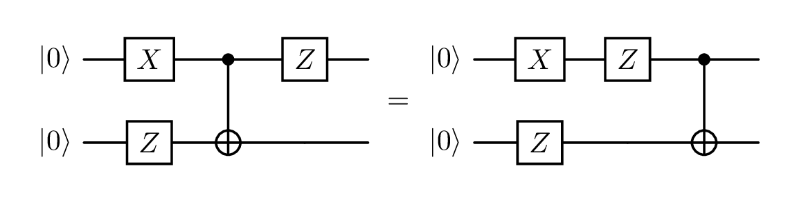

For the last year I've been doing a [Master's degree in Quantum Computer Science at the University of Amsterdam](https://www.uva.nl/shared-content/programmas/en/masters/quantum-computer-science/quantum-computer-science.html).
The first year has been primarily lecture-based, looking at a lot of the maths underpinning quantum computation.
I'm now going into my second year, in which I will primarily work on my thesis about working with the [ZX-calculus](https://zxcalculus.com) in [Lean](https://lean-lang.org).

As I work on this project, I will hopefully put out blogs along the way, so I think it will be helpful to be able to link to this page to provide some understanding for what the ZX-calculus is.

## Linear algebra

One of the most recurrent themes in my lectures this year has been **linear algebra**.
This may be a daunting phrase, and I certainly don't understand it anywhere near well enough to talk about it authoritatively, but, in so far as I have interacted with it:

> [!tip]
> Linear algebra is matrices and vectors.

In school, you might have learned matrix multiplication:
$$
  \left( \begin{array}{cc} 1 & 2 \\ 3 & 4 \end{array} \right)
  \left( \begin{array}{cc} 5 & 6 \\ 7 & 8 \end{array} \right)
  =
  \left( \begin{array}{cc} 1 \cdot 5 + 2 \cdot 7 & 1 \cdot 6 + 2 \cdot 8 \\ 3 \cdot 5 + 4 \cdot 7 & 3 \cdot 6 + 4 \cdot 8 \end{array} \right)
  =
  \left( \begin{array}{cc} 19 & 22 \\ 43 & 50 \end{array} \right)
$$

Or how to find the determinant of a matrix:
$$
  \left| \begin{array}{cc} a & b \\ c & d \end{array} \right| = ad - bc
$$

Or even eigenvectors and eigenvalues:
$$
  A v = \lambda v
$$

These are some of the tools of linear algebra, which are applied in a wide range of fields.
In quantum computing, they can be used to see what a quantum circuit does.

### Quantum circuits

A **quantum circuit** is one way that the 'code' for a quantum computer can be written.

They have rows which represent **qubits**, which are given a starting **state** (often $\ket{0}$).

Along each row are placed **gates**, which represent operations being done on the state.
Gates act sequentially from left to right, and gates placed vertically above each other can act at the same time.
You can sort of read them like sheet music.

Here is an example quantum circuit:

> [!note]
> The red dashed lines (**time slices**) are for ease of reference to the diagram; they don't have any meaning in the circuit itself.

Looking at each time slice step by step:
- $t_0$: 2 qubits initialized to the $\ket{0}$ state
- $t_1$: top qubit had an X gate applied, bottom qubit had a Z gate applied, at the same time
- $t_2$: both qubits had a CNOT gate applied
  - This gate affects both qubits at the same time
  - Which side has the dot and which the plus is important!
- $t_3$: top qubit had a Z gate applied, bottom qubit was left alone

### Evaluating a quantum circuit

If we want to understand the effect that this circuit has on its starting state, we need a few pieces of information:

1. Some vectors commonly used in quantum physics have a special shorthand called [**Dirac notation**](https://learn.microsoft.com/en-us/azure/quantum/concepts-dirac-notation). The starting state in the circuit above means:

$$
  \ket{0} = \left( \begin{array}{c} 1 \\ 0 \end{array} \right)
$$

2. Matrices and vectors stacked vertically in our diagram are combined using the [**Kronecker product**](https://learn.microsoft.com/en-us/azure/quantum/concepts-vectors-and-matrices#tensor-product). Our starting state would therefore be:

$$
  \ket{0} \otimes \ket{0} = \left( \begin{array}{c} 1 \\ 0 \end{array} \right) \otimes \left( \begin{array}{c} 1 \\ 0 \end{array} \right) = \left( \begin{array}{c} 1 \\ 0 \\ 0 \\ 0 \end{array} \right)
$$

3. The effect of a gate can be described as a matrix. Common gates can be seen in [this handy reference image](https://upload.wikimedia.org/wikipedia/commons/e/e0/Quantum_Logic_Gates.png?utm_source=commons.wikimedia.org&utm_campaign=index&utm_content=original).
4. A wire with no gate on it can be represented by the [identity matrix](https://www.khanacademy.org/math/precalculus/x9e81a4f98389efdf:matrices/x9e81a4f98389efdf:properties-of-matrix-multiplication/a/intro-to-identity-matrices).
5. [Matrices are composed right to left](https://www.3blue1brown.com/lessons/matrix-multiplication/#composition-is-multiplication).
6. We commonly use $\ket{\psi}$ to mean _'some unknown state'_.

Then it is just matrix multiplication:

$$
  \begin{aligned}
    \ket{\psi} &= 
      \left( Z \otimes I \right)
      \cdot \operatorname{CNOT}
      \cdot \left( X \otimes Z \right)
      \cdot \left( \ket{0} \otimes \ket{0} \right) \\
    &=
      \left( Z \otimes I \right)
      \cdot \operatorname{CNOT}
      \cdot \left( \begin{array}{cccc} 0 & 0 & 1 & 0 \\ 0 & 0 & 0 & -1 \\ 1 & 0 & 0 & 0 \\ 0 & -1 & 0 & 0 \end{array} \right)
      \left( \begin{array}{c} 1 \\ 0 \\ 0 \\ 0 \end{array} \right) \\
    &=
      \left( Z \otimes I \right)
      \cdot \left( \begin{array}{cccc} 1 & 0 & 0 & 0 \\ 0 & 1 & 0 & 0 \\ 0 & 0 & 0 & 1 \\ 0 & 0 & 1 & 0 \end{array} \right)
      \left( \begin{array}{c} 0 \\ 0 \\ 1 \\ 0 \end{array} \right) \\
    &=
      \left( \begin{array}{cccc} 1 & 0 & 0 & 0 \\ 0 & 1 & 0 & 0 \\ 0 & 0 & -1 & 0 \\ 0 & 0 & 0 & -1 \end{array} \right)
      \left( \begin{array}{c} 0 \\ 0 \\ 0 \\ 1 \end{array} \right) \\
    &= \left( \begin{array}{c} 0 \\ 0 \\ 0 \\ -1 \end{array} \right) \\
    &= - \ket{1} \otimes \ket{1}
  \end{aligned}
$$

This tells us that our circuit transformed our starting state ($\ket{0} \otimes \ket{0}$) into the state $- \ket{1} \otimes \ket{1}$.

$\ket{1}$ is another example of Dirac notation.
The minus sign is referred to as the **global phase**, and it is typically ignored because it can't be [detected physically](https://qubit.guide/2.6-phase-gates-galore#:~:text=In%20general%2C%20states%20differing%20only%20by%20a%20global%20phase%20are%20physically%20indistinguishable%2C%20and%20so%20it%20is%20physical%20experimentation%20that%20leads%20us%20to%20this%20mathematical%20choice%20of%20only%20defining%20things%20up%20to%20a%20global%20phase.).
So we put in $00$ and got out $11$.[^dirac-notation]

[^dirac-notation]: It is not always possible to interpret vectors written in Dirac notation as binary (otherwise qubits would just be bits), but in this case it is valid to claim that $\ket{0} \otimes \ket{0}$ is equivalent to the binary string $00$, and similarly for $11$.

That's not very quantum[^not-very-quantum], but it demonstrates the process of working through a quantum circuit with linear algebra.

[^not-very-quantum]: I felt like I should put a footnote here because that clause is horribly informal and imprecise, but there's nothing really to explain. I'm just acknowledging the laziness.

These $\ket{0}$ s and $\ket{1}$ s may still seem a bit random.
There is usually some work done before and after the quantum part which translates the problem that is being solved into this format that the quantum computer can work with.
Similarly to how classical computers do everything in binary, which is then processed into a human-friendly interface for writing emails etc.

### No-one likes matrices

For larger circuits this can become quite tedious.
Of course, computers can do these operations very quickly, but eventually even they will struggle, and having a computer do all the work for you can prevent you from developing intuitions that might take you somewhere interesting.

Also, matrices seem quite inefficient for this job.
An operation on a single qubit requires a $2 \times 2$ matrix; but combining these matrices multiplies their sizes instead of adding them together.
So a circuit on 10 qubits would be represented by a $2^{10} \times 2^{10} = 1024 \times 1024$ matrix!

Putting my computer scientist hat on: having to use a data structure which scales exponentially with what it is representing seems inefficient.
Is there something we can replace our matrices with, which allows us to reason about quantum processes?

## The ZX-calculus

{.img-w-100}

> [!question]
> Which famous quantum protocol is shown in the diagram above?

The ZX-calculus is a graphical language built upon a strongly complementary pair of commutative special dagger Frobenius algebras, which together form a scaled bialgebra.[^coecke-duncan]

[^coecke-duncan]: Bob Coecke and Ross Duncan, "Interacting Quantum Observables: Categorical Algebra and Diagrammatics," *New Journal of Physics* 13, no. 4 (2011): 043016, <https://doi.org/10.1088/1367-2630/13/4/043016>.

Precisely understanding this statement requires a deep understanding of [category theory](https://bartoszmilewski.com/2014/10/28/category-theory-for-programmers-the-preface/) (which I absolutely do not possess), but in short: we have found a 'tighter', more intuitive data structure. The components of a quantum circuit map (almost) one-to-one^[Two for CNOT, 25 for TOFFOLI but there are [workarounds](https://pennylane.ai/demos/tutorial_zx_calculus#the-zxh-calculus) for this..!] with elements in a ZX-diagram, and (can) look quite similar to the quantum circuits which they represent.

It also naturally encodes things like rules around matrix composition, e.g. $(A \otimes B)(C \otimes D) = (AC \otimes BD)$, because the precise locations of the spiders on the page are not important in the same way as terms in matrix algebra.
It's the wires joining them up which counts, giving rise to the mantra:

> **Only connectivity matters!**

Luckily for us, we can happily use the ZX-calculus without any understanding of category theory.

### ZX-diagrams

**ZX-diagrams** are the bread and butter of the ZX-calculus.
They are composed (almost^[Hadamard boxes; keep reading.]) entirely of green and red circles, called **Z spiders** and **X spiders** respectively.
They sometimes have numbers attached (**phases**), and are connected with **wires**.

The names Z and X (and hence ZX) come from the corresponding [quantum observables](https://en.wikipedia.org/wiki/Pauli_matrices).
The reason for the green and red colours was the availability of whiteboard markers as the formalism was being developed.[^red-and-green-markers]
And the term 'spider' is used because blobs with lines sort of look like little spiders!

[^red-and-green-markers]: See footnote 5 in [ZX-calculus for the working quantum computer scientist](https://arxiv.org/html/2012.13966v1#footnote5).

Each spider, along with its phase and number of wires (**arity**), represents a matrix.[^linear-map-not-matrix]
Wires can be joined together to make larger diagrams of spiders, and these larger diagrams have a matrix representation, which remains consistent with the chunks that they were constructed from.
This system of composing building blocks turns out to be expressive enough to fully represent any quantum circuit!

[^linear-map-not-matrix]: Technically it represents a linear map, which can be written as a matrix in a given basis.^[Technically technically it represents a tensor.]

Converted to a ZX-diagram, our example circuit would look like this:

<!-- TODO image layout -->

The starting $\ket{0}$ s have become **phaseless** X spiders.
The Z and X gates have become corresponding Z and X spiders, with a phase of $\pi$.
And the CNOT gate has become a linked pair of phaseless Z and X spiders.

If you interpret each of those elements as a matrix/vector, you get back the matrices from earlier^[Up to a scalar factor], and if you interpret the entire diagram you will get the result of our calculation.

> This is all very fun, but to be honest this might be harder to read, what's the point?

This is where the rules of the ZX-calculus come in!

### Rewriting

One quantum circuit can be represented by lots of different ZX-diagrams, and the ZX-calculus provides **rewrite rules** which allow us to move between them.
This is what makes them usable as an alternative to matrices, for reasoning about and simplifying circuits.

Each rewrite rule changes the diagram, without changing its meaning as a quantum process/state/linear map.

Below are the 7 standard rules of the ZX-calculus:

> [!info]
> The yellow squares represent an important gate called the **Hadamard**.
> They ever so slightly mar our beautiful 2-coloured graphs, but the bottom right rule (**eu**) shows that they are actually representable as spiders.

Even once you've learned the rules of the ZX-calculus, it's not necessarily instantly obvious what has been changed between two diagrams.
To make it clearer, it's a common convention to write an abbreviation for the rule(s) applied between diagrams.

Underneath the rule codes you will see either an equals sign or a 'proportional to' sign ($\propto$).
This is because some rewrite rules return to you a diagram which is equivalent '**up to a scalar factor**'.
These scalar factors are often global phases (which are [physically indistinguishable](https://qubit.guide/2.6-phase-gates-galore#:~:text=In%20general%2C%20states%20differing%20only%20by%20a%20global%20phase%20are%20physically%20indistinguishable%2C%20and%20so%20it%20is%20physical%20experimentation%20that%20leads%20us%20to%20this%20mathematical%20choice%20of%20only%20defining%20things%20up%20to%20a%20global%20phase.)), or normalization factors (which usually work themselves out) so we can often ignore them.

Taking our example, we can move the top-right green spider through the spider to its left:



> [!tip]
> You can drag around the spiders diagrams about; this doesn't change their meaning because of course: **Only connectivity matters!**

That was an application of the **spider fusion** (**sp**) rule, and then applying it in reverse (colloquially: 'unfusion').

If you refer to the quantum circuit diagram, you'll see that what we did was move the Z gate to before the CNOT gate.
And, if you worked out the linear algebra, you'd see that those two circuits represent entirely equivalent operations!

{.img-w-100}

We can also use the rules to simplify the diagram:



A $\pi$-phase X (red) spider with 1 wire is exactly how we represent the $\ket{1}$ state, so we have ended up with $\ket{1} \otimes \ket{1}$, exactly the same answer as the linear algebra (up to a scalar factor!)

This was a toy example, but these rewrite rules can be helpful for simplifying a circuit, reasoning about error correction, and lots more.

## Epilogue

Understanding the basics of the ZX-calculus is an 8-week master's course, and (somewhat) understanding the quantum operations it represents took another 16 weeks, so I can't fit it all into a blog post.
But hopefully you can see the beauty of the ZX-calculus, its value in providing an alternative to linear algebra, and could identify a ZX-diagram if you saw one in the wild!

Below is a particularly wild diagram from a real academic paper...[^wan-zhong]

[^wan-zhong]: Kwok Ho Wan and Zhenghao Zhong, "Cutting Stabiliser Decompositions of Magic State Cultivation with ZX-Calculus," preprint, submitted September 20, 2025, arXiv:2509.01224v3, <https://arxiv.org/abs/2509.01224>.

> [!info]
> Further reading:
> - [Quantum in pictures](https://www.quantinuum.com/blog/quantum-in-pictures) was my first introduction to the ZX-calculus, after a talk by the author.
>
> It's sort of styled as a kids' book, and tries to demonstrate the mechanics of working with the diagrams, without worrying too much about the quantum behind it.
>
> - [Picturing quantum software](https://github.com/zxcalc/book) is excellent if you're really committed.
>
> It takes you through the quantum maths that you will need, and then goes through a very large chunk of the approaches in modern ZX-calculus (and other Z*-calculi), and was co-written by my master's supervisor [John van de Wetering](https://vdwetering.name)!
> - [zxlive](https://github.com/zxcalc/zxlive) (also developed by John) is a brilliant tool for working with ZX-diagrams digitally.

## Addendum

You might have noticed that the diagrams in the previous example are interactive: you can drag them into different arrangements.
This doesn't change the meaning of the diagram because of course **only connectivity matters!**

These diagram viewers are part of the first stages of my thesis, and actually the impetus for this blog post, so I could show them off.

They are originally based on the interactive viewer built into [pyzx](https://github.com/zxcalc/pyzx). I put that into a React component in the Lean InfoView for a [functional programming project](https://youtu.be/eGvnrGTpLqk). I'm now continuing that project for my thesis, and I decided to extract the functionality out into a separate library called [zxcc](https://github.com/adnathanail/zxcc).



I wanted the ergonomics of components without the bulk of something like React, so I rewrote it using a web components library called [Lit](https://lit.dev). I then realised the bundle was still 500KB because of the D3 dependency, so I rewrote the renderer using raw SVGs.

In an effort to maintain visual and functional parity with the original viewer, I created a [Storybook](https://main--6a7e12985acc92e6ec37bdaa.chromatic.com/) displaying various types of diagrams. This is fed into a tool called [Chromatic](https://www.chromatic.com), which visually compares each part of the Storybook whenever I push new code, so I can confirm that changes are working as intended and that no regressions are introduced.

I'm doing all this, because I don't want to actually start working on my thesis...!