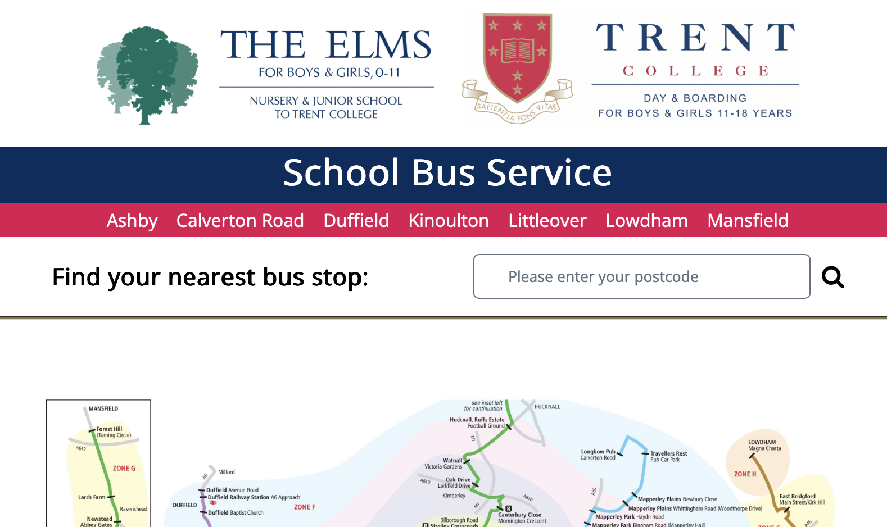
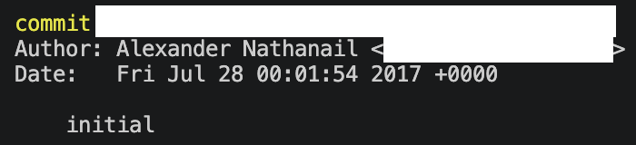
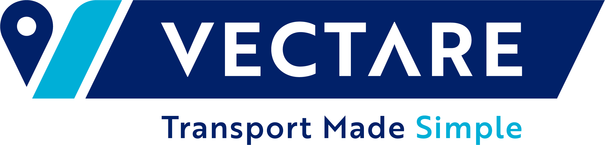

10 years ago my brother (Peter) and his friend (Dominic) started a company providing transport consultancy to private schools.
Well, school.
Their first client was the school I was attending (their alma mater), where Peter had been involved with the bus service as a student, due to his passion for transport. 
After he graduated, they missed his inputs, and so asked if he would like to keep working with them.

A few months into this endeavour someone (whom precisely is lost to time) came up with the idea of having a web-based booking system created, to replace the paper forms that they were currently using.
With the advent of modern LLMs still almost a decade away, which would eventually precipitate the ability for anyone to make such a simple system, they sought out the next best thing: 15-year old me.

Whilst that may sound young, this wasn’t actually my first coding job.
I’d cut my teeth a year or two earlier building a recycling bin collection management system, for the environmental team my brother setup at our school.
I was paid a whopping £40 (in iTunes gift cards) for the bin database, so when I was offered £600 cash for a bus booking system I jumped at the chance.

I learned a few lessons from that first deal: most importantly **define your scope of work**.
We had just agreed a price for 'a booking system', and so as the features were dreamt up I had no real recourse to request additional payment.
I think eventually it must have been deemed completed, because in my email archive I’ve got records of me submitting hours worked.

A year or two in, we started doing some consultancy for some real bus companies.
I was tasked with pulling as much data as possible out of their ticketing system (I was contacted by their IT team and told off for overloading them), and answering various different questions using the data.
In the 3 days leading up to the biggest deadline I put my bed next to my desk, and would start analysis running, nap until it was done, then come back to it.
I don’t think I slept more than 30 minutes continuously for the whole 3 days!

> [!note]
> I'm pretty sure I didn't mind, as it was interesting, I felt very important, and I didn't really need much sleep; ah the joys of being young.

We then started gaining schools clients, and soon I was maintaining about 5 copies of roughly the same codebase, with minor tweaks for each school.
I realised this was untenable, and decided to create a single system which could manage as many websites as we wanted, with different features available with settings.
This is not a groundbreaking concept in the world of the modern SaaS, but this was almost 10 years ago, and I was 16, so I was quite please with the idea!

This decision meant that the marginal developer time cost of doubling the number of sites over the next year was basically zero!

This was the first of many instances where I applied another important principle: **you Are gonna need it** (yAgni). This is a direct contravention of the common coding wisdom that [you aren’t gonna need it](https://martinfowler.com/bliki/Yagni.html). I understand the points that its proponents are making, and agree that you shouldn't create features that you don't yet need. I think there is a time and a place for all wisdom, and I've correctly predicted problems (far enough out to prevent them entirely) a lot.
It's a subtle art.

<!-- TODO improve -->
Up until this point I was paid hourly for the work I was doing.
But I realised that, as the critical person in the development of our core product, **I should get a slice of the pie**.
It's tricky to create a fair arrangement that both sides are happy with, but it's better to rock the boat a little than keep quiet.

The system grew, and as I approached my A levels it became clear that we were going to need more than just me working on the system. 
So, in mid-2019, we hired a placement student to work with me on the system for a year.
After he finished his final year of uni, he came back to us full time.
He grew into a fantastic developer, providing great leadership and mentorship to the team.

I applied yAgni in a major way several more times:
- Packaging up the environment into a Docker container as soon as I was working with someone else, making collaboration and deployment very simple forever onwards.
- Creating an automated mapping tool, allowing our transport professionals to do data analyses themselves without needing developer input.
- Building automations to remove the hassle of manual deployment, and catching bugs early as a result of updates going out almost as soon as they were ready.
- Obsessively adding more and more tools for automate testing, linting, type checking, etc. to remove as many opportunities for human error to cause problems.

<!-- We created driver and passenger facing apps, allowing people to see where there bus was. -->

I also decided that I didn't like our logo, and managed to convince the holder of the purse strings that we should spend (what seemed at the time) an enourmous sum of money on getting one professionally made:

{.img-w-60}

Alongside all this, the company had branched out into running public service vehicles on the roads.
Coach hire, bus services, rail replacement, you name it.
As this fleet grew, its management became more complex, and so we started creating software to help manage that.
This was a major step-change from the relative simplicity of 5-10 routes, all centering on a school, running just twice a day, and over time the system was able to assist with everything from payroll to vehicle maintenance.

Last summer, it became clear that the two diverging aims of the business were splitting people’s attention, and so the schools business was [sold to an EdTech company](https://www.faria.org/about-us/faria-news/faria-education-group-acquires-vectare-to-expand-global-school-transport-innovation/).
It was sad to say goodbye to my team, but it was great to know that this thing that I’d been building for so long was going to be well looked after.

I kept working on the software for the bus company, but I was also starting a two year Master’s in Quantum Computer Science in Amsterdam, so again my attention was split.
Over the last year, I worked with an excellent developer who landed a series of very useful functionalities to support the now unfathomable fleet of over 250 vehicles.

At the half-way point of my degree, staring down my thesis project, it became clear that I couldn’t keep all the plates spinning.
I’d been managing the development of software in various capacities alongside my GCSEs, A levels, and Bachelor’s degree, but it seems that a Master’s is just too much.
As such, after over 10 years, it is time to say goodbye to Transport Made Simple, and all the wonderful people that I’ve worked with along the way.

I’m very excited to now apply all these years of coding and management experience to my next projects: starting with an internship at a quantum simulation company, followed by my Master’s thesis about working with formal proof assistants.

My life would be vastly different without this opportunity, and I cannot imagine the trust it took to offer it to my 15 year old self.
I cannot thank Peter and Dominic enough.