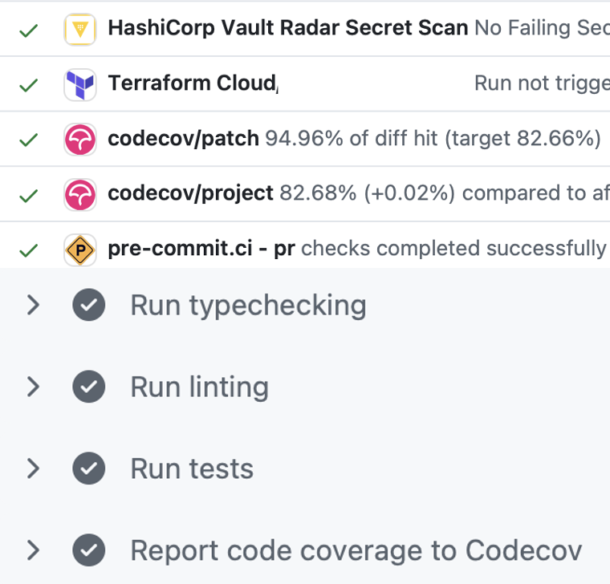
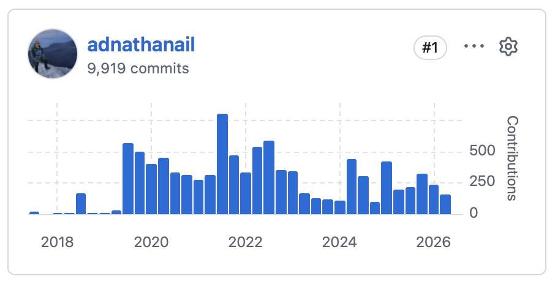

## 2016

Just before my 16th birthday, my brother asked me a question:

> Do you think you can build a bus booking website?

He'd just started a company with his friend to provide consultancy for school bus services, assisting with network routing and scheduling.
Their first client was the school I was still attending (he had just graduated), and they wanted to digitise their paper booking form.
In our brave new world of LLMs this type of thing would be trivial for anyone to produce in an afternoon, but a decade ago they had to seek out the next best thing: a teenager with a passion for coding.

I read everything I could find online, settled on a LAMP stack (Linux + Apache + MySQL + PHP), and put together the first version in a few months:

We then began a working arrangement which would continue indefinitely, where my 2 bosses would promise functionality to people and I would figure it out.
At first I found this deeply frustrating, as I felt an enormous pressure to create the impossible, but over time it developed in me a certainty that **I can figure out basically anything**.

## 2017

We started gaining clients, and soon I was maintaining 5 copies of roughly the same codebase, with minor tweaks for each school.
I realised this was untenable, and decided to create a single system which could manage as many websites as we wanted, with different features available with settings.

Not a groundbreaking concept in the world of the modern SaaS, but this was almost 10 years ago, and I was 16, so I was quite pleased with the idea.
The result was that the marginal developer time cost of doubling the number of sites over the next year was basically zero!

This was the beginning of another learning: **you Are gonna need it** (yAgni); a direct contravention of the common coding wisdom that [you aren't gonna need it](https://martinfowler.com/bliki/Yagni.html).
I completely agree that you shouldn't create features that you don't know your users need.
But foreseeing a need, particularly needs relating to scaling, and particularly when you are in full control of a project, can save a lot of time and effort!
It's a subtle art.

Of course this was a double-edged sword for me.
I had reduced the work required for me to keep these sites running, which meant I was being paid for fewer hours.
To make my goals align with the company's I realised that **I should get a slice of the pie**, and so I entered into my first serious business negotiation.

It was tough, but I had my grandfather as legal counsel, and we came to a revenue share arrangement that meant that I was invested in making a high quality sustainable product.

## 2018

A year or two in, we started doing some consultancy for some real bus companies.
I was tasked with pulling as much data as possible out of their ticketing system (I was contacted by their IT team and told off for overloading them), and answering various different questions using the data.
In the 3 days leading up to the biggest deadline, I put my bed next to my desk, and would start analysis running, nap until it was done, and then start the next stage.
I don't think I slept more than 30 minutes continuously for the whole 72 hours!

> [!note]
> I'm pretty sure I didn't mind; it was interesting work, it made me feel very important, and I didn't really need much sleep.
> The joys of being young.

I also remember sitting in my parents' kitchen stuffing about 500 envelopes twice (we messed up the first time), to send to the pupils of our biggest client at the time, and it really felt like we were having the _startup experience_™️.

## 2019

As the system grew, and I approached my A levels, it became clear that we were going to need more dev resource than just me.
So in mid-2019 we hired a placement student for a year.
This turned out to be an excellent decision, as he came back full time after finishing university, and grew into a fantastic developer, providing great leadership and mentorship to the team.

<!-- I applied yAgni in a major way several more times:
- Packaging up the environment into a Docker container as soon as I was working with someone else, making collaboration and deployment very simple forever onwards.
- Creating an automated mapping tool, allowing our transport professionals to do data analyses themselves without needing developer input.
- Building automations to remove the hassle of manual deployment, and catching bugs early as a result of updates going out almost as soon as they were ready.
- Obsessively adding more and more tools for automate testing, linting, type checking, etc. to remove as many opportunities for human error to cause problems. -->

## 2020

My main design skill lies in user experience, not visual design, but I've definitely developed a strong taste for what looks good to me^[LGTM!], and I started to feel that our logo wasn't up to scratch for the company that I saw us becoming.
So I managed to convince the master of coin that we should spend (what seemed at the time) an enormous sum of money on getting one professionally made:

{.img-w-60}

It's impossible to tell whether anyone was ever put off by our old logo, or convinced by our new one, but in my eyes it was a big step in the professionalisation of our growing company.
And I think that one of the most important skills that I've plied over the years is to **fight for what I believe in**; pushing for ideas that I felt were valuable, and not being steamrolled into accepting ones which I felt were misguided, even by people more senior than me.

## 2021

Alongside all this, the company had branched out into running public service vehicles on the roads.
Coach hire, bus services, rail replacement, you name it.
As this fleet grew, its management became more complex, and so we started creating software to assist.
This was a major step-change from the relative simplicity of 5-10 routes, all centring on a school, running just twice a day, and over time the system was involved in everything from payroll to vehicle maintenance.

## 2022-2024

My team of developers grew to 7, the customer service team grew to more than 10, and our client list grew to 150.
We built functionality to help schools with managing sports trips, allowed parents to track the location of the bus through an app, and created deep links with other school management software.

I stepped into my absolute favourite role that I've had in my career so far: greasing the wheels.
My team worked with schools to fulfil their needs, and I worked to fulfil my team's, by improving processes and introducing automation.
We massively increased test coverage, and started type-checking, linting, and auto-formatting.
We added a CDN, caches, auto-scaling, infrastructure as code, and instrumentation to provide insights into our running systems.

All of these things are completely standard in industry, but this codebase was essentially my learning environment, and so every 'best practice' I rolled out felt like another step on my journey to becoming a professional developer.

## 2025

Last summer, it became clear that our two diverging arms (school transport software, and our internal fleet) were splitting people's attention, and so the schools business was sold to an EdTech company.
It was sad to say goodbye to my team, but it was great to know that this thing that I'd been building for so long was going to be well looked after.

## 2026

I kept working on the software for the bus company.
This year I worked with a fantastic developer, who brought in a radical new suite of functionality, to support the needs of our growing fleet.

I also started a two year Master's in Quantum Computer Science in Amsterdam, so again my attention was split.

## What now?

At the half-way point of my degree, staring down my thesis project, I realised that I couldn't keep all the plates spinning.
I've been managing the development of software in various capacities alongside my GCSEs, A levels, and Bachelor's degree, but it seems that a Master's is just too much.
As such, after over 10 years, it is time to say goodbye to the company, and all the wonderful people that I've worked with along the way.

{.img-w-60}

I'm very excited to now apply all these years of experience to my next projects, starting with an internship at a quantum simulation company, followed by my Master's thesis working with formal proof assistants.

My life would be vastly different without this opportunity, and I cannot imagine the trust it took to offer it to my 15 year old self.
I cannot thank Peter and Dominic enough.