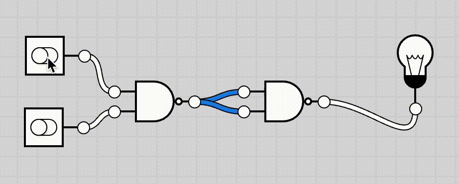
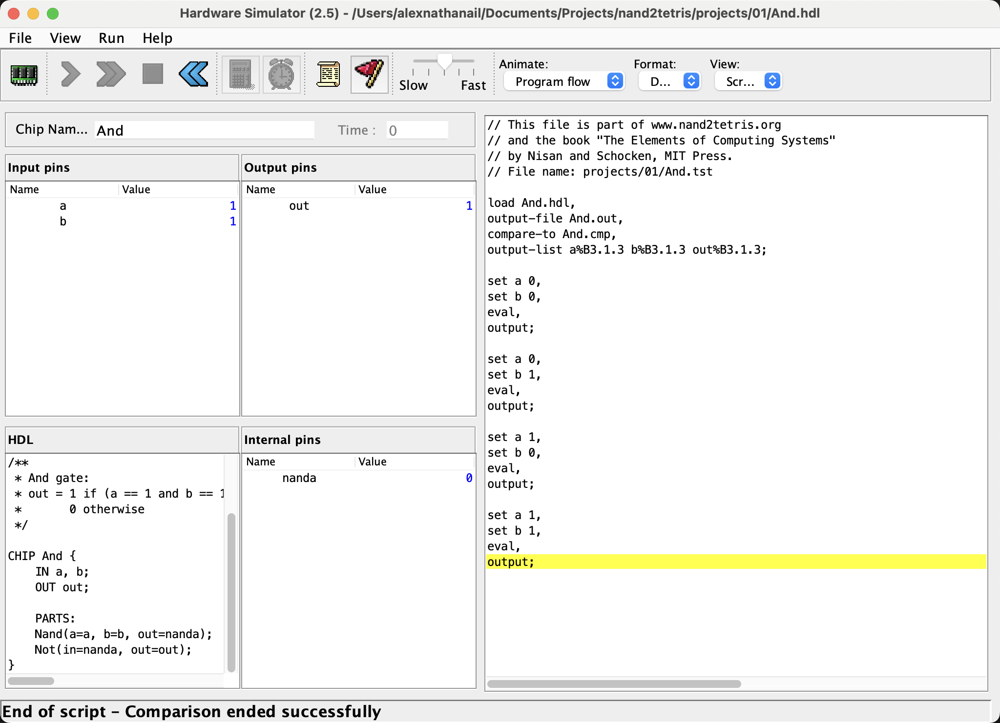
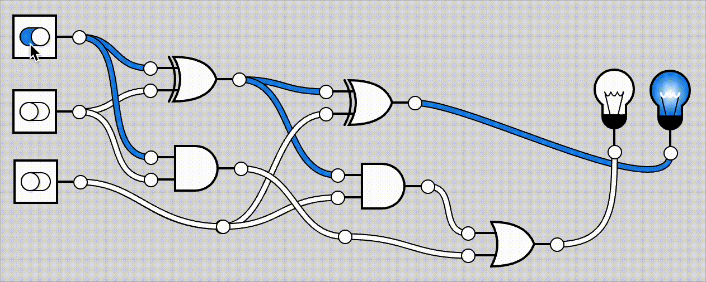
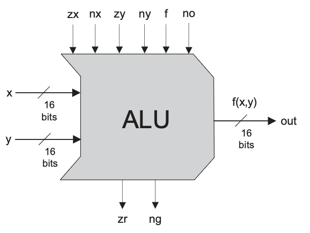

## TODO

* heroImg
* Israel
* Coursera course links
* Represent number bases with subscripts in LaTeX?
* Links to code
* Update contents table

A looooong time ago (2019) I started a fantastic course called [nand2tetris](http://www.nand2tetris.org/) which guides its pupils through the process of building a computer: from logic gates to fully functioning game.
But I was young and a little impatient, so I looked up the answers to some problems which were designed to make you struggle and then feel satisfaction when you got the answer.
And I think that only the first half of the course was available for free, so I stopped and forgot about it.

A different, and slightly less, long time ago (2023) I remembered about this course and decided to revisit it.
This time, I struggled against all the problems myself, and paid for the full Coursera course, and finally (slowly over \~2 years) completed it.

It was a fascinating process, requiring different styles of thinking at each layer of abstraction, and it gave me a lot more insight into what exactly a computer is and does.
It's also, if I may be allowed a single sentence of anti-AI grandstanding, exactly antithetical to the emerging "vibe coding" approach of not needing to understand what code is doing as long as it works, and I would highly recommend it to any interested developer.

I'd like not to give you the answers (although I will link my code on GitHub if you're really curious), but to give an idea of what goes on at each layer, so your interest may be peaked to go and check out the course. **I will introduce an idea and then skip to the next one, as I am not attempting to replicate the course here!**

## Contents

1. Basic gates (week 1)
2. Complex gates (week 2)
3. Time-based gates(week 3)
4. Full computer chip (week 5)
5. Assembly code (week 4)
6. Assembler (week 6)
7. VM translator (weeks 7 & 8)
8. High level language (week 9)
9. Compiler (weeks 10 & 11)
10. Operating system (week 12)
11. Game (week 9)

## Week 1: Boolean logic

The ground floor of computer science is logic gates, anything beyond that is a physics or engineering problem.
A logic gate is a box with inputs and outputs, which for our purposes we will assume can only be 0 or 1 (AKA `True` or `False`).

A classic example of a logic gate is an `AND` gate, which has 2 inputs and 1 output, and (in diagrams) it looks like this:

To describe the functionality of a logic gate we can use a truth table, which lists out all of the possible combinations of inputs, and their associated output:
**Input A** | **Input B** | **A AND B**
----------: | :---------: | :----------
0           | 0           | 0
0           | 1           | 0
1           | 0           | 0
1           | 1           | 1

If you think of the 1s as `True` and the 0s as `False` perhaps the name "AND" becomes clear, as the output is only true when both of the inputs are true (`True AND True = True`).

Some gates can be constructed from combinations of others. Interestingly, **it is possible to construct all gates from just a `NAND` gate** (the inverse of an `AND` gate).
Hence the name of the course!

Below is an `AND` gate implemented using 2 `NAND` gates; compare it to the truth table above and you should see the inputs and outputs match.

_This video is from an [online circuit emulator](https://logic.ly/), not the tool used in the course_

In the first week of this course you are given access to a (code-based) circuit simulator (below), with just a `NAND` gate, and asked to construct a list of gates with given truth tables.

In the bottom left you can see the code which actually defines the chip, in a language called HDL (hardware description language).
You can see this `AND` gate is made of 1 `NAND` gate and 1 `NOT` gate (which itself was constructed from a `NAND` gate in a different file).

On the right hand side is some test code, provided by the course, which sets the inputs to each row in the truth table, and checks the output is correct.

This automated testing is one of the things I loved about this course, as it allows you access to a “teachers eye” in an asynchronous remote manner.
This is less possible for some tasks, particularly as the work gets more complex, and you're still left with some head scratchers.
But the test files you're given (I believe) are the exact same as those run on your assignment submissions which give you your grades for the course!

## Week 2: Boolean arithmetic

Computers are now used for just about every application you can imagine, but a good starting point for a first task to attempt seems like addition.

It is possible to represent "normal" (decimal) numbers as 1s and 0s (binary) numbers. I won't go into exactly how this works, but you should know that 0 is `00`, 1 is `01`, 2 is `10` and 3 is `11` in order to understand the below video:

The switches on the left each represent a separate number (0 or 1), and the two bulbs on the right represent a single number. When none of the switches are on (0 + 0 + 0), neither of the lights are on (00 = 0). When two of the switches are on (1 + 1 + 0), the left light is on (10 = 2). And when all three switches are on, both lights are on (11 = 3)!

This is a circuit called a **full adder**, and it can perform addition on sums up to a maximum output of 3.
If you chain multiple of these together you can perform addition on arbitrary large numbers.

However, it's important to note that the exact size of the numbers you can add is fundamentally limited by the number that you chain together. This is a decision made by the circuit designer, and it's locked in forever; this is the nature of working directly in hardware. If you want to do larger, or more complex operations, than you have designed, then you need to introduce the concept of time.

_Also, that video does sort of give you the answer to one of the problems in week 2, but in all honesty I've seen and forgotten that circuit so many times; I had to look it up to make that video. So if you don't have this page actively open whilst you're working on the problem, you shouldn't have any issues with spoilers._

Thanks to the magic of [two's complement binary](https://www.cs.cornell.edu/~tomf/notes/cps104/twoscomp.html), this adder circuit can also add negative numbers.
There is a simple process to convert a positive number to it's negative equivalent (`5 -> -5`), so we can now also perform subtraction, because `a - b = a + (-b)`!

Combining together several of these full adders, and some glue to stick it all together, we can produce an **Arithmetic logic unit** or ALU.
This implements a barebones set of operations, which we can compose together in software (a few layers up), to do general computation, e.g. multiplication.

_TODO nand2tetris book, Fig 36, pg 36_

<Spoiler title_text={"What are the inputs/outputs along the top/bottom?"}>
    Inputs:
    - `zx` zeroes the `x` input
    - `nx` negates the `x` input
    - `zy` zeroes the `x` input
    - `ny` negates the `x` input
    - `f` is the "function code": `1` for add, `0` for and
    - `no` negates the ouput

    Outputs:
    - `zr` is `True` if `out=0`
    - `ng` is `True` if `out<0`
</Spoiler>

## Week 3: Sequential logic

So how do we implement multiplication?
We need a notion of time.

The adder circuit, and ALU, are **combinational**, meaning they only depend on the combinations of their inputs at a given point in time.
To do something like multiplication, which is a sequence of addition operations (`3 x 5 = 5 + 5 + 5`), we need a way to maintain "state", i.e. memory.

We implemented all of the Boolean logic and addition with increasing layers of abstraction on the `NAND` gate.
To implement memory, we need a new primitive: the *data flip flop* (DFF).

The DFF has a single input wire, a single output wire, and a
