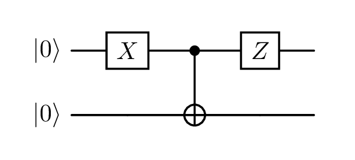
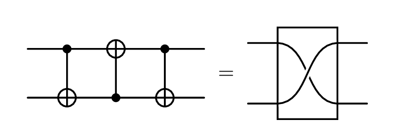
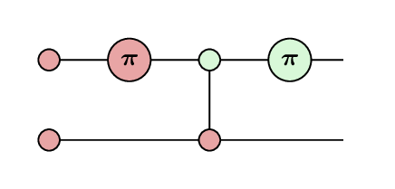
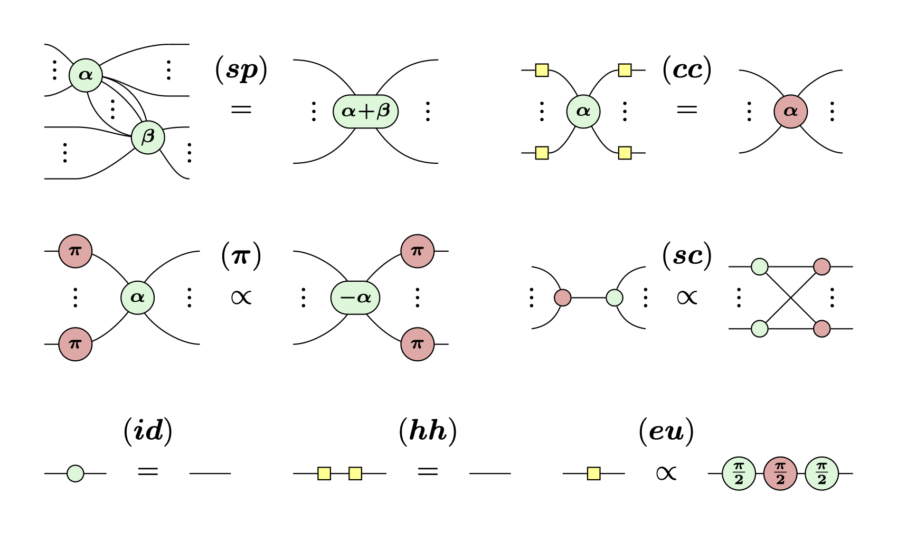

For the last year I've been doing a [Master's degree in Quantum Computer Science at the University of Amsterdam](https://www.uva.nl/shared-content/programmas/en/masters/quantum-computer-science/quantum-computer-science.html).
The first year has been primarily lecture-based, looking at a lot of the maths underpinning quantum computation.
I'm now going into my second year, in which I will primarily work on my thesis about working with the [ZX-calculus](https://zxcalculus.com) in [Lean](https://lean-lang.org).

> [!warning]
> As with a lot of my posts, I have no idea where to pitch this.
> It discusses some quite high level concepts, but through the lens of my journey to understand them, so it will probably be slow and obvious for an expert, and missing context for people with no prior knowledge.
> Sorry..!

## Linear algebra

One of the most applicable underlying topics has been linear algebra.
This may be a daunting phrase, and I certainly don't understand it anywhere well enough to talk about it authoritatively, but, in so far as I have interacted with it, **linear algebra is matrices and vectors**.

In school, you might have learned matrix multiplication
$$
  \left( \begin{array}{cc} 1 & 2 \\ 3 & 4 \end{array} \right)
  \left( \begin{array}{cc} 5 & 6 \\ 7 & 8 \end{array} \right)
  =
  \left( \begin{array}{cc} 1 \cdot 5 + 2 \cdot 7 & 1 \cdot 6 + 2 \cdot 8 \\ 3 \cdot 5 + 4 \cdot 7 & 3 \cdot 6 + 4 \cdot 8 \end{array} \right)
  =
  \left( \begin{array}{cc} 19 & 22 \\ 43 & 50 \end{array} \right)
$$

Or how to find the determinant of a matrix:
$$
  \left| \begin{array}{cc} a & b \\ c & d \end{array} \right| = ad - bc
$$

Or even eigenvectors and eigenvalues:
$$
  A v = \lambda v
$$

In quantum computing, one thing they are used for is to see what a quantum circuit does.

### Quantum circuits

A quantum circuit is one way that the "code" for a quantum computer can be written.
They have rows which represent **[qubits](https://www.ibm.com/think/topics/qubit)**, and along each row are placed [**gates**](https://quantum.cloud.ibm.com/learning/en/courses/utility-scale-quantum-computing/bits-gates-and-circuits) which represents operations being done on the qubits, sequentially from right to left.

The system has a **starting state** (usually $\ket{0}$ on every qubit) which will then be altered by the gates of the circuit.
We can use linear algebra to determine what state the system will be in once the circuit has been run.

Here is an example (useless) quantum circuit:

We read this circuit left-to-right:
- We have 2 qubits initialized to the $\ket{0}$ state.
- The top qubit has an X gate applied,
- then both qubits have a CNOT gate applied (which side has the dot and which the plus is important!),
- and lastly the top qubit has a Z gate applied.

If we want to understand what process this circuit is performing we need these facts:
- $\ket{0}$ is a [handy shorthand](https://learn.microsoft.com/en-us/azure/quantum/concepts-dirac-notation) for the vector $\left( \begin{array}{c} 1 \\ 0 \end{array} \right)$.
- We combine matrixes and vectors which are stacked vertically using the [Kronecker product](https://learn.microsoft.com/en-us/azure/quantum/concepts-vectors-and-matrices#tensor-product), so our two qubits can be combined into $\left( \begin{array}{c} 1 \\ 0 \end{array} \right) \otimes \left( \begin{array}{c} 1 \\ 0 \end{array} \right) = \left( \begin{array}{c} 1 \\ 0 \\ 0 \\ 0 \end{array} \right)$.
- The effect of a gate can be described as a matrix, which can be seen in [this handy reference image](https://upload.wikimedia.org/wikipedia/commons/e/e0/Quantum_Logic_Gates.png?utm_source=commons.wikimedia.org&utm_campaign=index&utm_content=original).
- A wire with no gate on it can be described with the [identity matrix](https://www.khanacademy.org/math/precalculus/x9e81a4f98389efdf:matrices/x9e81a4f98389efdf:properties-of-matrix-multiplication/a/intro-to-identity-matrices).
- [Matrices are composed right to left](https://www.3blue1brown.com/lessons/matrix-multiplication/#composition-is-multiplication)
- We commonly use $\ket{\psi}$ to mean _'some unknown state'_

Then it is just matrix multiplication:

$$
  \begin{aligned}
    \ket{\psi} &= 
      \left( Z \otimes I \right)
      \operatorname{CNOT}
      \left( X \otimes I \right)
      \left( \ket{0} \otimes \ket{0} \right) \\
    &=
      \left( Z \otimes I \right)
      \operatorname{CNOT}
      \left( \begin{array}{cccc} 0 & 0 & 1 & 0 \\ 0 & 0 & 0 & 1 \\ 1 & 0 & 0 & 0 \\ 0& 1 & 0 & 0 \end{array} \right)
      \left( \begin{array}{c} 1 \\ 0 \\ 0 \\ 0 \end{array} \right) \\
    &=
      \left( Z \otimes I \right)
      \left( \begin{array}{cccc} 1 & 0 & 0 & 0 \\ 0 & 1 & 0 & 0 \\ 0 & 0 & 0 & 1 \\ 0 & 0 & 1 & 0 \end{array} \right)
      \left( \begin{array}{c} 0 \\ 0 \\ 1 \\ 0 \end{array} \right) \\
    &=
      \left( \begin{array}{cccc} 1 & 0 & 0 & 0 \\ 0 & 1 & 0 & 0 \\ 0 & 0 & -1 & 0 \\ 0 & 0 & 0 & -1 \end{array} \right)
      \left( \begin{array}{c} 0 \\ 0 \\ 0 \\ 1 \end{array} \right) \\
    &= \left( \begin{array}{c} 0 \\ 0 \\ 0 \\ -1 \end{array} \right) \\
    &= - \ket{1} \otimes \ket{1}
  \end{aligned}
$$

That was long and tedious, and that was a small (useless) circuit.

Here is an example of a more useful calculation, which shows that we can replace 3 CNOT gates with 1 SWAP gate.
Don't worry about what those gates do, but finding a way to represent the same operations with fewer gates makes our circuits run faster!

  
Linear algebra: DO NOT OPEN

  _Note that the middle CNOT has a `2 → 1` subscript, to indicate that the dot and plus are the opposite way around._
  _It also has a slightly different matrix representation._
  $$
    \begin{aligned}
      \operatorname{CNOT} \cdot \operatorname{CNOT}_{2 \rightarrow 1} \cdot \operatorname{CNOT} &=
        \operatorname{CNOT} \cdot
        \left( \begin{array}{cccc} 1 & 0 & 0 & 0 \\ 0 & 0 & 0 & 1 \\ 0 & 0 & 1 & 0 \\ 0 & 1 & 0 & 0 \end{array} \right)
        \left( \begin{array}{cccc} 1 & 0 & 0 & 0 \\ 0 & 1 & 0 & 0 \\ 0 & 0 & 0 & 1 \\ 0 & 0 & 1 & 0 \end{array} \right) \\
      &=
        \left( \begin{array}{cccc} 1 & 0 & 0 & 0 \\ 0 & 1 & 0 & 0 \\ 0 & 0 & 0 & 1 \\ 0 & 0 & 1 & 0 \end{array} \right)
        \left( \begin{array}{cccc} 1 & 0 & 0 & 0 \\ 0 & 0 & 1 & 0 \\ 0 & 0 & 0 & 1 \\ 0 & 1 & 0 & 0 \end{array} \right) \\
      &=
        \left( \begin{array}{cccc} 1 & 0 & 0 & 0 \\ 0 & 0 & 1 & 0 \\ 0 & 1 & 0 & 0 \\ 0 & 0 & 0 & 1 \end{array} \right) \\
      &= \operatorname{SWAP}
    \end{aligned}
  $$

<!-- TODO improve motivation -->
Of course computers can do these operations very quickly, but eventually even they will struggle, and you, the human, are more disconnected from the intuitions possible in the field.

## The ZX-calculus

The ZX-calculus is a pair of commutative special dagger Frobenius algebras, which together form a scaled bialgebra.[^coecke-duncan]

[^coecke-duncan]: Bob Coecke and Ross Duncan, "Interacting Quantum Observables: Categorical Algebra and Diagrammatics," *New Journal of Physics* 13, no. 4 (2011): 043016, <https://doi.org/10.1088/1367-2630/13/4/043016>.

I'm currently working through [Category Theory for Programmers](https://www.blurb.co.uk/b/9621951-category-theory-for-programmers-new-edition-hardco) ([free version on the author's blog](https://bartoszmilewski.com/2014/10/28/category-theory-for-programmers-the-preface/)) to understand what on earth that means.
I think it's basically saying that quantum observables happen to follow a bunch of symmetries and rules, which means we can work with them in beautiful ways.

Luckily for us, we can happily use the ZX-calculus without any understanding of category theory.

### ZX-diagrams

<!-- TODO insert example diagram -->

ZX-diagrams are the bread and butter of the ZX-calculus.
They are composed (almost) entirely of red and green circles (called **spiders**), sometimes with numbers attached (**phases**), connected with various quantities of wires.

Each spider, along with its phase, and number of wires, represents a matrix.[^linear-map-not-matrix]
Wires can be joined together to make larger diagrams of spiders, again with a matrix representation.
This system of composing building blocks turns out to be expressive enough to fully represent any quantum circuit!

[^linear-map-not-matrix]: Technically it represents a linear map, which can be writted as a matrix in a given basis.[^tensor-not-linear-map]

[^tensor-not-linear-map]: Technically technically it represents a tensor.

Every element of a quantum circuit has a way to write it as a ZX-diagram.
For example, the first circuit as a ZX-diagram would look like this:

This is all very fun, but to be honest this might be harder to read, what's the point?
This is where the rules of the ZX-calculus comes in!

It turns out that lots of different ZX-diagrams can represent the same quantum circuit, and the ZX-calculus provides rules which allow us to move between them.

For example, in the diagram above, we can move the green spider with the $\pi$ in it through the spider to its left.
If you compare the two diagrams, you'll see that what we did was move the Z gate to before the CNOT gate.
And, if you worked out the linear algebra, you'd see that those two circuits were entirely equivalent operations!

That was an example of an application of the **spider fusion** (**sp**) rule. [^spider-unfusion]

[^spider-unfusion]: And then applying it in reverse, colloquially 'unfusion'

Below are 7 such rules (including spider fusion) which form the standard rules of the ZX-calculus.

Understanding these rules properly requires a bit of effort, and isn't really the point of this blog post.
But as an example, the second circuit from earlier showing 3 CNOTs equal SWAP is quite nice to see.



1. Draw out our circuit as a ZX diagram.
2. Just drag the diagram around a bit so that it looks more like our (sc) rule.

> [!info]
> You can drag the elements of the diagram around to see that nothing actually changed!

3. Apply the strong complementarity rule.
4. Apply the spider fusion rule.
5. Use something called the Hopf rule, which allows us to remove a pair of links between the same two nodes. This is derived from strong complementarity, so we have just called it (sc) here.
6. Apply the identity rule twice.

These little diagrams are part of the first little stage of my thesis.
