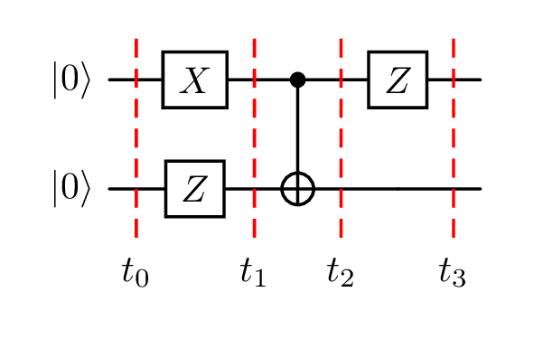
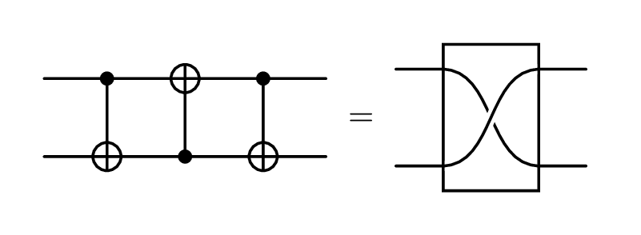
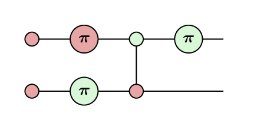

For the last year I've been doing a [Master's degree in Quantum Computer Science at the University of Amsterdam](https://www.uva.nl/shared-content/programmas/en/masters/quantum-computer-science/quantum-computer-science.html).
The first year has been primarily lecture-based, looking at a lot of the maths underpinning quantum computation.
I'm now going into my second year, in which I will primarily work on my thesis about working with the [ZX-calculus](https://zxcalculus.com) in [Lean](https://lean-lang.org).

> [!warning]
> As with a lot of my posts, I have no idea where to pitch this.
> It discusses some quite high level concepts, but through the lens of my journey to understand them, so it will probably be slow and obvious for an expert, and missing context for people with no prior knowledge.
> Sorry..!

## Linear algebra

One of the most applicable underlying topics has been linear algebra.
This may be a daunting phrase, and I certainly don't understand it anywhere well enough to talk about it authoritatively, but, in so far as I have interacted with it, **linear algebra is matrices and vectors**.

In school, you might have learned matrix multiplication
$$
  \left( \begin{array}{cc} 1 & 2 \\ 3 & 4 \end{array} \right)
  \left( \begin{array}{cc} 5 & 6 \\ 7 & 8 \end{array} \right)
  =
  \left( \begin{array}{cc} 1 \cdot 5 + 2 \cdot 7 & 1 \cdot 6 + 2 \cdot 8 \\ 3 \cdot 5 + 4 \cdot 7 & 3 \cdot 6 + 4 \cdot 8 \end{array} \right)
  =
  \left( \begin{array}{cc} 19 & 22 \\ 43 & 50 \end{array} \right)
$$

Or how to find the determinant of a matrix:
$$
  \left| \begin{array}{cc} a & b \\ c & d \end{array} \right| = ad - bc
$$

Or even eigenvectors and eigenvalues:
$$
  A v = \lambda v
$$

In quantum computing, one thing they are used for is to see what a quantum circuit does.

### Quantum circuits

A quantum circuit is one way that the "code" for a quantum computer can be written.
They have rows which represent **[qubits](https://www.ibm.com/think/topics/qubit)**, and along each row are placed [**gates**](https://quantum.cloud.ibm.com/learning/en/courses/utility-scale-quantum-computing/bits-gates-and-circuits) which represents operations being done on the qubits, sequentially from right to left.

The system has a **starting state** (usually $\ket{0}$ on every qubit) which will then be altered by the gates of the circuit.
We can use linear algebra to determine what state the system will be in once the circuit has been run.

Here is an example (useless) quantum circuit:



We read this circuit left-to-right:
- We have 2 qubits initialized to the $\ket{0}$ state.
- The top qubit has an X gate applied,
- then both qubits have a CNOT gate applied (which side has the dot and which the plus is important!),
- and lastly the top qubit has a Z gate applied.

If we want to understand what process this circuit is performing we need these facts:
- $\ket{0}$ is a [handy shorthand](https://learn.microsoft.com/en-us/azure/quantum/concepts-dirac-notation) for the vector $\left( \begin{array}{c} 1 \\ 0 \end{array} \right)$.
- We combine matrixes and vectors which are stacked vertically using the [Kronecker product](https://learn.microsoft.com/en-us/azure/quantum/concepts-vectors-and-matrices#tensor-product), so our two qubits can be combined into $\left( \begin{array}{c} 1 \\ 0 \end{array} \right) \otimes \left( \begin{array}{c} 1 \\ 0 \end{array} \right) = \left( \begin{array}{c} 1 \\ 0 \\ 0 \\ 0 \end{array} \right)$.
- The effect of a gate can be described as a matrix, which can be seen in [this handy reference image](https://upload.wikimedia.org/wikipedia/commons/e/e0/Quantum_Logic_Gates.png?utm_source=commons.wikimedia.org&utm_campaign=index&utm_content=original).
- A wire with no gate on it can be described with the [identity matrix](https://www.khanacademy.org/math/precalculus/x9e81a4f98389efdf:matrices/x9e81a4f98389efdf:properties-of-matrix-multiplication/a/intro-to-identity-matrices).
- [Matrices are composed right to left](https://www.3blue1brown.com/lessons/matrix-multiplication/#composition-is-multiplication)
- We commonly use $\ket{\psi}$ to mean _'some unknown state'_

Then it is just matrix multiplication:

$$
  \begin{aligned}
    \ket{\psi} &= 
      \left( Z \otimes I \right)
      \operatorname{CNOT}
      \left( X \otimes I \right)
      \left( \ket{0} \otimes \ket{0} \right) \\
    &=
      \left( Z \otimes I \right)
      \operatorname{CNOT}
      \left( \begin{array}{cccc} 0 & 0 & 1 & 0 \\ 0 & 0 & 0 & 1 \\ 1 & 0 & 0 & 0 \\ 0& 1 & 0 & 0 \end{array} \right)
      \left( \begin{array}{c} 1 \\ 0 \\ 0 \\ 0 \end{array} \right) \\
    &=
      \left( Z \otimes I \right)
      \left( \begin{array}{cccc} 1 & 0 & 0 & 0 \\ 0 & 1 & 0 & 0 \\ 0 & 0 & 0 & 1 \\ 0 & 0 & 1 & 0 \end{array} \right)
      \left( \begin{array}{c} 0 \\ 0 \\ 1 \\ 0 \end{array} \right) \\
    &=
      \left( \begin{array}{cccc} 1 & 0 & 0 & 0 \\ 0 & 1 & 0 & 0 \\ 0 & 0 & -1 & 0 \\ 0 & 0 & 0 & -1 \end{array} \right)
      \left( \begin{array}{c} 0 \\ 0 \\ 0 \\ 1 \end{array} \right) \\
    &= \left( \begin{array}{c} 0 \\ 0 \\ 0 \\ -1 \end{array} \right) \\
    &= - \ket{1} \otimes \ket{1}
  \end{aligned}
$$

That was long and tedious, and that was a small (useless) circuit.

Here is an example of a more useful calculation, which shows that we can replace 3 CNOT gates with 1 SWAP gate.
Don't worry about what those gates do, but finding a way to represent the same operations with fewer gates makes our circuits run faster!



<details>
  <summary>Linear algebra: DO NOT OPEN</summary>

  _Note that the middle CNOT has a `2 → 1` subscript, to indicate that the dot and plus are the opposite way around._
  _It also has a slightly different matrix representation._
  $$
    \begin{aligned}
      \operatorname{CNOT} \cdot \operatorname{CNOT}_{2 \rightarrow 1} \cdot \operatorname{CNOT} &=
        \operatorname{CNOT} \cdot
        \left( \begin{array}{cccc} 1 & 0 & 0 & 0 \\ 0 & 0 & 0 & 1 \\ 0 & 0 & 1 & 0 \\ 0 & 1 & 0 & 0 \end{array} \right)
        \left( \begin{array}{cccc} 1 & 0 & 0 & 0 \\ 0 & 1 & 0 & 0 \\ 0 & 0 & 0 & 1 \\ 0 & 0 & 1 & 0 \end{array} \right) \\
      &=
        \left( \begin{array}{cccc} 1 & 0 & 0 & 0 \\ 0 & 1 & 0 & 0 \\ 0 & 0 & 0 & 1 \\ 0 & 0 & 1 & 0 \end{array} \right)
        \left( \begin{array}{cccc} 1 & 0 & 0 & 0 \\ 0 & 0 & 1 & 0 \\ 0 & 0 & 0 & 1 \\ 0 & 1 & 0 & 0 \end{array} \right) \\
      &=
        \left( \begin{array}{cccc} 1 & 0 & 0 & 0 \\ 0 & 0 & 1 & 0 \\ 0 & 1 & 0 & 0 \\ 0 & 0 & 0 & 1 \end{array} \right) \\
      &= \operatorname{SWAP}
    \end{aligned}
  $$
</details>

<!-- TODO improve motivation -->
Of course computers can do these operations very quickly, but eventually even they will struggle, and you, the human, are more disconnected from the intuitions possible in the field.

## The ZX-calculus

The ZX-calculus is a pair of commutative special dagger Frobenius algebras, which together form a scaled bialgebra.[^coecke-duncan]

[^coecke-duncan]: Bob Coecke and Ross Duncan, "Interacting Quantum Observables: Categorical Algebra and Diagrammatics," *New Journal of Physics* 13, no. 4 (2011): 043016, <https://doi.org/10.1088/1367-2630/13/4/043016>.

I'm currently working through [Category Theory for Programmers](https://www.blurb.co.uk/b/9621951-category-theory-for-programmers-new-edition-hardco) ([free version on the author's blog](https://bartoszmilewski.com/2014/10/28/category-theory-for-programmers-the-preface/)) to understand what on earth that means.
I think it's basically saying that quantum observables happen to follow a bunch of symmetries and rules, which means we can work with them in beautiful ways.

Luckily for us, we can happily use the ZX-calculus without any understanding of category theory.

### ZX-diagrams

<!-- TODO insert example diagram -->

ZX-diagrams are the bread and butter of the ZX-calculus.
They are composed (almost) entirely of red and green circles (called **spiders**), sometimes with numbers attached (**phases**), connected with various quantities of wires.

Each spider, along with its phase, and number of wires, represents a matrix.[^linear-map-not-matrix]
Wires can be joined together to make larger diagrams of spiders, again with a matrix representation.
This system of composing building blocks turns out to be expressive enough to fully represent any quantum circuit!

[^linear-map-not-matrix]: Technically it represents a linear map, which can be writted as a matrix in a given basis.[^tensor-not-linear-map]

[^tensor-not-linear-map]: Technically technically it represents a tensor.

Every element of a quantum circuit has a way to write it as a ZX-diagram.
For example, the first circuit as a ZX-diagram would look like this:



This is all very fun, but to be honest this might be harder to read, what's the point?
This is where the rules of the ZX-calculus comes in!

It turns out that lots of different ZX-diagrams can represent the same quantum circuit, and the ZX-calculus provides rules which allow us to move between them.

For example, in the diagram above, we can move the green spider with the $\pi$ in it through the spider to its left.
If you compare the two diagrams, you'll see that what we did was move the Z gate to before the CNOT gate.
And, if you worked out the linear algebra, you'd see that those two circuits were entirely equivalent operations!

That was an example of an application of the **spider fusion** (**sp**) rule. [^spider-unfusion]

[^spider-unfusion]: And then applying it in reverse, colloquially 'unfusion'.

Below are 7 such rules (including spider fusion) which form the standard rules of the ZX-calculus.


Understanding these rules properly requires a bit of effort, and isn't really the point of this blog post.
But as an example, the second circuit from earlier showing 3 CNOTs equal SWAP is quite nice to see.



1. Draw out our circuit as a ZX diagram.
2. Just drag the diagram around a bit so that it looks more like our (sc) rule.

> [!info]
> You can drag the elements of the diagram around to see that nothing actually changed!

3. Apply the strong complementarity rule.
4. Apply the spider fusion rule.
5. Use something called the Hopf rule, which allows us to remove a pair of links between the same two nodes. This is derived from strong complementarity, so we have just called it (sc) here.
6. Apply the identity rule twice.

<!-- TODO introduce H boxes -->

### zxcc

These little diagram viewers are part of the first little stage of my thesis, and actually the impetus for this blog post.

They are based on the [interactive viewer](https://github.com/zxcalc/pyzx/blob/master/pyzx/js/zx_viewer.js) built into [pyzx](https://github.com/zxcalc/pyzx). I [embedded that](https://github.com/adnathanail/LeanSpider/tree/a2a6cb0f0c755194b394058b9231575589a0c69b/zx_view_widget) into a React component in a [project working with the ZX-calculus in Lean](https://github.com/adnathanail/LeanSpider). I'm now continuing that project for my thesis, and I decided to extract the functionality out into a separate library: [zxcc](https://github.com/adnathanail/zxcc).

I wanted the ergonomics of components, without the bulk of something like React, so I rewrote it using a web components library called [lit](https://lit.dev). I then realised the bundle was 500KB because of the D3 dependency, so I rewrote the renderer using raw SVGs.

In an effort to maintain visual and functional parity with the original viewer, I created a [Storybook](https://main--6a7e12985acc92e6ec37bdaa.chromatic.com/) displaying various types of diagrams. This is fed into a tool called [Chromatic](https://www.chromatic.com), which visually compares each part of the Storybook whenever I push no code, so I can confirm changes are working as intended, and no regressions are introduced.

I'm doing all this, because I don't want to actually start working on my thesis.

## Hypergraphs

### Graphs

The word [graph](https://adacomputerscience.org/concepts/struct_graph) means something very different to mathematicians than it does to most people.
In mathland they are basically a way of showing relationships.

You have a bunch of **nodes** which are often drawn as dots or circles, and **edges** which are lines between nodes.

Essentially, a ZX-diagram looks exactly like a graph.
Our spiders are the nodes, and our wires are the edges.

It's been a while since I showed a pretty diagram so here's one:



> [!question]
> What famous quantum protocol does this diagram represent?

That ones a bit complicated for my next example so here's another:



A graph is nice visually for humans because we have eyes, but a computer needs a more ergonomic way to work with them.

There are a two main ways a computer can represent a graph; **adjacency lists** make the most sense here. [^adjacency-matrixes]
In this format, each of our nodes has an ID, and then each of our edges is represented by a pair of node IDs.

For the example above, the adjacency list representation (ignoring the node types/phases) might look like this:

```js
{
  "nodes": [0, 1, 2, 3],
  "edges": [
    [0, 1],
    [1, 2],
    [2, 3],
  ]
}
```

[^adjacency-matrixes]: The other option is an adjacency matrix, where you have a sort of table, with each node having both a row and a column. If two nodes are connected, then you follow along their row and column to find the cell in both, and put a 1 there. Adjacency matrices are useful when you have a **dense** graph, i.e. lots of nodes are connected to lots of other nodes. In our diagrams, each node/spider is typically only connected to a few neighbours.

### Hypergraphs

In a hypergraph, an edge can be between more than 2 nodes.
That might sound a little bit insane, but it can be a more ergonomic way to represent some types of relationships.

Imagine a graph of people and their friendships.
You can happily draw lines between pairs of people to accurately display all of the relationships between them.
But you might then want to plan a party with a group of people where everyone knows each other.

This information is absolutely contained within the graph, but it requires a bit of processing to find it.
In fact this question is equivalent to the [clique problem](https://en.wikipedia.org/wiki/Clique_problem), which is NP-complete. [^np-complete]

[^np-complete]: Computer science shorthand for 'we don't have a good algorithm for it'.

If we instead stored our friendships in a hypergraph, where a hyperedge between several people means that they are all friends, then the answer to this question is readily available from our data structure.

> [!note]
> This setup might make other questions longer to answer; this is the fundamental trade-off in selecting the right data structure for the job!

## Hypergraph representations of ZX-diagrams

So why do we care about hypergraphs here?
Clearly a ZX-diagram is laid out like a regular graph, each wire is only between two spiders.

The idea here is to have the wires become the nodes, and the spiders become the hyperedges.
Because each wire/node can necessarily only be connected to 2 spiders/hyperedges, we can visualize our ZX-diagrams as a funny sort of Venn diagram-looking structure.

<!-- TODO make diagram responsive, and rephrase para velow -->
If you click the spiders on the left, you'll see the corresponding blobs (hyperedges) highlight on the right. Similarly, if you click in a blob (or at an intersection of multiple blobs) you'll see the corresponding spider(s) on the left highlight; and, if you click a node on the right, the corresponding wire on the left will highlight.



But why should we do this?
That is essentially the point of this blog post, and it's sort of an attempt for me to coherently explain it to myself.

<!-- TODO find out the proper explanation -->

In my computer scientist brain, it's about which of spiders and wires should be 'first-class objects'; i.e. which should have unique identifiers, and which should be defined in relation to the first-class object.

### Only connectivity matters

This is the core mantra in the study of [string diagrams](https://zxcalc.github.io/book/html/main_htmlch2.html), of which the ZX-calculus is an example.

It's basically saying that it doesn't matter _where_ your spiders are, so long as they are connected up identically; hence why the viewers let you drag them around.

<!-- TODO don't show labels -->


These two diagrams above are entirely equivalent to each other.
We could move any of the spiders and H-boxes anywhere at all, and the diagrams mean the same thing.
The only two nodes for which this is not true are the two black circles: the input and the ouput.

'Input' and 'output' are different because they are the locations at which diagrams can be stuck together.
In fact, implicitly, every spider (with a given number of wires), has implicit input and output nodes on their ends:

<!-- TODO add: = the same diagram rotated, lightning arrow the diagram with spiders on the ends, = that diagram rotated -->


However, because of the specifics of the linear maps that the spiders and H-boxes represent, these inputs/outputs are symmetric in how they are connected.

Comparing this to IO on an arbitrary diagram, it is highly unlikely that the linear map represented is symmetric on its inputs and outputs.
So we need a way of labelling our inputs and outputs.

### Port graphs

In a regular graph, wires exist only in reference to spiders.
The pink wire in the diagram below is represented as `(5, 6)`, i.e. _'this edge connects nodes 5 and 6`_, and that's all we know about the wire.


  {
    "nodes": [
      { "id": 5, "qubit": 0, "col": 1, "type": "spider", "color": "Z" },
      { "id": 6, "qubit": 0, "col": 2, "type": "spider", "color": "X", "phase": "π" }
    ],
    "edges": [
      { "src": 5, "tgt": 6, "kind": "hadamard" }
    ]
  }


If wanted to say that we have an input to node 5, and an output from node 6, there isn't a straightforward way to represent this.
We could say that `(null, 5)` means _'node 5 accepts an input'_, but if we have multiple places accepting inputs/outputs in our diagram, we need a way to refer to them directly.

We could do this by creating a separate list just for input/output, or creating special node types which represent an input/output (or probably several other subtly different structures):

```js
{
  "nodes": [ { "id": 5, "type": "Z", "phase": "0" }, { "id": 6, "type": "X", "phase": "π" } ],
  "edges": [ (5, 6) ],
  "ports": { 0: 5, 1: 6 } // option 1: port 0 -> node 5, port 1 -> node 6
}

{
  "nodes": [
    { "id": 5, "type": "Z", "phase": "0" }, { "id": 6, "type": "X", "phase": "π" },
    { "id": 0, "type": "in" }, { "id": 1, "type": "out" } // option 2
  ],
  "edges": [
    (5, 6),
    (0, 5), (1, 6) // option 2: node 0 (in) -> node 5, node 1 (out) -> node 6
  ],
}
```

These are essentially just different memory representations for this:


  {
    "nodes": [
      { "id": 0, "qubit": 0, "col": 0, "type": "input" },
      { "id": 5, "qubit": 0, "col": 1, "type": "spider", "color": "Z", "phase": "0" },
      { "id": 6, "qubit": 0, "col": 2, "type": "spider", "color": "X", "phase": "π" },
      { "id": 1, "qubit": 0, "col": 3, "type": "output" }
    ],
    "edges": [
      { "src": 0, "tgt": 5 },
      { "src": 5, "tgt": 6, "kind": "hadamard" },
      { "src": 6, "tgt": 1 }
    ]
  }


This concept of defining inputs and outputs on a graph is known as a **port graph** with the inputs and outputs termed **ports**.
This is a perfectly valid approach, but the data structure just isn't as _neat_.
It gives me a feeling of hackiness, which would be nice to avoid.

### Edges as first class objects

The hypergraph representation of the same diagram looks like this:

```js
{
  "nodes": [ { "id": 0 }, { "id": 1 }, { "id": 2 } ], // wires
  "edges": [ (0, 1, "Z", "0"), (1, 2, "X", "π") ],
}
```


  {
    "nodes": [
      { "id": 0, "qubit": 0, "col": 0, "type": "input" },
      { "id": 5, "qubit": 0, "col": 1, "type": "spider", "color": "Z", "phase": "0" },
      { "id": 6, "qubit": 0, "col": 2, "type": "spider", "color": "X", "phase": "π" },
      { "id": 1, "qubit": 0, "col": 3, "type": "output" }
    ],
    "edges": [
      { "src": 0, "tgt": 5 },
      { "src": 5, "tgt": 6, "kind": "hadamard" },
      { "src": 6, "tgt": 1 }
    ]
  }


Here, the ports attached to the two spiders inherently have names.
The spiders themselves do not, but this doesn't seem to matter.
We still have a way to give them properties like what type of spider they are, or what their phase is.

## ZX-calculus rules as hypergraphs

