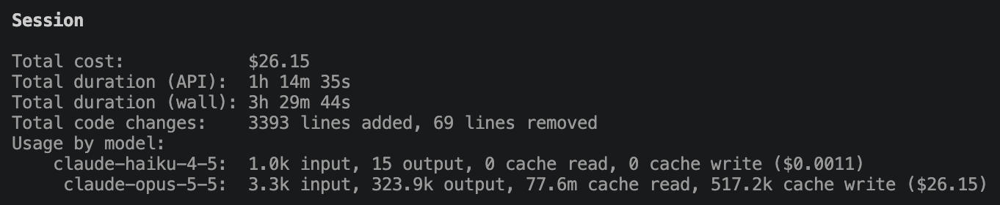

A year or two ago I experimented with nixOS.
The promise is a beautiful one: your whole device setup lives in version controlled text files.

This particularly appeals to my sensibilities, because I [never trust myself](../2026-08-15-github-verified-linear/) and I want to be able to [configure fearlessly](../2024-12-28-code-fearlessly/).
Specifically, my devices inevitably accrete a thick mess of different language toolchains, and python versions, installed through various methods, and when everything gets tangled up the only real advice is to wipe it all and start again.

So a year or two ago I installed [nixOS](https://nixos.org) and had a lovely time configuring everything, but I just wasn’t a Linux user (yet?)
There were some apps and niceties which I couldn’t find a replacement for quick enough to make the change stick.
Also managing all the config was a little laborious and documentation wasn’t amazing.
So I came back to macOS.

About 6 months ago I got a new MacBook, and had discovered [nix-darwin](https://github.com/nix-darwin/nix-darwin), and thought this might be a happy medium.
It was!
I couldn’t configure everything, but the main complicated task of dev toolchains was very doable.

Also I discovered that the advances in AI had changed the game completely in terms of managing config.
Now I essentially had a butler for my laptop.
I know there are all sorts of ways to have an agent directly control a device, but I’m not brave enough for those yet.
But, being able to type “can you configure 1Password commit signing with git” was a dream.
Also being able to see the result of that request as code, not yet run on my machine, generated by an agent with write permissions scoped only to that directory, which I could then choose whether to apply to my laptop, was a perfect workflow.

My initial adoption was mainly just listing all the apps I wanted installing.
Lots of the macOS tools I was using didn’t have declarative config, and that was fine.

Then in the last couple of weeks I decided I had time to play with my interface, and Claude put together a lovely sketchybar + aerospace config, which automatically sorts windows for different parts of my life into different desktops, and it even threw together 2 different helper apps, one in swift and one in C (not sure why the difference) to smooth over the gaps.

It’s been pretty cool.
I want my network download/upload speed visible at all times?
It’s there.
Upcoming meetings make my menu bar bright red 30s before with a link to the meeting?
Done.

Now that I had so much of my config safely sorted away, I then decided I wanted to see how quick a fresh install could get me back to my identical setup, when I remembered my files.

Most of my files live either in different Google drives for different jobs, or in git.
That sounds like everything is sorted, but my git repos need a bit of help.

I have about 30 on my laptop currently, and they’re all in various states of un-pushedness.
Some have uncommitted work, some commits are unpushed, some branches only exist on my laptop.
I needed a tool which managed them all centrally, showing me where I had data only on this device.

It didn’t exist, so I built it.

I gave Claude the idea and it got a working version very quickly.
I spent about 4h playing with the tool and improving it to be exactly how I like it.
It integrates with [GitButler](https://gitbutler.com) and the [GitHub CLI](https://cli.github.com) to surface lots of different kind of data in a single cohesive interface.

It tells me where there is vulnerable data that I need to push somewhere.
It also tells me when there are old branches which are integrated into main.

It also stores the locations of my different repos in a config file, which it will auto-generate on request, which I can then use to replicate my whole directory structure onto a new machine!
It even has a [Nix flake](https://nixos.wiki/wiki/Flakes), so I can pop it in my config, and exposes hooks which I can use to have the config file be encrypted in my Nis config, whilst allowing the tool to read and modify it.

And, for the first time ever, I have no idea how this all works.
It’s written in Go, a language I have never used.
If I look at a file I can understand what it does, but I’m not familiar with the structure of a Go project, or its best practices.
I’ve also never written a Nix flake before (and I still haven’t).

It’s a very strange feeling.
When I see people in charge of big companies saying that they don’t read the code their AI writes I still think to myself ‘what an idiot’.
But a year ago when I saw people saying they were using what the AI wrote at all, as opposed to reading the slop and using it to motivate their own better solution, I thought similar.
So I’m probably wrong this time.

The AI’s truly can do almost anything better than almost anyone.
In any specific application, there will always(??!) be human experts who will know better.
But across even quite a small surface area of different specialisms, most humans are going to be hard-pushed to compete.

For me, this experience of development was a nice one.
Today I got to be a designer and a product manager, and I got something that I wanted for like £20 of tokens at API prices (in actuality I only pay £20 per month).
Whilst my 'developer' wrote over 3000 lines of a language I don't understand.

{.img-w-60}

In the larger context of my career, and society as a whole, it is concerning.
But the march of progress inevitably comes for us all.
Just as the systems I built replaced work done on paper by people, the skills I plied have been subsumed into the capabilities of the machine.

I will have to/am reckoning with this truth, and will have to see what I still have to offer for the world.
I have a feeling circus schools are about to become oversubscribed.

